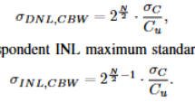
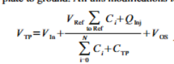

## 电荷重分布型 SAR ADC 仿真工具

电容阵列中，每个电容块的实际值
\(C_{i}=2^{i-1} C_{u}+C_{p a r, i}+\sum_{1}^{2^{i-1}} \delta_{j} \quad (i=1, ..., N) \)
- \(2^{i-1} C_{u}\):理想值
- \(C_{p a r, i}\)：第i个电容块的寄生电容（确定性）
- \(\sum_{1}^{2^{i-1}} \delta_{j}\)：单位电容的失配总和（每个\(C_u\)存在随机失配\(\delta_j\)，统计值）

电容失配（单位电容\(\delta_j\)）模型
单位电容失配服从高斯分布
- 均值：等于标称值\(C_u\)
- 标准差：\(\sigma_{C}=\frac{C_{u} k_{c}}{\sqrt{2 A}}=k_{c} \cdot \sqrt{\frac{c_{spec } \cdot C_{u}}{2}}\)其中，\(k_c\)为失配系数），A为单位电容面积，\(c_{spec}\)为比电容

1. （可能是公式错误） 对于DNL的标准差，DNL跳变最大的时候在MSB跳变(2^(N-1)个小电容),同时由于大电容是小电容并联，所以标准差不是简单叠加，而是要开根号，所以公式应当为$$\sigma_{\text{DNL},CBW} = 2^{\frac{N-1}{2}} \cdot \frac{\sigma_C}{C_u}$$
其他结构的电容阵列DNL和INL同理都要-1
德累斯顿的论文的公式就是-1的
2. 论文里输出电压的公式简化了，少考虑了顶板电容和电荷注入
德累斯顿的论文里的公式把这两部分给加上了，还考虑了比较器的失调，当然这里比较器失调是线性误差

​

w = hann(Ns); 
x = (vout_dac - mean(vout_dac)) .* w;
Xf = fft(x);
P2 = abs(Xf/Ns).^2;
P2 = P2 / (sum(w.^2)/Ns); % hann 窗功率补偿
P1 = P2(1:floor(Ns/2)+1);
P1(2:end-1) = 2*P1(2:end-1);

faxis = (0:floor(Ns/2))' * (fs/Ns);
% 找出信号主峰
[~, idx_peak] = max(P1(2:end)); idx_peak = idx_peak + 1;
% 信号功率：取峰附近 +-1 bin (确保包含泄露)
sig_bins = max(2, idx_peak-1) : min(length(P1), idx_peak+1);
signal_power = sum(P1(sig_bins));

% 噪声功率（不含谐波失真）
noise_power_total = sum(P1) - signal_power;

% 计算谐波（失真）功率：取前 Mharm 高次谐波（排除基频）
Mharm = 5; % 包括 2..Mharm 次谐波
harmonic_power = 0;
for h = 2:Mharm
    idx_h = idx_peak * h;
    if idx_h <= length(P1)
        bins_h = max(2, idx_h-1) : min(length(P1), idx_h+1);
        harmonic_power = harmonic_power + sum(P1(bins_h));
    end
end

SNR = 10*log10(signal_power / noise_power_total);
SNDR = 10*log10(signal_power / (noise_power_total + harmonic_power));
ENOB = (SNR - 1.76) / 6.02;
ENOB_sndr = (SNDR - 1.76) / 6.02;

fprintf('Simulated SNR  = %.2f dB, ENOB (SNR)  = %.2f bits\n', SNR, ENOB);
fprintf('Simulated SNDR = %.2f dB, ENOB (SNDR) = %.2f bits\n', SNDR, ENOB_sndr);