# Pipelined Versus SAR
## Binary Search
流水线 ADC 和 SAR ADC 均采用二分查找（binary search） 来计算逐渐逼近输入电压的模拟估计值
- 初始假设 ADC 的输入范围为 0 至 $V_{REF}$ ，输入信号为$V_{in}$。二分查找首先以$V_{REF}/2$作为初始模拟估计值
- 迭代比较，每次循环中，ADC 将$V_{in}$与最新的模拟估计值比较，根据两者差值的极性调整查找方向。例如，若$V_{in} > V_{REF}/2$，则下一个估计值更新为$3V_{REF}/4$，以此类推
- 残差（residue）$V_{in}$与模拟估计值的差值为残差
- 二分查找的最终目标是将残差减小到小于 1 个最低有效位（LSB），此时模拟估计值已足够接近$V_{in}$，可生成对应的数字量
  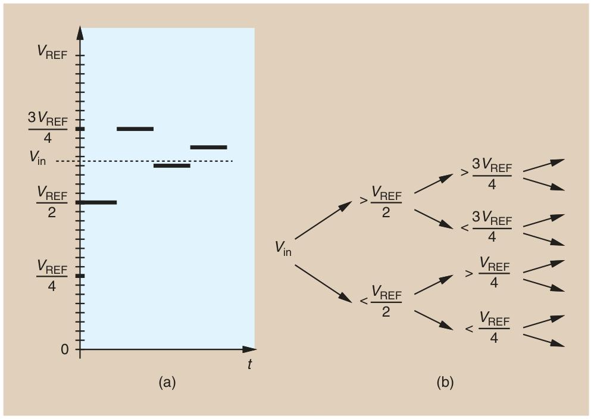
## Pipelined ADC
- 要理解基本的流水线架构，我们首先注意到，二分查找起始于一个残差 $V_{in}-\frac{V_{REF}}{2}$ ，其极性与 $V_{in}-\frac{V_{REF}}{2}$ 相同（因为 $V_{in}-\frac{V_{REF}}{2}=\frac{2V_{in} - V_{REF}}{2}$ ）。我们可以将 $2(V_{in}-\frac{V_{REF}}{2})$ 作为残差，并且在进入下一个二分查找周期前，利用它所带来的 2 倍放大特性。如果能高效且简洁地实现函数 $f(V_{in}, V_{REF}) = 2(V_{in}-\frac{V_{REF}}{2})$ ，这种方法就很有吸引力
- MDAC 
  采样阶段把Vin采到两个电容上
  放大阶段，会通过电荷再分配 $C \cdot V_{\text{out}} + C \cdot V_{\text{REF}} = 2C \cdot V_{in} $
  输出电压最终稳定为 $2V_{in} - V_{REF}$
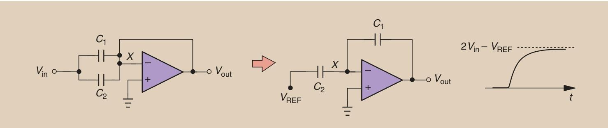
-  下一轮周期的操作与矛盾
  当将残差 $2V_{in} - V_{REF}$ 输入到下一级 MDAC 时，会生成新的残差：$f(2V_{in} - V_{REF}, V_{REF}) = 2(2V_{in} - V_{REF}) - V_{REF} = 4V_{in} - 3V_{REF}$
其极性可用于判断 $V_{in}$ 与 $3V_{REF}/4$ 的大小（对应二分查找的下一步），但这仅在 $V_{in} > V_{REF}/2$ 时有效。若 $V_{in} < V_{REF}/2$，二分查找需要比较 $V_{in}$ 与 $V_{REF}/4$，此时需要的残差应为 $4V_{in} - V_{REF}$。但该值无法通过上一级的函数 $f(V_{in}, V_{REF}) = 2V_{in} - V_{REF}$ 递归得到，这暴露了初始架构的局限性 —— 无法兼容不同输入范围的残差处理需求
- 为克服这一难题，我们对 MDAC（乘法数模转换器）的操作进行修改，如下：$f(V_{in}, V_{REF}) = 
\begin{cases} 
2V_{in} - V_{REF} & \text{若 } V_{in} \geq \frac{V_{REF}}{2} \quad (1)\\
2V_{in} & \text{若 } V_{in} < \frac{V_{REF}}{2} \quad (2)
\end{cases}$
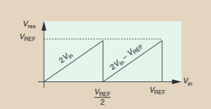
  - 情况 1：C2接Vref $V_{in} \geq \frac{V_{REF}}{2}$ 和原来的一样
  - 情况 2：C2接地 $V_{in} < \frac{V_{REF}}{2}$
  $V_{out} = 2V_{in}$
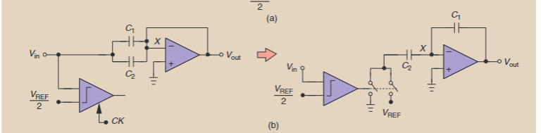

**特点是没有独立采样保持电路（SHA），靠比较器和电容 “边比较边采样”，简化前端设计，所以叫 “SHA - less front end”**

- 流水线级间并行时序
Stage 1：工作在 放大模式（Amplification Mode），用图 (b) 的逻辑生成残差，输出给下一级；
Stage 2：工作在 采集模式（Acquisition Mode），对前一级输出的残差进行采样、存储电荷。
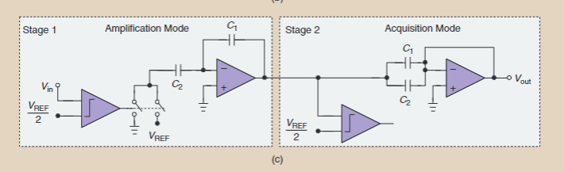
### 1.5bit/Stage架构
- 回顾前面的Pipelined ADCs，我们可以发现他可能存在一些误差来源。
   - 电容失配和有限的运放开环增益会改变残差曲线的斜率 （a）
  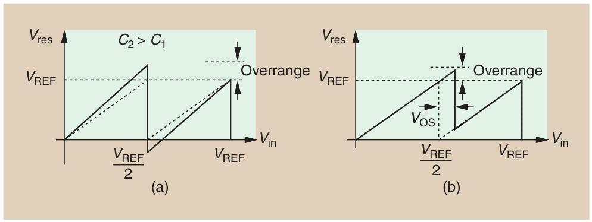
   - 比较器失调 $V_{OS}$ 会使判决点偏离 $V_{in}=V_{REF}/2$ （b）
- 全差分系统与残差曲线
  考虑全差分系统，输入摆幅变大
$f(V_{in}, V_{REF}) = 
\begin{cases} 
2V_{in}-V_{REF} \\
2V_{in} +V_{REF}
\end{cases}$
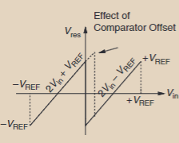
此时比较器是将 $V_{in}$ 与 0 比较。若 $V_{in}=0$ ，但比较器误判为 $V_{in}= + 2\ \text{mV}$ ，那么判决不会在 $V_{in}=0$ 时发生，且 $2V_{in}+V_{REF}$ 会延续到正电压区域，甚至超过 $+V_{REF}$ 。我们的目标是将 $2V_{in}+V_{REF}$ 限制在小于 $+V_{REF}$
- 新的残差函数解析调整判决点后，残差$V_{res}$的生成规则分为三种情况，确保残差始终在后续电路可处理的范围内
  - 当$V_{in} > +V_{REF}/4$时：
残差为$2V_{in} - V_{REF}$。此时输入足够大，即使比较器有正向失调（比如误判$V_{in}$比实际小），残差也不会超过$+V_{REF}$（例如，当$V_{in}=+V_{REF}/4$时，残差为$2*(V_{REF}/4) - V_{REF}=-V_{REF}/2$，处于安全范围）
  - 当$-V_{REF}/4 < V_{in} < +V_{REF}/4$时：
残差为$2V_{in}$
  - 当$V_{in} < -V_{REF}/4$时：
  残差为$2V_{in} + V_{REF}$
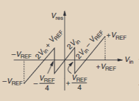
- 通过将输入放大 2 倍，而不额外加减 $V_{REF}$ ，我们避开了 $V_{in}=0$ 附近的误差。实现电路采用了两个比较器，即1.5 位/级架构
这种拓扑可容忍高达 $\pm V_{REF}/4$ 的比较器失调
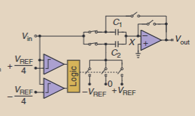

## Sar ADC
SAR ADC 与流水线 ADC 一样通过二分查找逼近输入电压的模拟估计值，但核心差异在于：流水线 ADC 通过多级 MDAC 并行操作，而 SAR ADC 采用单级结构，在多个时钟周期内循环完成转换，期间模拟输入保持不变
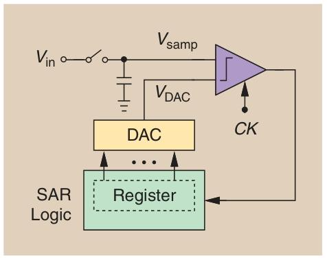
- 转换开始时，寄存器被设为仅最高位为 1，DAC 输出初始模拟估计值$V_{DAC}=V_{REF}/2$
- 比较器将采样电压$V_{samp}$与$V_{DAC}$比较：若$V_{samp} > V_{DAC}$，则保留最高位为 1，下一个估计值调整为$3V_{REF}/4$；若$V_{samp} < V_{DAC}$，则最高位设为 0，下一个估计值调整为$V_{REF}/4$
- 每轮比较后，寄存器更新 1 位，DAC 输出根据新的寄存器值调整，重复上述过程，直到完成 N 位转换（需 N 个时钟周期）
###  核心优势
SAR 架构的突出特点使其在低功耗场景中极具吸引力
- 高分辨率潜力：通过多轮迭代可实现高精度转换
- 无运放设计：无需流水线 ADC 中的运放，规避了运放在低电压工艺中的性能瓶颈
- 零静态功耗：仅在转换时消耗动态功耗，静态时几乎不耗电
- 对比较器失调不敏感：比较器失调仅会使整体转换特性平移（如整体偏移一个固定值），不会导致非线性失真，易于校准
### 电荷再分配DAC
采样过程，所有电容接Vin
比较过程，根据sar logic改变开关电容状态，为1的位数接Vref，为0的位数接地
- 比较器与电容网络构成负反馈环路，所以Vx虚地
- 采集：节点 X 直接接地，$V_X = 0V$，此时所有电容存储与输入$V_{in}$相关的电荷
  转换：尽管每次切换电容底板会暂时使$V_X$偏离 0V（如第一轮转换中$V_X = V_{REF}/2 - V_{in}$），但比较器的高增益会通过负反馈快速调整后续电容状态，使$V_X$在每轮迭代结束时都重新接近 0V。最终完成转换时，$V_X$会稳定在接近 0V 的范围内（小于 1 LSB）
- Vx虚地的核心优势
  - 开关$S$的非线性结电容：开关的结电容（如 MOS 管的$C_{GD}$、$C_{GS}$）通常随电压变化（非线性），若$V_X$大幅波动，结电容的变化会导致电荷损失或误差；而$V_X \approx 0V$时，结电容几乎不变，降低了其对电荷分配的干扰
  - 比较器的共模相关失调：比较器的失调电压（$V_{OS}$）往往随输入共模电压变化（共模依赖性），若$V_X$波动大，共模电压变化会导致失调不稳定；而$V_X \approx 0V$（共模电压固定）时，失调更稳定，转换误差更小

时间网格（time trellis），其核心是通过追踪 DAC 输出随时间的所有可能变化路径，来分析转换器的动态特性
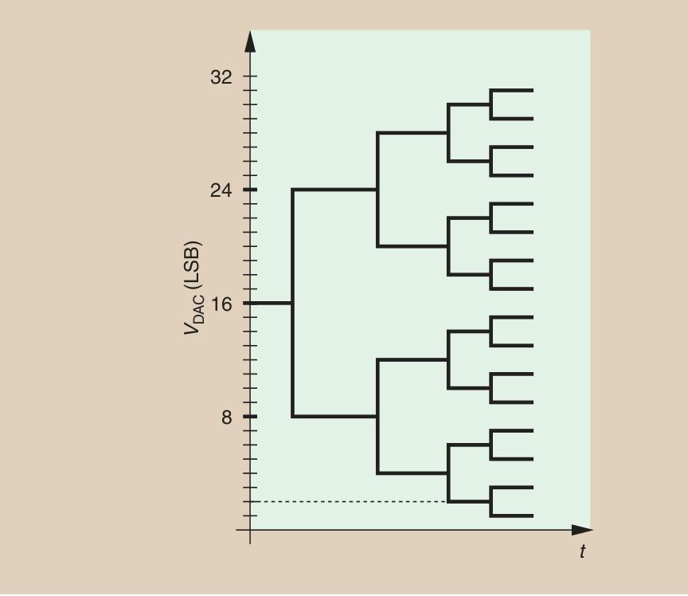

### 问题
- 速度较慢
  每个周期的耗时由三个关键部分构成
  - 比较器响应时间（$t_{comp}$）：比较器判断输入与 DAC 输出差异所需的时间
  - 逻辑延迟（$t_{logic}$）：SAR 逻辑根据比较结果更新寄存器值的延迟
  - DAC 建立时间（$t_{DAC}$）：DAC 根据新寄存器值输出稳定模拟电压的时间
  - 总转换时间约为 $N \times (t_{comp} + t_{logic} + t_{DAC})$
- DAC 的高精度与高分辨率要求导致面积过大
  10 位 SAR ADC 的二进制加权电容 DAC 需要$2^{10}=1024$个单位电容；若为全差分系统，电容数量翻倍至 2048 个
- 缺乏残差放大，比较器噪声限制高性能
  为了降低噪声，比较器需设计为 “低噪声型”，但其响应时间（$t_{comp}$）和功耗会远高于标准比较器
- 与流水线 ADC 的共有问题
  - 电容匹配要求：若不采用数字校准，电容的匹配精度必须与 ADC 分辨率匹配（例如，10 位 ADC 要求电容失配小于$1/2^{10}$），增加了制造难度
  - 参考电压（$V_{REF}$）电路性能：生成$V_{REF}$的电路需满足 “快速建立”（确保 DAC 输出及时稳定）和 “低噪声”（避免参考电压噪声引入转换误差），设计复杂度较高

### 提升速度
- Interleaving 时钟交织：多通道并行转换
  通过集成两个或多个独立的 SAR ADC 通道，让它们并行处理输入信号
  问题
  1. 通道失配：不同通道的电路特性（如失调、增益、延迟）存在差异
  2. 面积与输入电容增加：多通道需要额外的 DAC、比较器等模块，面积显著增大；输入电容随通道数成比例增加
  3. 参考电压耦合：若多通道共享参考电压（$V_{REF}$），通道间的开关切换会相互干扰，引入噪声
- 每周期解析多位（Resolving More Than 1 Bit per Cycle）
常规 SAR 每周期仅解析 1 位，而该技术通过多个比较器和 DAC 同时处理多个模拟估计值，一次解析 2 位及以上信息
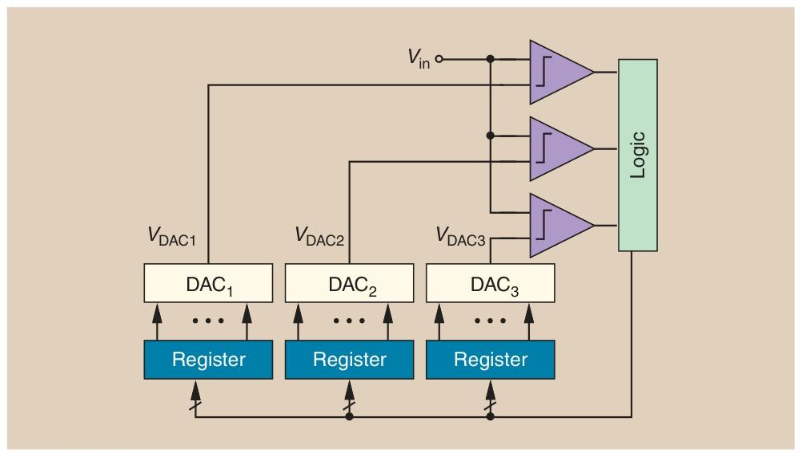
  1. 用 3 个比较器同时将输入电压与 3 个 DAC 输出（如$3V_{REF}/4$、$V_{REF}/2$、$V_{REF}/4$）比较，一次得到 2 位信息
  2. 下一轮根据比较结果，调整 3 个 DAC 输出至更精细的估计值（如$15V_{REF}/16$、$14V_{REF}/16$、$13V_{REF}/16$），继续解析下 2 位
  - 优势：显著减少总转换周期，直接提升速度
  - 问题：复杂度与面积激增：需要多个 DAC 和比较器，电荷再分配架构中输入电容随 DAC 数量增加，设计难度加大；比较器失调敏感：多比较器的随机失调会导致判决错误，需额外校准；开关网络复杂
  - 现状：目前已实现每周期解析 3 位的设计，但权衡后多用于中高速场景
- 利用冗余容忍 DAC 未完全建立（Redundancy for Incomplete DAC Settling）
常规 SAR 中，DAC 需在每个周期内完全稳定（tDAC），否则会导致比较器误判；但完全稳定耗时较长，限制单周期速度
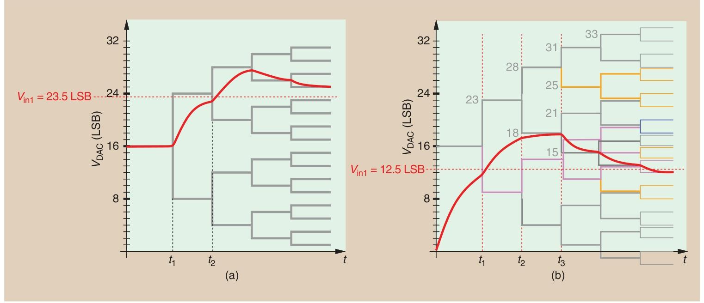
  - 图 (a)：无冗余时，DAC 未稳定导致误差
输入电压 $V_{in1}=23.5\ \text{LSB}$
$t_1$ 时刻：DAC 输出从 16 LSB 跳变到 24 LSB，但此时 DAC 未完全稳定（红色曲线是实际建立波形，没立刻到 24 LSB ）
$t_2$ 时刻：比较器根据未稳定的 DAC 输出（误判为 $V_{DAC}< V_{in}$），错误地调整后续 DAC 步长，导致后续逼近方向跑偏。因为无冗余设计时，比较器的误判是不可逆的
  - 图 (b)：有冗余时，容忍 DAC 未稳定并修正误差
  - 实现
  1. 采用非二进制步长（如 7 LSB、5 LSB 等），而非严格的二进制倍数
  2. 在寄存器后增加查找表（LUT），将冗余判决结果映射为正确的数字输出，无需修改 DAC 硬件
### DAC 复杂度降低 Split/Coupled 结构
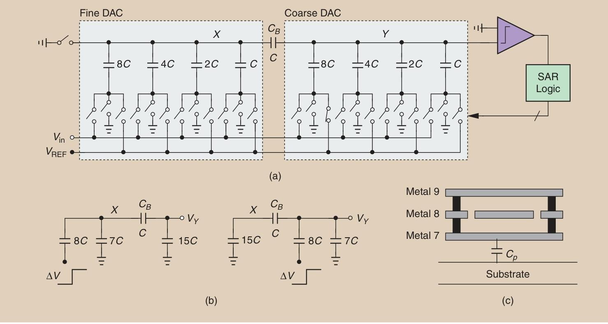
对于图c的寄生电容，可以利用c中的形式进行屏蔽，使得寄生电容Cp很小，只需要对Gain error做修正

---
- Bang Bang 和 Ring Ring
  - Bang Bang是通过比较器判断Vres的大小，用sar logic来控制cdac的电容开关（就是像开关电闸一样也是bangbang的声音？）
  - Ring Ring就是像门铃一样震荡，比如说在到达最后稳定之前可能会先调过头，再往回调，又继续调过头的情况
- sar为什么更适合工艺scaling
  - Sar logic是数字电路
  - 电容阵列也比较适合工艺scaling
  - 用的是比较器，不像pip用的放大器，放大器随着工艺scaling需要各个因素tradeoff，比较器简单一些
- Vx虚地。尽管每次切换电容底板会暂时使$V_X$偏离 0V，但比较器的高增益会通过负反馈使每轮迭代结束时都重新接近 0V
  - 如果电压$V_X$波动，$S_1$两端的电压差会变化，导致结电容值波动，进而干扰CDAC的电荷
  - 比较器的共模相关失调，如果$V_X$波动大，共模电压变化会导致失调不稳定
- S1的非线性结电容的影响
   S1在采样的时候闭合，比较保持的时候断开。但是比较保持的时候还是会挂着一个和Vx相关的小电容，相当于等效一个接地的C6？ 相当于电容被稀释了一点点？cdac输出的电压偏小？所以每次比较都有DNL
   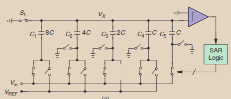
- accuracy和resolution的区别
  - 我看文章到这的时候也查了一下，但不是很确定
  -  Accuracy就是真实值和测量值的差。是一个绝对数值
  -  Resolution就是相对的，比如说10位，LSB就是Vref/1024
- residue amplification
  - 就是pip就需要残差放大，因为pip的每一级都是和固定的Vref/2比较
  - sar不需要残差放大，所以越到后面的Ring Ring阶段，对比较器的低噪声要求越高
- 图4推导
   电荷分配
  $2C \cdot V_{in}=C \cdot V_{\text{out}} + C \cdot V_{\text{REF}}  $
  输出电压为 $2V_{in} - V_{REF}$
- 噪声和功耗Trade off
  - 热噪声${KT}/{C}$，电容增大了，CDAC每次切换消耗的功耗$f\cdot C \cdot V^2$就增大了
  - 比较器中，为了噪声小，跨导要大；Vovd一样的情况下（gm/id），跨导大了，分配的电流就要大，所以功耗大
- finite opamp gain和offset对pipeline adc的影响体现在哪些方面？
  - 电容失配和有限的运放开环增益会改变残差曲线的斜率 （a）
  - 放大器失调 $V_{OS}$ 会使判决点偏离 $V_{in}=V_{REF}/2$ （b），结果甚至超过 $+V_{REF}$幅值范围
   