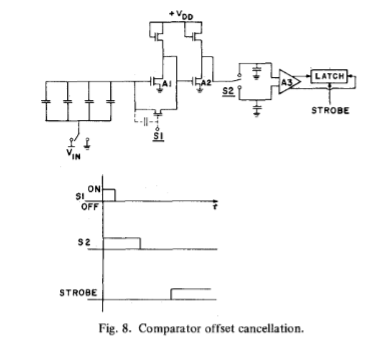
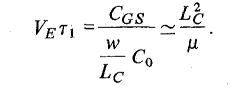

# 背景
传统 ADC（如 R-2R 电阻网络型）在工艺中存在缺陷
- 依赖 特定薄层，标准 MOS 工艺做不出
- MOS 开关 导通电阻比例难控制
- 电阻温度系数大
# 电荷再分配
- 采样
Q = CT × VIN
- 电荷再分配
  VTOP = -Vin+C/Ct×VREF
- 底板优势
  底板开关寄生电容要么接GND要么接Vref，不会从 电容阵列顶板 吸收电荷，所以可以做的更大一些，Ron变小，提升速度
- 顶板优势
  由于顶板Vx始终会回到0，所以没有额外电荷。同时：10 位 ADC 中，即使顶板寄生电容\(C_{\text{parasitic}}\)是 最小电容\(C_1\)的 100 倍，也仅会导致 0.1 位失调误差（100/1024），这意味着小电容可以做的很小
- 利用比较器偏置电压 (offset) 来抵消误差
初始的 VX 不一定要是 0，也可以是比较器的阈值电压。即采样时预充电

-  双极性输入
把第一位作为符号位可以接受输入信号为差分输入 范围-Vref——+Vref。但是ENOB要损失1位

# 精度问题
## 电容比例误差
- 只导致 “非线性误差”：不会有增益误差（传输函数端点 < 0 和满量程 > 不受比例影响），也不会有失调误差（零输入时无电荷转移，误差显现不出来）。
例：10 位 ADC 理想转换点是 “4.88mV/LSB”，若 C₅₁₂偏小，某转换点可能变成 5.0mV，导致线性度变差，但整体增益（满量程 5V）和零输入输出（0V）不变
- 高位电容更敏感：图 5 显示，C₅₁₂（最高位）的 1% 误差会让线性度崩掉，而 C₁（最低位）的 1% 误差几乎没影响 —— 所以设计时要优先保证高位电容精度
**如何解决**

|刻蚀不足或者过多|大电容采用小正方形电容并联组成|	单块小电容的刻蚀误差（如 1%）会被多块并联稀释|
|---|---|---|
| 氧化层梯度变化        |   采用共质心布局      | 左侧电容因氧化层薄→容量偏小，右侧对称位置的电容因氧化层厚→容量偏大，两者偏差相互抵消，电容比例不受梯度影响 |
|掩模对准偏差|电容顶板的互连金属仅沿单一方向（如 X 轴）跨越薄氧化层|若掩模沿 Y 轴方向错位，单一 X 轴互连的 覆盖薄氧化层面积不会变化|
拐角圆角效应|设计每个电容时，确保 90° 拐角与 270° 拐角的数量相等|90° 圆角会使电容面积 减少，270° 圆角（凹角）会使面积 增加
 ## 其他问题
 - 小信号电容会随着两端电压改变而改变，但这不重要
 - 介电吸收（Dielectric absorption）是指电容器经快速放电后，其两端仍会出现残余电压的现象。但这也不重要
 - 比较器Offset
  
通过两个放大器，A1 和 A2 的失调电压以及 S1 的馈通效应均会被抵消。因此，A3 的失调电压成为比较器中唯一显著的失调来源
有效失调电压计算公式为 $V_{OS-effective} = \frac{V_{OS-A3}}{G_{A1} \cdot G_{A2}}$，其中 $G_{A1} \cdot G_{A2}$ 为两级放大器的增益乘积
- 二氧化硅（SiO₂）介电电容的一大显著优势是其极低的温度系数，约为 20 ppm/°C（百万分之一每摄氏度）；相比之下，扩散电阻的温度系数约为 2000 ppm/°C，薄膜电阻和注入电阻的温度系数则为数百 ppm/°C
# 速度问题
- 采样阶段：充电慢，因为顶板开关电阻不敢做太小
充电回路电阻：信号源电阻 Rs（可忽略，加缓冲器）+ 顶板接地开关电阻 RONG（核心）+ 底板开关电阻 RONk（可做小）。
时间常数 τ₁ ≈ RONG × CT：RONG 不能无限制减小 ——RONG 小要增大 MOS 管尺寸，但会导致栅漏电容 变大，引入电荷干扰，需额外时间抵消失调
- 再分配阶段：RC 时间可优化，但有面积代价
  时间常数 τ₂ ≈ (RON/2) × CT **底板电阻**
- 最根本瓶颈：比较器延迟
每次再分配后，比较器要 “分辨微小电压差”（10 位 ADC 最小差≈2.4mV），需要时间稳定输出：
分辨率越高，延迟越长（2.4mV 比 9.8mV 难分辨）；
这是物理限制：要快就得提高比较器带宽，但带宽高会引入更多噪声，导致误判 —— 只能在速率、精度、噪声间权衡。
实验数据：10 位 ADC 总转换时间 23μs（对应 44kHz 采样频率）
# 实际电路
  ## 电容
  - 误差：90% 以上电容的比例误差在 ±0.5‰内
  - 良率：8 位 98%、9 位 94%、10 位 45%——10 位虽良率不高，但证明可行，后续工艺优化能提升
  ## ADC功能
  - 线性度：总转换误差 <±½ LSB（用 12 位 DAC 验证）、
  - 速率：总转换时间 23μs（44kHz 采样）

# 问题
1. 这个提问者只看了电容，但是比较器offset改变了电压判决点，会带来整体平移
2. 对于10位adc，即使顶板寄生电容\(C_{\text{p}}\)是 最小电容\(C_1\)的 100 倍，也仅会导致 0.1 位失调误差（100/1024），这意味着小电容可以做的很小。本质上由于Ctotal是1024，很大
3. 为什么b10为负数，因为这里MSB是符号位，双极性输入需要正负判断位置
4. 存疑  $\left(DeltaVT/V R\right)/\left(Delta c_i
5. 时间常数为\(\tau_1 = \left( R_s + \frac{R_{\text{ON}_1}}{2} + R_{\text{ONG}} \right) C_T\)
- Rs是信号源电阻，电压输入可以加buffer把输入电阻做小；
- Rong是顶板开关电阻，这个做小了会引起电容寄生问题
- Ron1是底板开关电阻，至于为什么是\(\frac{R_{\text{ON}_1}}{2}\)是因为每一位开关电阻要和电容匹配

电容 \(C_k = 2^k C_1\)，但开关电阻 \(R_{\text{ON}k}\) 与 \(C_k\) 无关（比如所有开关电阻相同），那么时间常数（\(\tau = R_{\text{ON}} C\)）会差异巨大

开关电阻为 \(R_{\text{ON1}}, 2R_{\text{ON1}}, 4R_{\text{ON1}}, \dots, 2^N R_{\text{ON1}}\)
代入并联公式：\(\frac{1}{R_{\text{total}}} = \frac{1}{R_{\text{ON1}}} + \frac{1}{2R_{\text{ON1}}} + \frac{1}{4R_{\text{ON1}}} + \dots + \frac{1}{2^N R_{\text{ON1}}}\)

得到\(\frac{1}{R_{\text{total}}} = \frac{1}{R_{\text{ON1}}} \left( 1 + \frac{1}{2} + \frac{1}{4} + \dots + \frac{1}{2^N} \right)\) 这是一个等比数列

求和结果代回总电阻公式
\(R_{\text{total}} = \frac{R_{\text{ON1}}}{2 \left( 1 - \frac{1}{2^{N+1}} \right)} \)

6. 和第5问差不多。源电阻 \(R_s\) 可以做得很小，那么采集时间 \(\tau_{\text{acq}}\) 取决于 \(R_{\text{ON}}\)（底板开关的导通电阻）和 \(R_{\text{ONG}}\)（顶板开关的导通电阻）。\(R_{\text{ON}}\)能被做得比 \(R_{\text{ONG}}\) 小，因为底板开关的栅源电容和栅漏电容不会导致转换误差（接的GND或者Vref）
7. 
  
​这个公式中间分母确实少个迁移率，昨天晚上算了
8. 当上级版采样开关闭合时，MOS 通道中储存了反型电荷；开关断开瞬间，这些电荷会部分注入到采样电容  CT ，等效为在  CT  上产生一个误差电压
9. 电荷再分配阶段的速度由时间常数 τ₂ ≈ (RON/2) × CT决定，这里是底板开关电阻，为了减小他，就得加大宽长比，长度最小已经在工艺里固定，那么面积就增加了
至于为什么可以任意小，因为底板开关电阻小了，电容就大了，但是底板开关电容大了没有关系，因为底板总是接GND或者Vref
10.  Dac和sar logic
11.  工艺做出来的电阻会有误差，对于越大的电阻越明显，误差范围基本在千分之1以内，这也就是10 bit adc的一个enob（1/1024）
 