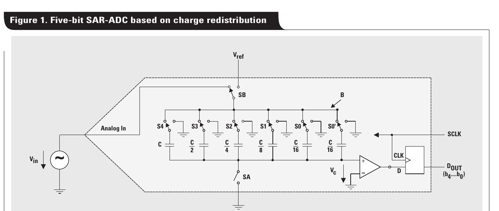
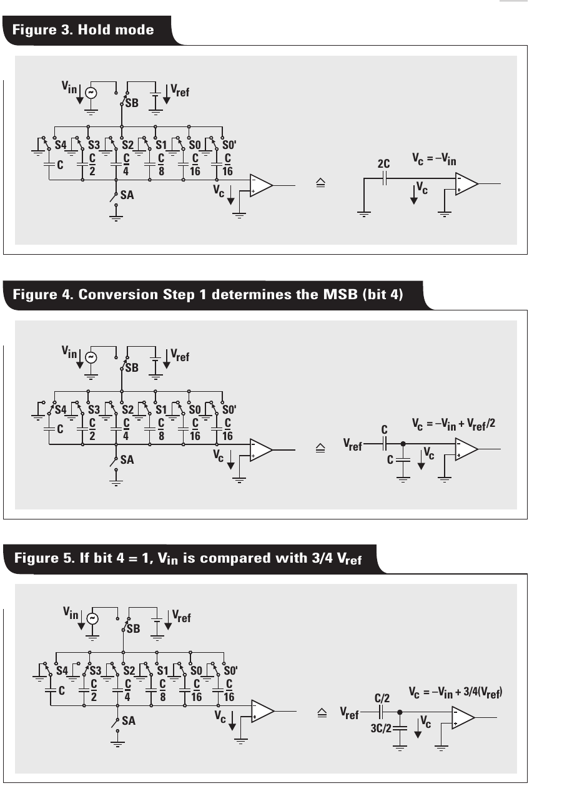
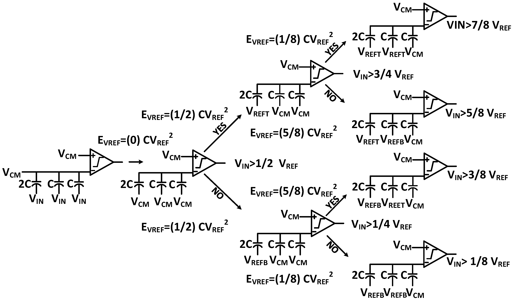
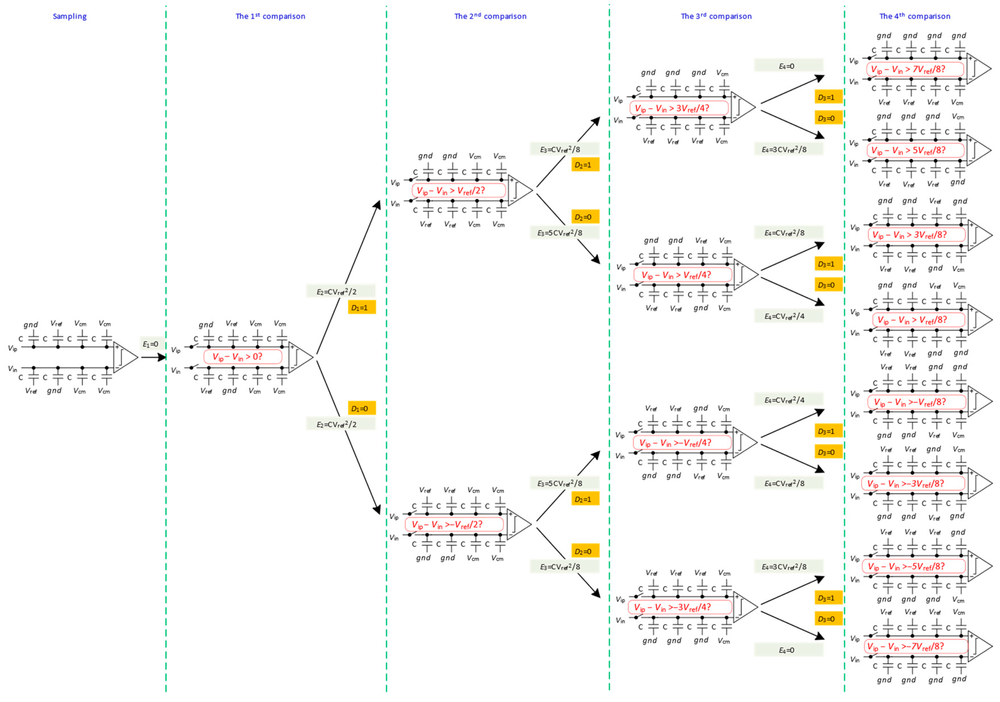
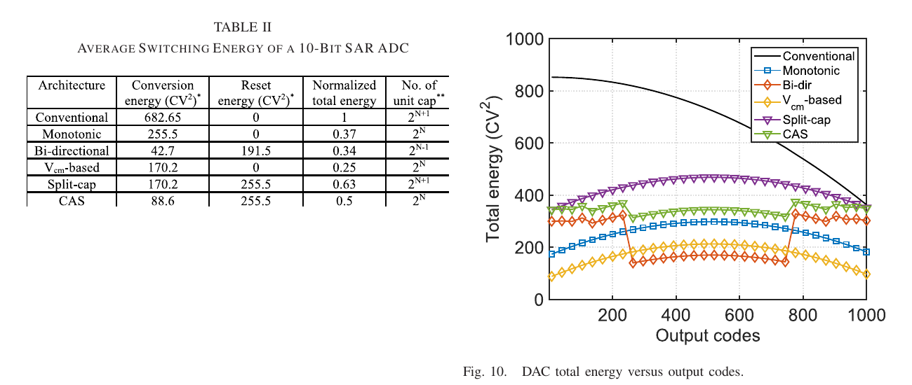
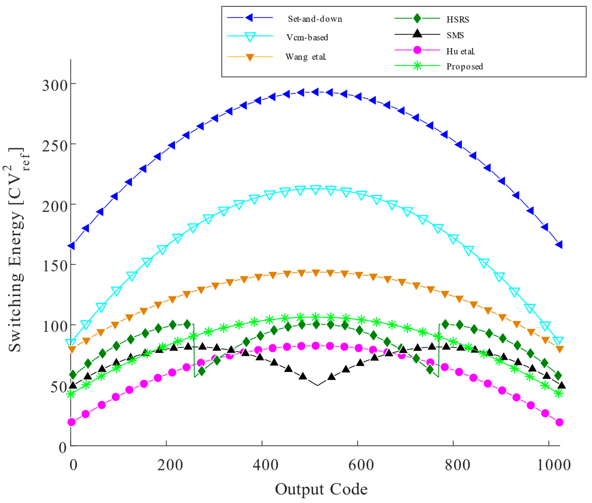

# CDAC 开关方案演进：从经典电荷再分配到现代低能耗开关

> [!abstract] 先给结论
> 1. 所有电容型 SAR DAC 的数学核心都没有变：**顶板浮空时，改变某只电容的底板电压，顶板按电容权重平移**。
> 2. 1975 年 McCreary 与 Gray 的贡献不是发明 SAR 搜索，而是把 **采样保持 + 二进制 DAC + SAR 转换**合并进一个 MOS 兼容的电容阵列。
> 3. conventional、monotonic、$V_{CM}$-based 等方案的数字判决本质相同，差别在于：**初始状态、每一拍切哪一侧、切多大电压、是否回切、共模怎样移动**。
> 4. monotonic 省能量和电容，但比较器输入共模单向漂移；$V_{CM}$-based 用三电平换取近似恒定共模；MCS、双向单边、charge-average、detect-and-skip 等继续在参考能量、共模、开关数和 reset 能量之间折中。
> 5. 论文里的“节能 81%、87.5%、93.4%、98%”不能直接横比，必须先统一：单端/差分、总电容、满量程、是否计入 reset、是否计入 $V_{CM}$ 发生器与参考 buffer。

---

## 1. 先把最容易混淆的术语拆开

### 1.1 什么是顶板、底板

在现代 SAR ADC 的常见画法中：

- **顶板（top plate）**：所有二进制权重电容连接在一起的公共节点，通常直接接比较器输入；转换时它应当保持高阻、近似浮空。
- **底板（bottom plate）**：每只电容独立的一端，接输入、$V_{REFP}$、$V_{REFN}$、$V_{CM}$ 或 GND，由开关控制。

这里的“顶/底”是电路功能命名，不一定等于版图或原理图中画在上面/下面的金属板。

> [!warning] 三个词不是一回事
> - **top-plate sampling**：输入在采样阶段接到公共顶板。
> - **bottom-plate sampling**：输入在采样阶段接到各只电容的底板。
> - **bottom-plate switching**：转换阶段通过各只电容的底板切换参考电压。绝大多数 CDAC 都属于这一类。
>
> 因此，“采用顶板采样的 monotonic DAC”完全不矛盾：它可以在采样时把输入接顶板，在转换时仍然切底板。

### 1.2 一条公式看懂所有方案

顶板节点 $V_x$ 浮空时，总电荷守恒：

$$
Q_x=\sum_i C_i(V_x-V_{b,i})=\text{constant}
$$

所以底板从 $V_{b,i}^{old}$ 变到 $V_{b,i}^{new}$ 后：

$$
\Delta V_x=\frac{\sum_i C_i\Delta V_{b,i}}{C_T},
\qquad C_T=\sum_i C_i
$$

对一只权重为 $C_k$ 的电容：

$$
\Delta V_x=\frac{C_k}{C_T}\Delta V_{b,k}
$$

这就是 CDAC 的全部“魔法”：

- 权重由 $C_k/C_T$ 决定；
- 步进方向由底板电压变化的正负决定；
- 方案之间的区别只是怎样组织这些 $\Delta V_{b,k}$。

差分 CDAC 还应同时观察：

$$
V_d=V_{xp}-V_{xn},\qquad
V_{cm,out}=\frac{V_{xp}+V_{xn}}{2}
$$

一个动作可能让 $V_d$ 正确移动，却同时让 $V_{cm,out}$ 漂移。这正是 monotonic 的主要代价，也是 $V_{CM}$-based 的主要价值。

---

## 2. 1975：经典电荷再分配 CDAC 从哪里来

### 2.1 历史定位

通常被当作 CDAC SAR 起点的是：

> J. L. McCreary and P. R. Gray, “All-MOS Charge Redistribution Analog-to-Digital Conversion Techniques - Part I,” IEEE JSSC, 1975.

严格说，它不是历史上第一篇 SAR ADC 论文。逐次逼近思想更早就存在；这篇论文的奠基性在于提出并验证了 **全 MOS、二进制加权电容、电荷再分配**的 A/D 结构，使同一片电容同时承担：

1. 输入采样与保持；
2. 二进制加权 DAC；
3. 逐次比较所需的 residue 更新。

下面这张 TI 后来的教学图把经典单端结构画得很清楚。它使用 $C,C/2,C/4,\ldots$ 的归一化写法；现代论文更常写成 $2^{N-1}C_u,\ldots,C_u$，两者完全等价。

*图 1：经典 5-bit 电荷再分配 SAR ADC。来源：[TI, The operation of the SAR-ADC based on charge redistribution](https://www.ti.com/lit/an/slyt176/slyt176.pdf)，Fig. 1。*

### 2.2 经典单端转换的三个阶段

以下令比较器阈值为 0，顶板是比较器输入，$C_T=2^NC_u$。

#### 阶段 A：采样

经典 bottom-plate sampling 的一种写法是：

- 顶板钳位到 0 或 $V_{CM}$；
- 所有底板接 $V_{IN}$；
- 电容阵列存下与 $V_{IN}$ 有关的总电荷。

若采样时顶板为 0，则存储电荷约为：

$$
Q_x=-C_TV_{IN}
$$

#### 阶段 B：保持

- 先断开顶板钳位，让顶板浮空；
- 再将所有底板从 $V_{IN}$ 切到 GND。

由电荷守恒，顶板变成：

$$
V_x=-V_{IN}
$$

这说明 CDAC 本身已经完成 sample-and-hold，不需要额外保持电容。

#### 阶段 C：逐次试探

先把 MSB 电容底板从 0 切到 $V_{REF}$：

$$
V_x=-V_{IN}+\frac{1}{2}V_{REF}
$$

比较器判断它在 0 的哪一侧，再决定保留还是撤销这一动作。之后依次尝试 $V_{REF}/4$、$V_{REF}/8$，直到 LSB。

*图 2：经典 hold、MSB trial 和下一位 trial。来源同上，Fig. 3-5。*

### 2.3 用 3-bit 数字例子走一遍

令：

$$
C_T=8C_u,\quad C_{MSB}=4C_u,\quad C_1=2C_u,\quad C_{LSB}=C_u
$$

取 $V_{IN}=0.68V_{REF}$，忽略 dummy 电容的显示。

| 步骤 | 试探动作 | 顶板 residue $V_x/V_{REF}$ | 决定 |
|---|---|---:|---|
| Hold | 全部底板接 0 | $-0.68$ | - |
| MSB | $4C_u:0\rightarrow V_{REF}$ | $-0.68+0.5=-0.18$ | 保留，$b_2=1$ |
| bit 1 | $2C_u:0\rightarrow V_{REF}$ | $-0.18+0.25=+0.07$ | 撤销，$b_1=0$ |
| LSB | $C_u:0\rightarrow V_{REF}$ | $-0.18+0.125=-0.055$ | 保留，$b_0=1$ |

最终码为 `101`，对应 DAC 值 $0.625V_{REF}$。整个过程其实就是让 residue 从 $-V_{IN}$ 开始，通过 $+V_{REF}/2,+V_{REF}/4,+V_{REF}/8$ 逐步逼近 0。

### 2.4 经典结构为什么后来要改

经典方案功能正确，但在现代低电压、高速 ADC 中有几个问题：

- **大权重电容切满摆幅**，参考源需要瞬间提供大量电荷；
- 差分实现中常常两侧同时、反向切换，开关能量较大；
- trial 失败后要回切，存在 preset-evaluate-reset 动作；
- $N$ 位全二进制阵列的单位电容数随 $2^N$ 增长；
- 大 MSB 动作给 reference buffer 带来最严重的 settling 压力。

因此后续方案不是改变 SAR 的二分搜索，而是尝试用更少、更小、更单向的底板动作产生相同的差分 DAC 步长。

---

## 3. conventional 全差分开关：现代比较的基线

为了抑制偶次失真、供电噪声和共模干扰，现代 SAR 通常采用两套 CDAC：P 阵列和 N 阵列。

令：

$$
V_{REFP}=V_{CM}+\frac{V_{REF}}{2},\qquad
V_{REFN}=V_{CM}-\frac{V_{REF}}{2}
$$

conventional 差分方案的典型特征是：

1. 采样后先建立 MSB trial 状态；
2. 同一权重的 P、N 两侧电容通常反向切换；
3. trial 错误时再把相应电容切回；
4. 两个顶板大致对称移动，所以比较器输入共模较稳定。

例如同一只权重 $C_k$：

$$
\Delta V_{xp}=+\frac{C_k}{C_T}V_{REF},\qquad
\Delta V_{xn}=-\frac{C_k}{C_T}V_{REF}
$$

它产生很大的差分步进，却也意味着两套阵列都从参考源取放电荷。

**优点 **

- 算法最直观，易于验证；
- 差分对称性好，比较器输入共模基本稳定；
- 对比较器 offset、noise、delay 随输入共模变化的敏感度较低；
- 参考文献和成熟设计经验最多。

**缺点**

- 开关能量最高，尤其是 MSB；
- reference buffer 的动态电流和 settling 要求高；
- 常见实现需要更多单位电容；
- trial/reset 增加数字动作和开关毛刺。

它仍然是很重要的基线：只有先画清 conventional 每一拍的状态，才能判断新方案到底省掉了哪一次充放电。

---

## 4. 2010：monotonic switching（单调 / set-and-down）

代表论文是 Liu 等人在 2010 年发表的 monotonic capacitor switching procedure。

### 4.1 核心动作

常见差分实现采用 top-plate sampling：

1. 采样时底板统一预置在一条参考轨；
2. 采样结束后直接比较输入，**第一次比较不切 DAC**，因此顺便得到 MSB；
3. 之后每一位只切 P 或 N 中的一侧；
4. 电容只沿一个方向切换，例如从 $V_{REFP}$ 向 $V_{REFN}$，不再回切。

因此它同时消掉了三类动作：MSB trial、双边同时切换、trial 后 reset。

### 4.2 为什么叫 monotonic

这里的“单调”有两个含义：

- 每只被选中的底板只沿一个方向切；
- 两个 DAC 顶板的平均值也会沿一个方向移动。

第二点正是它的主要缺点。假设每一拍只让一侧顶板下降，则：

$$
\Delta V_{cm,out}=\frac{\Delta V_{xp}+\Delta V_{xn}}{2}\neq 0
$$

随着转换从 MSB 走向 LSB，比较器看到的输入共模可能从 $V_{CM}$ 降到接近某一电源轨。

### 4.3 优缺点

**优点**

- 第一拍零 DAC 能量；
- 每位只切单侧、单只权重电容；
- 不需要失败后的 reset；
- 常见实现比 conventional 少约一半单位电容；
- 控制逻辑和参考驱动相对简单。

**缺点**

- 比较器输入共模随 bit cycle 和输入码变化；
- dynamic comparator 的 offset、noise、regeneration time 可能随共模变化；
- 低电压下比较器输入对的 $g_m$ 与 headroom 更容易成为问题；
- 共模变化可能把理论节能转化成线性度和速度代价。

> [!note] 81% 还是 63%？
> Liu 原论文及很多后续表格按各自常见阵列规模比较，常引用约 **81% switching-energy saving**。Tang 2022 在相同满量程、相同总 $C_{DAC}$ 条件下重新归一化后，monotonic 的总能量约为 conventional 的 0.37，即约 **63% saving**。二者使用的 baseline 不同，并不矛盾。

---

## 5. $V_{CM}$-based switching：用第三电平换回恒定共模

代表工作是 Zhu 等人在 2010 年发表的 10-bit 100-MS/s SAR ADC。

### 5.1 核心动作

它常采用三电平：

$$
V_{REFP},\quad V_{CM},\quad V_{REFN}
$$

典型过程是：

1. 采样阶段，各底板预置到 $V_{CM}$；
2. 第一次比较直接决定 MSB，不需要 DAC 动作；
3. 后续同一权重的两侧电容分别从 $V_{CM}$ 切向 $V_{REFP}$ 和 $V_{REFN}$；
4. 两个顶板等幅、反向移动。

若某权重为 $C_k/C_T$，则一对底板各移动 $V_{REF}/2$：

$$
\Delta V_{xp}=+\frac{C_k}{C_T}\frac{V_{REF}}{2},\qquad
\Delta V_{xn}=-\frac{C_k}{C_T}\frac{V_{REF}}{2}
$$

于是：

$$
\Delta V_d=\frac{C_k}{C_T}V_{REF},\qquad
\Delta V_{cm,out}=0
$$

也就是说，它产生了和所需二进制权重一致的差分步进，同时让比较器输入共模近似不变。

### 5.2 优缺点

**优点**

- 第一拍不切 DAC；
- 每个开关动作只有半个参考摆幅；
- 比较器输入共模近似恒定；
- 常见实现可减少约一半单位电容；
- 能量、速度、线性和实现复杂度之间较均衡。

**缺点**

- 每只电容通常需要三选一开关，driver 和布线更复杂；
- 需要低噪声、低阻抗、能快速吸/灌电荷的 $V_{CM}$；
- $V_{CM}$ 的 settling、噪声与路由失配可能进入差分 residue；
- 不能只把两个电阻分压得到的“静态中点”直接当作高速 CDAC 的 $V_{CM}$ 驱动源。

> [!important] “$V_{CM}$ 在差分里会消掉”只在理想条件成立
> 理想的、完全对称的 $V_{CM}$ 直流误差主要表现为共模；但有限输出阻抗、动态 settling、两侧路由/开关失配以及 comparator 的 common-mode sensitivity 都能把它变成差分误差。因此 $V_{CM}$-based 并不等于“对 $V_{CM}$ 精度没有要求”。

---

## 6. MCS、三电平与 charge-recovery：继续压低参考能量

### 6.1 MCS（Merged Capacitor Switching）

Hariprasath 等人在 2010 年提出 MCS。其思想不是只改一拍，而是把：

- 输入采样后的初始电荷状态；
- 第一次无需 DAC 的比较；
- $V_{CM}$、上参考和下参考之间的后续动作

合并成一套路径，使大量步骤不再从高参考源抽取完整的 $CV^2$ 能量。经典文献常给出相对 conventional 约 **93.4%** 的切换能量降低。

MCS 和“tri-level switching”的术语经常重叠。读论文时不要只看名字，要看以下三项：

1. sampling 结束时每只底板在哪里；
2. 第一次比较前是否有 MSB 动作；
3. 每个判决之后是从哪条轨切到哪条轨。

### 6.2 CMMC：$V_{CM}$-based monotonic + charge recovery 的例子

下面的 3-bit 图来自 2020 年的 CMMC（common-mode-based monotonic charge recovery）实现。它很好地展示了现代混合方案的思路：第一拍不消耗参考能量，后续只在必要的电容上使用 $V_{REFT}$、$V_{REFB}$ 与 $V_{CM}$。

*图 3：CMMC 3-bit 转换树。来源：[Verma et al., Electronics 2020](https://doi.org/10.3390/electronics9071100)，Fig. 5，开放获取。*

**优点**：参考能量很低、第一拍无切换、可控制共模。

**代价**：状态机和三电平 driver 更复杂；理论能量优势依赖 $V_{CM}$、上下参考的真实驱动能力与回收路径。

---

## 7. 2013 以后常见的几条分支

### 7.1 Bidirectional single-side switching（双向单边）

它保留 monotonic 的“每拍只切一侧”，但不再让所有动作都向同一方向：

- 初始时一部分底板在 $V_{REFP}$，另一部分在 $V_{REFN}$；
- 根据比较结果，选择向上或向下切；
- 让输出共模围绕目标值双向摆动，而不是一路滑向电源轨。

**优势**：单边切换仍然省能量，共模范围显著小于纯 monotonic。

**代价**：需要设计 initial/reset pattern；reset 本身会消耗能量；控制和验证比 monotonic 更复杂。

### 7.2 Split-cap equivalent $V_{CM}$ switching

一种思路是把每个权重电容分成两个相等子电容：

- 一个预置到 $V_{REFP}$；
- 一个预置到 $V_{REFN}$；
- 二者平均效果等价于连接到 $V_{CM}$。

这样可以避免专门生成 $V_{CM}$，并保持顶板共模稳定。

**优势**：没有独立 $V_{CM}$ reference buffer；差分共模好。

**代价**：电容单元、开关与底板寄生增加；reset 能量不小；两只“半电容”的 mismatch 会影响等效中点。

### 7.3 CAS（Charge-Average Switching）

CAS 不直接从参考源给某只大电容充电，而是临时连接 P/N 两侧或不同电容，让它们先做 charge sharing，以电荷平均产生所需 DAC 位移。

**优势**：部分 residue 位移不从 reference buffer 取能量，可减轻大电流脉冲。

**代价**：需要低阻、低寄生的局部连接开关；charge-sharing settling 和开关注入直接影响精度；低电源下有时需要 boosted switch。

### 7.4 Detect-and-Skip / subranging

先用很小的 coarse ADC 判定输入所在的大致区间，再直接设置 fine CDAC 的 MSB 状态，跳过若干最费能量的 MSB trial。

**优势**：对高分辨率、大 $C_{DAC}$ 的 reference buffer 特别有效；不局限于某一种底层 switching law。

**代价**：多一条 coarse path；两条路径的 offset、增益和时序误差需要 redundancy 或 calibration 吸收。

### 7.5 Capacitor-splitting / merge-and-split / hybrid schemes

近年的方案常把某些二进制权重拆成多个子电容，并结合：

- 第一拍零切换；
- $V_{CM}$ 或有限次 $V_{CM}$ 使用；
- 单边/双向动作；
- 低位改用不同的 switching rule。

目标往往不再只是最低理论能量，而是同时限制：共模摆动、$V_{CM}$ 精度敏感度、开关数和控制逻辑。

*图 4：一个 4-bit capacitor-splitting 混合方案的完整转换树。来源：[Hu et al., Micromachines 2023](https://doi.org/10.3390/mi14122244)，Fig. 3，CC BY 4.0。该图是现代设计实例，不代表唯一标准方案。*

---

## 8. 不要把“电容阵列结构”和“开关策略”混为一谈

这是阅读论文时第二个最常见的混淆。

### 8.1 阵列结构回答“电容怎样组成权重”

- **Binary-weighted array**：$2^{N-1}C_u,\ldots,C_u$。
- **Split / bridged array**：MSB 与 LSB 子阵列用 bridge/attenuation capacitor 连接。
- **C-2C ladder**：用重复的 $C$ 与 $2C$ 实现权重。
- **Segmented array**：高位 thermometer/unary，低位 binary。
- **Redundant / non-binary array**：总权重故意大于理想 radix，给 settling、noise 或 comparator error 留修正空间。

### 8.2 开关策略回答“每一拍底板接到哪里”

- conventional；
- monotonic / set-and-down；
- $V_{CM}$-based / tri-level；
- MCS / CMMC；
- bidirectional single-side；
- charge-average；
- detect-and-skip 等。

两类可以自由组合。例如：

- split array + monotonic switching；
- segmented array + $V_{CM}$-based switching；
- redundant array + bidirectional switching；
- NS-SAR 的多输入 CDAC + 任一种满足 residue sampling 要求的开关策略。

因此看到论文写 “split-cap SAR” 时，要继续问：它只是把阵列分段了，还是同时提出了新的 conversion switching sequence？

---

## 9. 用统一尺度比较主要方案

### 9.1 先看 2022 综述的同尺度结果

*图 5：在相同满量程与相同 $C_{DAC}$ 下，10-bit 差分 SAR 的平均切换能量、reset 能量与电容单元数。来源：[Tang et al., IEEE TCAS-I 2022](https://doi.org/10.1109/TCSI.2022.3166792)，Table II 与 Fig. 10。原文注明 personal use；此处仅作个人学习引用。*

由图中的 normalized total energy：

| 方案 | 相对 conventional 总能量 | 主要原因 |
|---|---:|---|
| Conventional | 1.00 | 双边、满参考摆幅、存在 trial/reset |
| Monotonic | 0.37 | 首拍零切换、单边、单向 |
| Bidirectional | 0.34 | 单边转换能量很低，但需计入 reset |
| $V_{CM}$-based | 0.25 | 首拍零切换、半摆幅、差分对称 |
| Split-cap equivalent | 0.63 | conversion 低，但 reset 和电容单元数较大 |
| CAS | 0.50 | conversion 借助 charge averaging，但有 reset |

这个表最重要的不是谁排第一，而是：**reset 能量可能改变排名**。只列 conversion energy 的论文，可能把系统每次采样都要付出的代价藏起来。

### 9.2 更广泛方案的 code-dependent energy

*图 6：多种低能耗方案的 switching energy 随输出码变化。来源：[Hu et al., Micromachines 2023](https://doi.org/10.3390/mi14122244)，Fig. 6，CC BY 4.0。*

能量随 code 改变说明：

- 不能只拿某一个输入码比较；
- 平均能量需要对所有码或实际输入概率分布求平均；
- 某些方案在中码附近最差，某些方案在区间边界出现跳变；
- 应用输入若高度集中，data-dependent / bypass / LSB-first 方案可能比“全码平均最优”更合适。

### 9.3 工程维度总表

| 方案 | 首次比较 | 每位主要动作 | 比较器输入共模 | 参考电平 | 电容/面积趋势 | 主要优点 | 主要风险 |
|---|---|---|---|---|---|---|---|
| 经典单端 | 先切 MSB | trial，必要时回切 | 单端节点大幅变化 | GND、$V_{REF}$ | $2^N$ 级 | 原理最清楚 | 高能量、单端抗扰差 |
| Conventional 差分 | MSB preset/trial | 两侧反向切换 | 稳定 | $V_{REFP/N}$ | 最大 | 对称、鲁棒、好验证 | reference stress 最大 |
| Monotonic | 零切换 | 单侧、单方向 | 单调漂移 | 两条 rail | 常减半 | 简单、低能量、少开关 | comparator 性能随共模变 |
| $V_{CM}$-based | 零切换 | 两侧从 $V_{CM}$ 向相反 rail | 近似恒定 | 三电平 | 常减半 | 能量与线性折中好 | $V_{CM}$ driver、三选一开关 |
| MCS / tri-level | 零或极低 | 合并采样与多电平动作 | 依具体序列 | 常为三电平 | 较小 | 理论能量极低 | 状态多、驱动和验证复杂 |
| Bidirectional single-side | 零切换 | 单侧但可向上/向下 | 有限双向摆动 | 两/三电平 | 较小 | 兼顾单边能量与共模 | reset pattern 与能量 |
| Split-cap equivalent $V_{CM}$ | 零切换 | 成对子电容切换 | 稳定 | 两条 rail | 单元数增加 | 无独立 $V_{CM}$ | reset、寄生、子电容 mismatch |
| CAS | 依实现 | 先 charge sharing | 较稳定 | 两条 rail + 局部节点 | 中等 | 减轻 reference buffer | sharing settling、boosted switch |
| Detect-and-skip | coarse 先判 | 跳过大 MSB trial | 依底层方案 | 依底层方案 | 增加小 coarse ADC | 特别适合大 CDAC | coarse/fine 边界误差 |

---

## 10. 为什么“理论最低能量”不一定是最好的设计

### 10.1 Reference settling 往往比 $CV^2$ 本身更关键

CDAC 的能量来自 reference buffer。MSB 大电容切换时，真实问题包括：

- reference pin/片上节点瞬间 droop；
- buffer 输出阻抗与 package/route 寄生形成多极点 settling；
- 非线性开关 $R_{on}$ 使正负方向 settling 不对称；
- 下一次比较开始前 residue 没有稳定到小于误差预算。

因此降低单次切换电荷，常常同时允许更小的 reference buffer，这个系统收益未必会被 ADC 核心的 Walden FoM 统计进去。

### 10.2 共模变化会把问题推给比较器

理论 DAC 能量很低，但若 $V_{cm,out}$ 大幅变化，比较器可能出现：

- 输入对 $g_m$ 变化；
- kickback 路径变化；
- offset 与 noise 随 common-mode 变化；
- regeneration delay 变化，异步 SAR 的 bit-cycle 时间随 code 改变；
- 低电源下输入晶体管离开合适工作区。

所以高速或高分辨率设计通常更愿意为稳定共模付出一些 $V_{CM}$ driver 能量。

### 10.3 开关数和底板寄生可能吃掉面积收益

“单位电容数减半”不等于版图面积一定减半，因为：

- 三选一开关比两选一开关更宽；
- 每条 reference route 都带来 bottom-plate parasitic；
- 小 $C_u$ 最终受 mismatch、$kT/C$ 与工艺最小可实现电容限制；
- 复杂 routing 破坏 common-centroid 和对称性。

### 10.4 $V_{CM}$ 并不是免费参考

一个实用的 $V_{CM}$ 节点可能需要：

- 低噪声基准或分压；
- buffer；
- 去耦电容；
- 独立布线和开关 driver；
- 与 $V_{REFP/N}$ 一致的上电及 settling 管理。

评估 $V_{CM}$-based 方案时，应把这些成本放回系统功耗和面积中。

---

## 11. 从 1975 到现代的演进主线

| 时期 | 代表方向 | 解决的问题 | 新代价 |
|---|---|---|---|
| 1975 | All-MOS charge redistribution | 用同一电容阵列完成采样、DAC、SAR | 大阵列、传统切换能量高 |
| 1990s-2000s | split / bridged / non-binary array | 降面积、加速 settling、提供误差冗余 | bridge parasitic、权重校准 |
| 2010 | monotonic / set-and-down | 去掉 MSB 与回切，单边单向 | 共模漂移 |
| 2010 | $V_{CM}$-based / tri-level | 半摆幅切换并稳定共模 | 第三参考与三选一开关 |
| 2010 | MCS | 合并采样和转换状态，进一步减能量 | 时序、状态和参考驱动复杂 |
| 2013-2015 | bidirectional、CAS、split-cap equivalent、merge-and-split | 平衡 reset、共模与参考能量 | 更多局部开关、寄生和控制 |
| 2014 以后 | detect-and-skip、bypass、input-range adaptive | 跳过不必要的 MSB 动作 | coarse path、边界校准 |
| 2020s | hybrid capacitor-splitting、mismatch/error shaping、NS-SAR co-design | 同时优化能量、面积、线性和噪声整形 | CDAC 同时承担更多系统功能 |

现代趋势已经不是寻找一个对所有 ADC 都最优的 switching scheme，而是让开关策略与以下模块共同设计：

- comparator 的 common-mode range 与噪声；
- reference buffer 的 settling；
- redundancy / digital calibration；
- noise-shaping residue sampling；
- 实际 unit capacitor、寄生和版图结构；
- 输入信号的概率分布与目标带宽。

---

## 12. 设计时怎样选

### 场景 A：8-10 bit、低功耗、速度不极端

- comparator 对 common-mode 变化鲁棒：优先考虑 monotonic，逻辑简单。
- 已有可靠 $V_{CM}$ buffer：$V_{CM}$-based 通常是更均衡的选择。
- 面积极敏感：结合 split/bridged array，但要先做 parasitic-aware behavioral model。

### 场景 B：10-12 bit、高速

- 优先保证固定或受控的 comparator common-mode；
- 比较 reference settling，而不是只比较理想 $CV^2$；
- 给 CDAC settling 留 redundancy；
- 用 transient 仿真逐 bit 检查 $V_{REFP/N/CM}$ droop 和恢复时间。

### 场景 C：12 bit 以上、高线性

- 单靠 switching scheme 不够；
- 通常需要 segmentation、redundancy、mismatch calibration 或 mismatch/error shaping；
- 重点检查 MSB mismatch、bridge capacitor 寄生、reference-dependent INL；
- 共模稳定往往比再省最后一点切换能量更重要。

### 场景 D：NS-SAR

- CDAC 不只做量化，还可能做 residue sampling、FIR/IIR feedback 或多输入求和；
- switching sequence 必须与噪声传递函数和 residue 增益一起推导；
- 不要直接把普通 SAR 的最低能量方案移植过来，因为它可能破坏 residue 共模、历史电荷或反馈系数。

---

## 13. 建议的分析与仿真方法

对任意一篇新 switching 论文，按下面顺序重画，不容易迷失：

1. **只画 3-bit 差分阵列**，每侧标出 $4C,2C,C$ 与 dummy。
2. 列出 sampling 结束瞬间每只底板的电平。
3. 写出每次比较前的 $V_{xp}$、$V_{xn}$、$V_d$、$V_{cm,out}$。
4. 列出比较器为 0/1 时，哪些底板从哪条 rail 切到哪条 rail。
5. 用 $\Delta V_x=(C_k/C_T)\Delta V_b$ 核对 DAC 步长。
6. 对所有 $2^N$ 个 code path 累积 reference source work。
7. 单独统计 conversion energy、reset energy 和 sampling/input-driver energy。
8. 加入 switch $R_{on}$、reference buffer 输出阻抗、bottom-plate parasitic 后再比较 settling。
9. 扫 comparator input common-mode，得到 offset/noise/delay 对应的真实变化。
10. 最后才扩到 10/12 bit 和 transistor-level。

> [!tip] MATLAB 行为模型最少应记录的波形
> `Vxp(bit)`, `Vxn(bit)`, `Vcm_out(bit)`, `Vrefp_current(bit)`, `Vrefn_current(bit)`, `Vcm_current(bit)`, `E_conversion(code)`, `E_reset(code)`。

---

## 14. 常见误区速查

1. **“顶板采样就是顶板切换”**：错。采样端口和转换时的 DAC 开关位置是两件事。
2. **“monotonic 的差分输出也是单调的”**：不准确。名称主要指电容动作单向；必须另看差分 residue 和输出共模。
3. **“$V_{CM}$-based 一定不受 $V_{CM}$ 误差影响”**：只在理想完全对称情况下近似成立。
4. **“电容数减半，$kT/C$ 噪声也一定变差 3 dB”**：要看比较时的总采样电容是否真的减半；很多公平比较会固定总 $C_{DAC}$。
5. **“switching energy 就是 $\tfrac12C(\Delta V)^2$ 相加”**：对相互连接、顶板浮空的 CDAC 不够。能量是路径相关的，应计算各参考源的 $\int v i\,dt$ 或 $V\Delta Q$。
6. **“节能百分比越大越好”**：还要计入 reset、reference/$V_{CM}$ buffer、逻辑、寄生、settling 和 comparator 共模敏感度。
7. **“split capacitor 是一种固定 switching scheme”**：错。它首先是阵列拓扑，可以和多种开关策略组合。

---

## 15. 推荐阅读顺序与来源

1. [McCreary & Gray, All-MOS Charge Redistribution ADC - Part I, 1975](https://doi.org/10.1109/JSSC.1975.1050629)  
   先理解采样、hold 和 $-V_{IN}+V_{DAC}$ 的来源。

2. [TI, The operation of the SAR-ADC based on charge redistribution, 2000](https://www.ti.com/lit/an/slyt176/slyt176.pdf)  
   图最直观，适合先把经典单端每一拍走通。[本地 PDF](sources/TI_charge_redistribution_SAR_ADC.pdf)。

3. [Liu et al., A 10-bit 50-MS/s SAR ADC With a Monotonic Capacitor Switching Procedure, 2010](https://doi.org/10.1109/JSSC.2010.2042254)  
   重点看第一次比较为什么不切换，以及 common-mode 为什么下降。

4. [Zhu et al., A 10-bit 100-MS/s Reference-Free SAR ADC in 90 nm CMOS, 2010](https://doi.org/10.1109/JSSC.2010.2048498)  
   重点看 $V_{CM}$ 初始状态、差分对称动作和三电平 driver。

5. [Hariprasath et al., Merged Capacitor Switching Based SAR ADC, 2010](https://doi.org/10.1049/el.2010.0706)  
   用 3-bit tree 比较 MCS 与 monotonic/$V_{CM}$-based 的状态差异。

6. [Sanyal & Sun, SAR ADC Architecture With 98% Reduction in Switching Energy, 2013](https://doi.org/10.1049/el.2012.3900)  
   看 bidirectional single-side 与 redundancy 如何限制共模变化。

7. [Tang et al., Low-Power SAR ADC Design: Overview and Survey, 2022](https://doi.org/10.1109/TCSI.2022.3166792)  
   适合统一能量 baseline，并从系统角度看 comparator、reference buffer 和 CDAC 的关系。[本地原 PDF](../Low-Power_SAR_ADC_Design_Overview_and_Survey_of_State-of-the-Art_Techniques-1.pdf)。

8. [Verma et al., CMMC Switching, 2020](https://doi.org/10.3390/electronics9071100) 与 [Hu et al., Capacitor-Splitting Scheme, 2023](https://doi.org/10.3390/mi14122244)  
   用来观察现代混合方案怎样在能量、共模和控制复杂度之间折中。

---

## 16. 一句话记忆

- **Classic/conventional**：两边大幅试探，最稳、最费电。
- **Monotonic**：只切一边、只走一个方向，省电但共模漂。
- **$V_{CM}$-based**：两边从中点对称走，省电且共模稳，但要养一条 $V_{CM}$。
- **MCS/tri-level/hybrid**：重新设计初始电荷和路径，把更多步骤变成零能量或小摆幅，但用复杂度和参考完整性来换。
