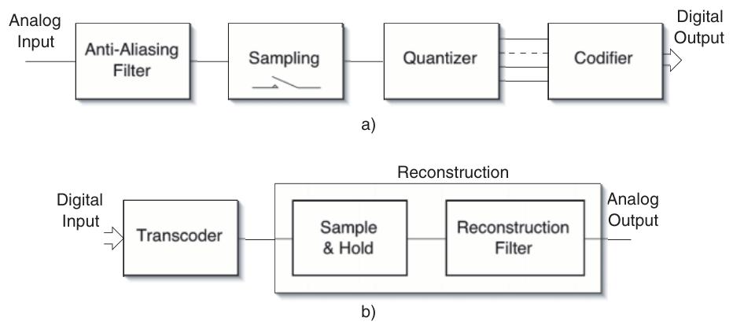
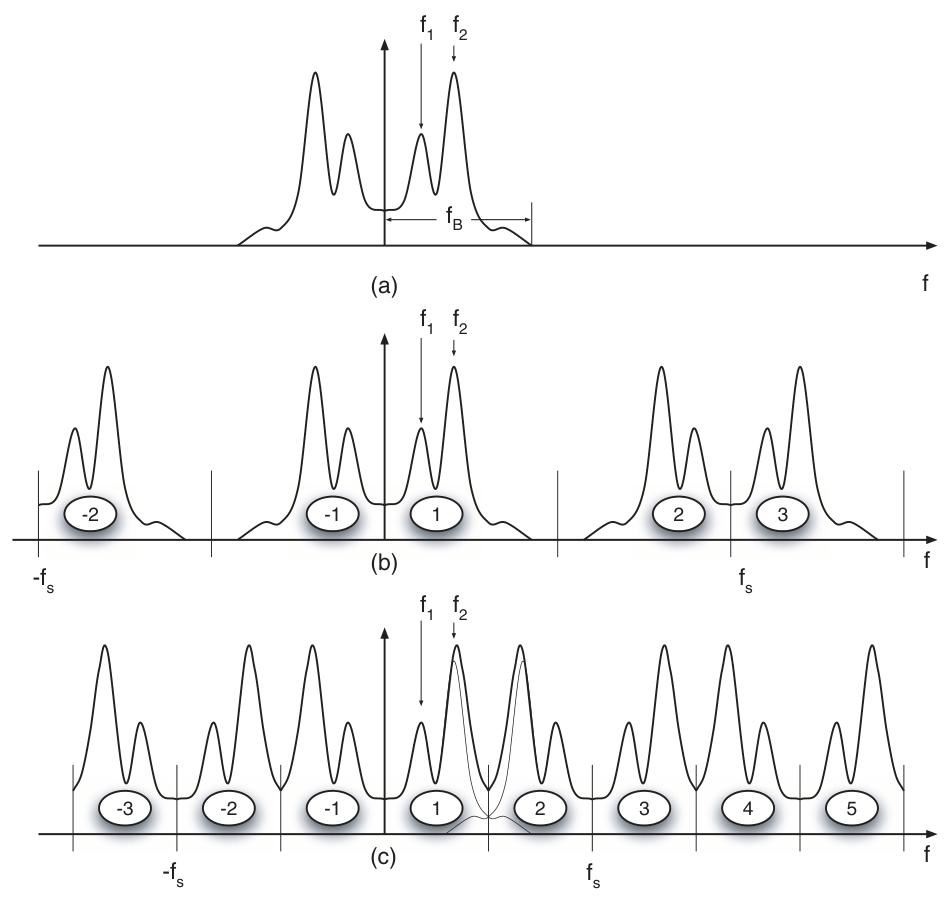
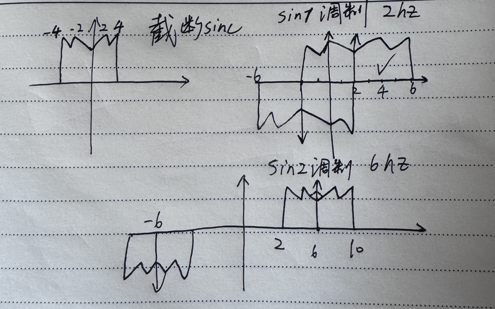
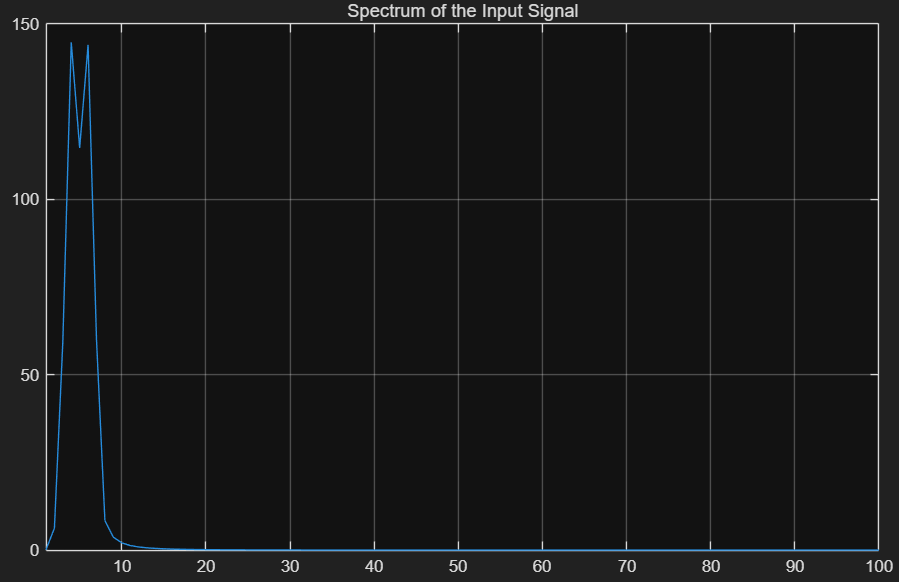
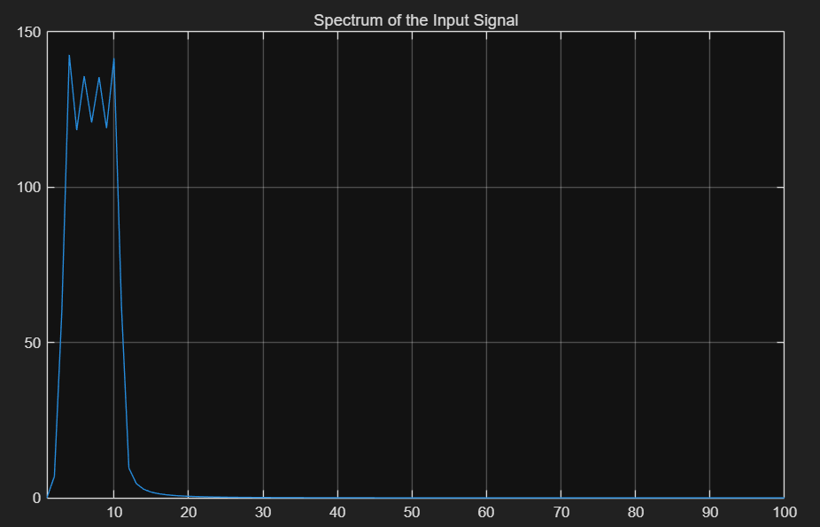
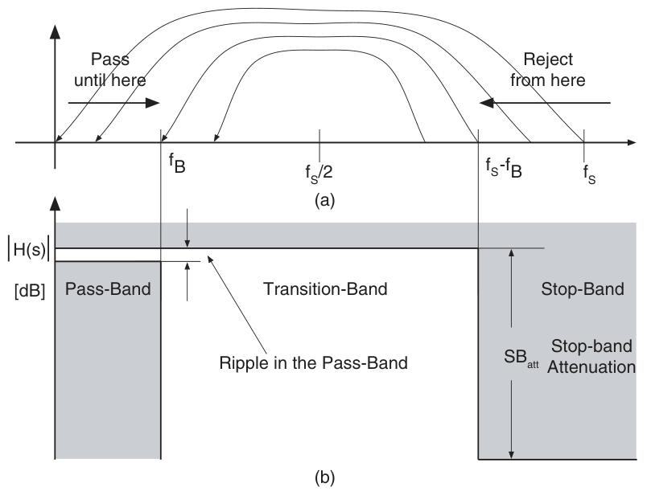
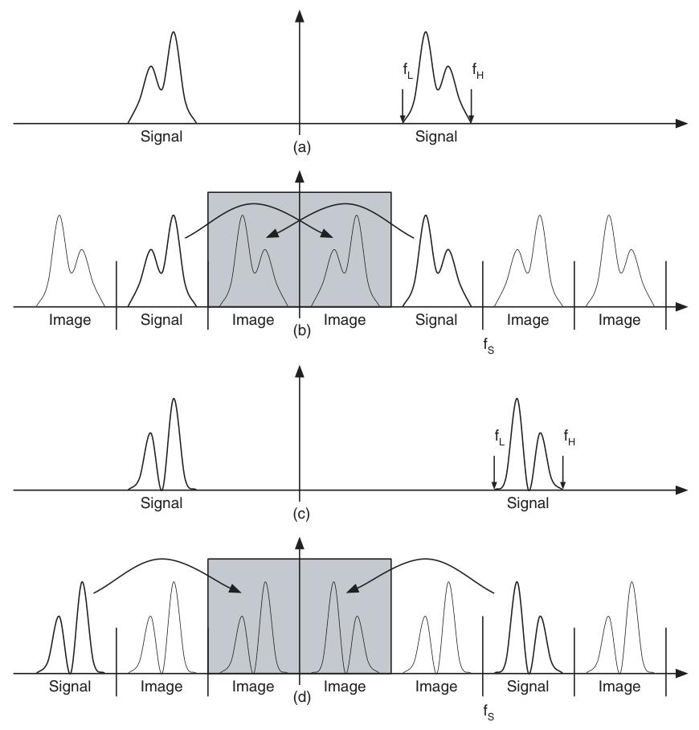
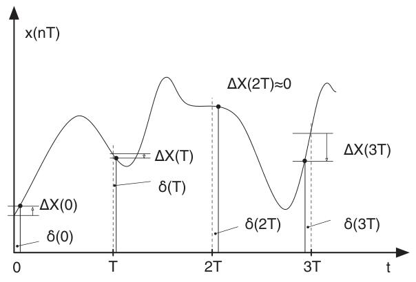
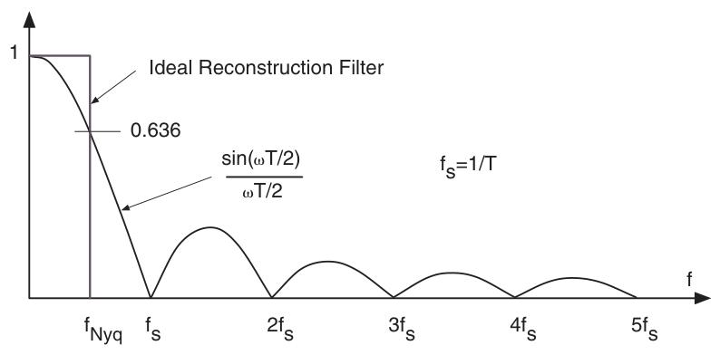

# Chapter1 AD/DA 理论基础
## 1.1 理想模型
模数转换是将**连续时间、连续幅度**信号转换为**离散时间、量化幅度**信号(a)
数模转换则相反，将数字信号还原为连续时间的模拟信号(b)

### 模数转换器（A/D Converter）
理想模数转换器可视为四个功能的级联
- 连续时间抗混叠滤波（Continuous-time anti-aliasing filtering）：去除输入信号中高于奈奎斯特频率的成分，避免采样时产生混叠失真。(低通滤波器)
- 采样（Sampling）：将连续时间信号转换为离散时间信号，即仅在特定采样时刻记录信号值。(Sampling and Hold)
- 量化（Quantization）：将连续幅度的采样信号转换为离散幅度，通过划分量化区间实现，会引入量化误差。(一把尺子)
- 数据编码（Coding）：将量化后的离散幅度用数字代码表示（如温度计码 二进制码）
 
### 数模转换器（D/A Converter）
- 代码转换阶段（transcoding stage）：将数字输入信号（如二进制代码）转换为等效的模拟信号。这一步是数字信号到模拟信号的直接转换，生成的模拟信号通常是离散时间的脉冲序列（即仅在采样时刻有值的信号）
- 重建阶段（reconstruction stage）：用于去除采样数据模拟信号中包含的高频成分，最终恢复出连续时间的模拟信号。
   - 重建过程分为两步：
采样保持：将离散的幅度转换为阶梯状幅度，使信号在每个采样周期内保持恒定值
    - 低通重建滤波器（low-pass reconstruction filter）：对阶梯波形进行平滑处理，滤除其中的高频分量，最终输出连续、平滑的模拟信号
## 1.2采样
  $\delta(t - nT)$ 是在时刻 nT（$n = 0, \pm1, \pm2, \cdots$）的 delta 函数，$x(t)$ 是原始连续时间信号
  $$x^*(t) = x^*(nT) = \sum_{n=-\infty}^{\infty} x(t)\delta(t - nT)$$
  

   做拉普拉斯变换得到
$$
\mathcal{L}\left[x^{*}(n T)\right]=\sum_{-\infty}^{\infty} X\left(s-j n \omega_{s}\right)=\sum_{-\infty}^{\infty} x(n T) e^{-n s T}
$$
采样后信号的频谱是输入信号频谱$X(s)$的无限复制，每个复制的中心位于$n\omega_s$（即采样频率的整数倍）处
原函数与无限脉冲delta函数相乘类似混频器，把原来的频率与无限个处于$n \omega_{s}$的采样频率相乘

图上分别为a原频谱 b奈奎斯特采样和c欠采样
**由于原函数必然存在非理想高频分量，不管采样频率多大都会造成高频混叠，所以做采样前要加低通滤波器（AAF）。做过采样，采样率很大可以把AAF设计得简单一些**

**书中1.4公式**
为了还原带限信号，时域卷积sinc函数，等于频域乘了一个门函数（带限为二分之奈奎斯特频率）
$x(t)=x^{*}(t) * h(t) = \left[ \sum_{n=-\infty}^{\infty} x(nT)\delta(t - nT) \right] * \text{sinc}\left( \frac{\omega_s t}{2} \right)$

$= \sum_{n=-\infty}^{\infty} x(nT) \cdot \left[ \delta(t - nT) * \text{sinc}\left( \frac{\omega_s t}{2} \right) \right]$
$= \sum_{n=-\infty}^{\infty} x(nT) \cdot \text{sinc}\left( \frac{\omega_s (t - nT)}{2} \right)$（delta函数的卷积平移性质）

**EX1.1 用混频器性质辅助看频谱**
原来的sinc函数频谱是一个2hz的矩形窗，截断之后相当于在时域上乘了一个矩形窗，频域上卷积了一个sinc函数。截断带来频谱泄露，变成一个2hz的尖峰和4hz的尖峰，4hz更高一点。
随后这个被截断的sinc函数受到四个sin函数的调制，这四个sin函数的频率其实是2 6 10 14hz（在matlab中采样为2048，而这四个sin函数分母为1024而非2048）
$$
\mathcal{F}\left\{ \sin(2\pi f_1 t) \right\} = \frac{1}{2j} \left[ \delta(f - f_1) - \delta(f + f_1) \right]
$$
受到sin调制，时域相乘，频域相卷积，与delta函数相卷积就是频移，原频谱产生频移。在正半轴产生一个幅度为正的，负半轴产生一个幅度为负的。
**同时，幅度变为原来二分之一**但由于加了窗函数，窗函数本身是类似低通滤波器的东西，它在频域中的主瓣宽，旁瓣小，但主瓣幅度 小于 1，所以会导致幅度损失（这可能也是为什么在matlab代码中把k4改成了1.2不是1）

这很好的解释了为什么收到sin1调制只有两个尖峰

sin2调制有4个尖峰 并且第四个尖峰频率为10hz

### 抗混叠滤波器
滤除高频杂散信号，避免其在采样时因混叠（折叠）进入感兴趣的信号频段（0~fB）

- fs/2 ~ (fs - fB) 的杂散折叠后落在信号频段（0~fB）之外，不干扰信号，非关键；
- (fs - fB) ~ fs 的杂散折叠后会进入信号频段（0~fB），必须被抑制，因此抗混叠滤波器的阻带衰减需从 (fs - fB) 开始生效
  
  fb到fs-fb的不会影响fb以内的信号，只有fs-fb到fs的杂散需要抑制。而高过fs的杂散已经几乎很少了
  
### 欠采样应用
对于某些中高频信号可以通过欠采样把信号折叠到第一奈奎斯特区，然后再进行处理。
类似中高频电路混频器

b信号在第二奈奎斯特区会折叠成原来频谱的镜像
d信号在第三奈奎斯特区会折叠成原来频谱的非镜像（跟原信号一个方向）

中高频欠采样系统也需要先做抗混叠滤波器，只是这时候不是低通而是带通
### 采样时间Jitter
由于时钟的不确定和采样动作本身与相位之间的延迟，会导致采样时刻偏离理想值，造成抖动

有正有负有平

对于正弦输入信号$X_{\text{in}}(t) = A \cdot \sin(\omega_{\text{in}} t)$
采样误差为：$\Delta X(nT) = A \cdot \omega_{\text{in}} \cdot \delta(nT) \cdot \cos(\omega_{\text{in}} nT)$ 相当于取微分dy

**建模与计算**
把jitter当作随机变量 白噪声 关注统计特性

抖动误差 $x_{\text{ji}}(t)$ 的功率推导：

$\langle x_{\text{ji}}(t)^2 \rangle = \langle [A \omega_{\text{in}} \cos(\omega_{\text{in}} nT)]^2 \rangle \cdot \langle \delta_{\text{ji}}(t)^2 \rangle$

因为$\langle \cos^2(\omega_{\text{in}} nT) \rangle = 1/2$

$\langle x_{\text{ji}}(t)^2 \rangle = \frac{A^2 \omega_{\text{in}}^2}{2} \cdot \langle \delta_{\text{ji}}(t)^2 \rangle$

信噪比SNR

$\text{SNR}_{\text{ji, DB}} = -20 \cdot \log\left( \sqrt{\langle \delta_{\text{ji}}(t)^2 \rangle} \cdot \omega_{\text{in}} \right)$
**频率越大，SNR越低；抖动时间越大，SNR越低**

**例子 snr=72db 20Mhz 2ps抖动**
$f = 20\,\text{MHz} = 20 \times 10^6\,\text{Hz}$
$\delta_{\text{rms}} = 2\,\text{ps} = 2 \times 10^{-12}\,\text{s}$
$2\pi f \delta_{\text{rms}} \approx 2 \times 3.14 \times 20 \times 10^6 \times 2 \times 10^{-12} \approx 2.512 \times 10^{-4}$
代入$\text{SNR}_{\text{dB}} \approx -20\log_{10}(2.512 \times 10^{-4}) \approx 72\,\text{dB}$
为了SNR不变，频率与抖动时间乘积需要不变
snr提升6db，抖动需要减小一倍

**EX1.2**
$P_s = \frac{A^2}{2} = \frac{1^2}{2} = 0.5\,\text{V}^2$

$P_n^{\text{total}} = \frac{P_s}{\text{SNR}} = \frac{0.5}{10^8} = 0.5 \times 10^{-8}\,\text{V}^2$

20% 预算分配给抖动
$P_n^{\text{jitter}}(20\,\text{MHz}) = 0.2 \times P_n^{\text{total}} = 0.1 \times 10^{-8}\,\text{V}^2$

任意频率 f 下的抖动噪声为：$P_n^{\text{jitter}}(f) = P_n^{\text{jitter}}(20\,\text{MHz}) \cdot \left( \frac{f}{20 \times 10^6} \right)^2$

## 1.3量化
量化把连续电平转成离散电平，就是一把尺子
n是位数
M是$2^n$
LSB是$V_{FullSwing}/M$
量化误差$-\Delta/2 \leq \varepsilon_Q \leq \Delta/2$（LSB中点代表区间值的情况）
**位数越多量化误差越小，但实际上位数很多的情况下，电路结构复杂，其他噪声会把量化噪声淹没**

量化误差被视为噪声
- 所有量化电平被等概率使用，能覆盖整个范围
- 量化器位数足够多
- 均匀量化步长：量化区间宽度一致
- 量化误差与输入信号不相关 **fs/fin为无理数，否则量化噪声会成周期性**
### 量化噪声计算
量化噪声功率谱密度
$$ P_Q = \int_{-\Delta/2}^{+\Delta/2} \varepsilon_Q^2 \cdot \frac{1}{\Delta} \, d\varepsilon_Q = \frac{\Delta^2}{12} $$

正弦波
$P_{\text{sin}} = (Δ \cdot 2^n)^2 / 8$
三角波
$P_{\text{trian}} = (Δ \cdot 2^n)^2 / 12$
正弦波信噪比
$\text{SNR}_{\text{sine(dB)}} = 10\log_{10}\left( \frac{\frac{(\Delta \cdot 2^n)^2}{8}}{\frac{\Delta^2}{12}} \right) = 6.02n + 1.78 \, \text{dB}$
三角波信噪比
$\text{SNR}_{\text{trian(dB)}} = 10\log_{10}\left( \frac{\frac{(\Delta \cdot 2^n)^2}{12}}{\frac{\Delta^2}{12}} \right) = 6.02n \, \text{dB}$
**过采样提升信噪比更新公式1.17**
由于采样频率大于信号带宽，量化噪声会均匀的分布在采样频率上，我们只需要取带宽内的就好，这可以减少量化噪声的总量，比上面的6.02n+1.78db信噪比可以高一些（上面的公式计算了所有的量化噪声）

量化噪声的总功率
$P_Q^{\text{total}} = \frac{\Delta^2}{12}$
功率谱密度为总功率除以奈奎斯特带宽
$S_Q(f) = \frac{P_Q^{\text{total}}}{f_s/2} = \frac{\Delta^2}{6f_s}$
信号带宽内的量化噪声功率
$P_Q^{\text{in-band}} = S_Q(f) \cdot B = \frac{\Delta^2 \cdot B}{6f_s}$
过采样率$OSR = \frac{f_s}{2B}$ 代入得到$P_Q^{\text{in-band}} = \frac{\Delta^2}{12 \cdot OSR}$
最后再利用正弦波功率计算信噪比
$\text{SNR} = 10\log_{10}\left( \frac{\frac{(\Delta \cdot 2^{\text{ENOB}})^2}{8}}{\frac{\Delta^2}{12 \cdot \text{OSR}}} \right) = 10\log_{10}(4^{\text{ENOB}}) +10\log_{10}\left( \frac{3}{2} \right)+ 10\log_{10}\left( \text{OSR} \right)=6.02n + 1.78 \, \text{dB}+10\log_{10}\left( \text{OSR} \right)$
**jitter影响ENOB**
公式1.21推导，书中应该忽略了1/2系数
对于振幅为A的正弦波
Jitter功率为$\langle x_{\text{ji}}^2 \rangle = \frac{1}{2}A^2 \omega_{\text{in}}^2 \cdot \sigma_{\text{ji}}^2=\frac{\pi^2}{2} X_{\text{FS}}^2 f_{\text{in}}^2 \sigma_{\text{ji}}^2$

$P_{\text{total}} = P_Q + \langle x_{\text{ji}}^2 \rangle = \frac{(X_{\text{FS}}/2^N)^2}{12} + \frac{\pi^2}{2} X_{\text{FS}}^2 f_{\text{in}}^2 \sigma_{\text{ji}}^2$

代入 ENB 修正后的表达式为

$\text{ENB} = \frac{10 \log\left( \frac{\pi^2}{2} f_{\text{in}}^2 \sigma_{\text{ji}}^2 + \frac{2^{-2N}}{12} \right) - 1.78}{6.02}$
**量化噪声单边谱密度比双边大一倍**

## 1.4热噪声
主要介绍了电阻的热噪声，功率谱密度是4KTR和频率无关
来源是电容开关，由一个mos管和电容C构成，mos管可以简化为导通电阻，输出的时候经过电容C，这是一个低通模型，这时候就和频率有关了
但恰巧把低通的噪声进行积分之后总功率是KT/C和频率又无关了
**例子1** 1pF 采样电容在室温下（$T\approx300K$）的噪声电压约为 64.5μV
**例子2** 如果热噪声等于量化噪声,那么噪声增加一倍，SNR变为原来0.707（功率开根号2），减小3db，少了半个LSB
**EX1.3**
书本算抖动噪声的时候应该是忽略了一个1/2系数，但是无所谓了，抖动噪声在这里太小了，不是一个量级。
## 1.5傅里叶变换 DFT
DFT公式1.31应该是
$$X(f_k) = \sum_{n=0}^{N-1} x(nT) e^{-j2\pi kn/N}$$
### 窗函数
由于截取的波形很难刚好是信号的整数周期倍，所以需要做窗函数避免频谱扩散
虽然有助于改善原信号的频谱，但他本质上是一种幅度调制

副作用
加窗虽减轻了首尾不连续性，但可能掩盖序列首尾的尖峰信号，仍然会导致一定的频谱泄漏。

相干采样（Coherent Sampling）
为避免泄漏，需确保采样窗口内包含 “整数个信号周期”（$k$ 个周期），且 $k$ 为质数（避免输出序列出现重复模式）。对于 $2^N$ 个样本的序列，信号频率需满足：

$$f_{\text{in}} = \frac{k \cdot f_s}{2^N} \quad$$

$k$ 为质数，$f_s$ 为采样频率
**EX1.4**
加窗后谱线更清晰，两谱线之间的能量接近归零，能明确区分两个信号的频率成分
加窗后信号的幅度降低，但两个正弦波的幅度比保持不变

FFT每条谱线对应一个 带宽为$f_s/N$（即谱线间隔）
点数加倍（N→2N），通道带宽减半（$f_s/N \to f_s/(2N)$），每个通道的噪声功率也减半，噪底降低 3dB
N 越大，处理增益越高，噪声基底越低
$x_{\text{noise}}^2|_{\text{dB}} = P_{\text{sign}} - 1.78 - 6.02 \cdot M - 10 \cdot \log(N/2)$

Page31/32
4096 点 FFT：处理增益较低，-80dB 的小信号被噪声基底（约 - 95dB）部分掩盖，难以分辨
32768 点 FFT：点数增加 8 倍，处理增益提升 9dB（10log (8)≈9dB），噪声基底降低，小信号可见

Process gain要足够大
一般FFT点数 $N_{\text{FFT}} \approx 2^{N + 4}$
对于12bit adc 这会带来 48db处理增益

## 1.6 数据编码
编码是 ADC 的最后一步功能，用于将量化后的模拟幅度转换为数字代码
常见的温度计码 二进制码（BTC）

## 1.7 D/A转换器
D/A转换器工作流程
-代码转换：第一阶段生成脉冲序列，每个脉冲的幅度对应数字代码的模拟值
-采样保持：脉冲序列经采样保持电路处理后，形成阶梯状波形
-滤波平滑：阶梯波包含大量高频成分（因跳变导致），需通过重建滤波器去除高频，将阶梯波平滑为连续的模拟信号

**理想重建**：传递函数在基带内（$-f_s/2 < f < f_s/2$）增益为 1（完整保留基带信号），在其他频率增益为 0
采样数据的频谱包含基带信号和无限多个 “镜像频谱”（由采样导致的高频复制），而目标是仅保留基带信号（$-f_s/2 \sim f_s/2$，$f_s$为采样频率），完全去除镜像。这需要一个低通滤波器
 
**实际重建**
- 采样保持电路
  等效为加了一个矩形窗
  对信号的影响
  - 幅度衰减：在奈奎斯特区间（$0 \sim f_s/2$）内，信号幅度随频率升高而衰减，奈奎斯特频率（$f_s/2$）处衰减至 0.636（对应 - 3.9dB）
  - 高频镜像残留：sinc 函数仅在采样频率整数倍（$kf_s$）处幅值为零，而相邻零点间的峰值衰减缓慢，导致高奈奎斯特区的信号镜像无法完全消除
  - 相位偏移：存在与频率成正比的相位误差
-  实际重建滤波器的补偿作用
   - 衰减高频镜像：与抗混叠滤波器类似，需对高奈奎斯特区的残留镜像进行强衰减，避免镜像干扰重建信号
   - 校正基带衰减：针对 S&H 的 sinc 特性导致的基带衰减，理想情况下需在信号带宽内模拟$x/\sin(x)$（sinc 的倒数）响应以补偿衰减
- 实际重建滤波器的设计
   - S&H 的 sinc 特性在靠近$kf_s$的频率处（如$f_s - f_B$）已有一定衰减，可计入重建滤波器的阻带指标。例如，若信号带宽为$f_s/20$，则在$f = 19f_s/20$处，sinc 衰减约 26dB，可降低对滤波器的阻带要求
  - 过渡带与滤波器阶数
   过渡带（$f_B$到$f_s - f_B$）的宽度影响滤波器阶数：过渡带越宽，阶数越低

**推导公式1.39 1.40**
S&H 的冲激响应 $ h(t) $ 是一个矩形脉冲：
$$
h(t) = 
\begin{cases} 
\displaystyle \frac{1}{\tau} & 0 \leq t < \tau \quad \text{（保持阶段）} \\
0 &
\end{cases}
$$
$$H_{\text{S\&H}}(s) = \int_{-\infty}^{\infty} h(t) e^{-st} dt = \int_{0}^{T} \frac{1}{\tau} e^{-st} dt$$
$$\int_{0}^{T} e^{-st} dt = \left[ \frac{e^{-st}}{-s} \right]_{0}^{T} = \frac{1 - e^{-sT}}{s}$$
代入$h(t)$的幅度$1/\tau$，得到：$$H_{\text{S\&H}}(s) = \frac{1}{\tau} \cdot \frac{1 - e^{-sT}}{s} = \frac{1 - e^{-sT}}{s\tau}$$

对分子变形$1 - e^{-j\omega T} = e^{-j\omega T/2} \cdot \left( e^{j\omega T/2} - e^{-j\omega T/2} \right)$
代入欧拉公式$e^{j\theta} - e^{-j\theta} = 2j\sin\theta$（令$\theta = \omega T/2$）
$1 - e^{-j\omega T} = e^{-j\omega T/2} \cdot 2j\sin\left( \frac{\omega T}{2} \right)$
$H_{\text{S\&H}}(j\omega) = \frac{e^{-j\omega T/2} \cdot 2j\sin\left( \frac{\omega T}{2} \right)}{j\omega \tau}$
进一步化简$H_{\text{S\&H}}(j\omega) = j\frac{T}{\tau} \cdot e^{-j\omega T/2} \cdot \frac{\sin\left( \frac{\omega T}{2} \right)}{\frac{\omega T}{2}} $

**EX1.5**
使用 64 点 “平顶函数”（经插值扩展为 1024 点）模拟带限信号
- 采样过程会导致信号频谱周期性复制（镜像生成）
当采样频率为$f_s/64$（对应频谱中的 bin#17）时，基带信号（原始低频成分）会在采样频率的整数倍（$k \cdot f_s/64$，$k=1,2,...$）附近生成镜像频谱
- S&H 对镜像的影响
   - 零点抑制：sinc 函数在采样频率（$f_s/64$）及其整数倍处取值为零（$\sin(k\pi)=0$）
   - 残留镜像：在采样频率整数倍之间的频率点信号未被完全消除
  
## 1.8 Z变换

