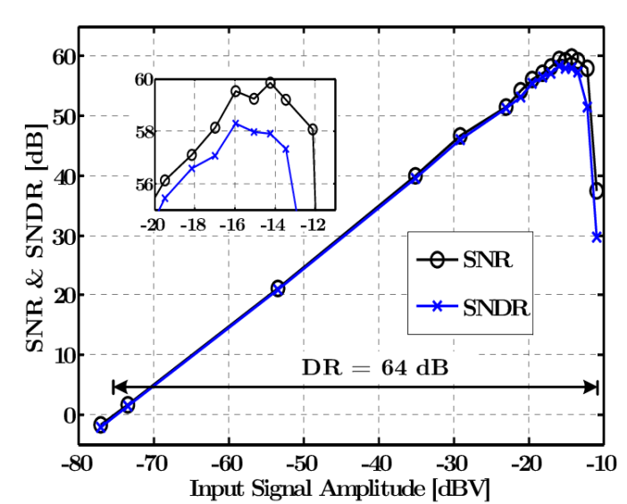
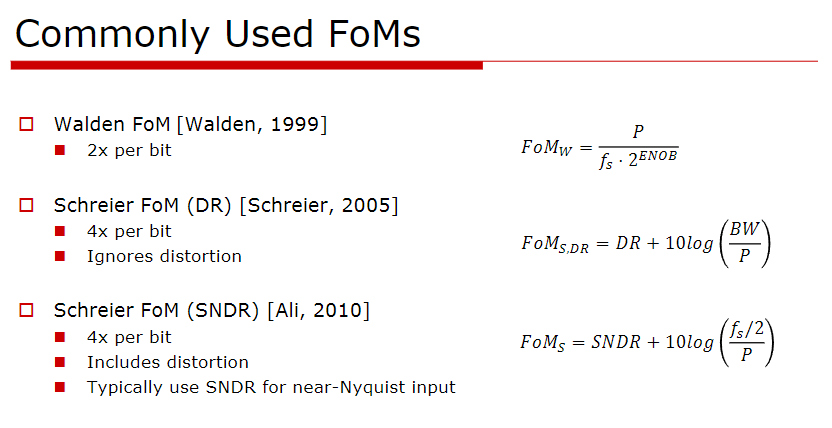

# Chapter2 数据转换器核心规格
## 数据转换器基本类型
- 奈奎斯特型
- 过采样型
区分两类转换器的核心指标是过采样率（Oversampling Ratio, OSR）\(\text{OSR} = \frac{f_s}{2f_B}\)
奈奎斯特速率型：设计目标是让输入信号占据奈奎斯特区间（\(0 \sim f_s/2\)）的大部分（因\(f_s \approx 2f_B\)），适合需要处理宽频信号的场景，但抗混叠滤波器设计复杂，且信号带内噪声较高
过采样型：输入信号仅占据奈奎斯特区间的小部分（因\(f_s \gg 2f_B\)），通过提高采样频率（增大 OSR），将大部分量化噪声 “推” 到信号带外（高频区域），再通过低通滤波器滤除，从而降低信号带内噪声；同时，抗混叠滤波器因过渡带宽，设计更简单，适合对噪声敏感的场景

## 数据转换器的运行条件

- 电源电压与温度，需要承受一定的波动
  **推导VDD变化对ADC的ENOB的影响**
  SNR的分子和分母的Vref随着VDD变化而改变，表面看起来Vref波动不会影响SNR。但实际上电源波动会影响输出，这与PSRR有关，VDD波动越大，输出电压变化带来的噪声越大；PSRR越大，输出电压变化带来的噪声越小
- PCB 设计直接决定转换器能否发挥标称性能
   - 双层板仅适合低频场景；
   - 高频应用需用多层板，以保证信号完整性（减少干扰、阻抗匹配）
- 时钟与参考电压

## 一般特性
1. 模拟输入 / 输出信号形式，单端信号，伪差分信号，差分信号
   - 由于差分信号能更好的遏制共模噪声，相比伪差分信号噪声更小，SNR更好
   - 差分信号是两个信号之差，最大可以达到Vref+ - Vref-，摆幅更大
2. 分辨率
3. 动态范围（Dynamic range）转换器能处理的最大信号电平与噪声电平的比值，单位为 dB。决定转换器的最大信噪比
 DR = 信号最⼤不失真输入功率 - 噪底功率
 
5. 绝对最大额定值
6.  ESD（静电放电）
   人体放电模型HBM: 1/2/4/8kV
机器放电模型MM: 100/200/400V
带电器件模型CDM: 500/1000V
7. 引脚
8. 上电时间
9.   漂移，指定温度或电压范围内的变化量。常用指标：温度系数漂移：单位为 ppm/℃；电压系数漂移：单位为 ppm/V

## 静态特性
静态规格描述数据转换器在直流或极低频输入下的性能
- 模拟分辨率（Analog Resolution）
对应 1 个 LSB 数字码变化的最小模拟输入增量
- 模拟输入范围（Analog Input Range）：
单端输入：信号以地为参考；差分输入：信号为两个输入端的差值
- Offset
ADC：输入为理想零信号（如 0V）时，输出数字码与理想全零码（0…0000）的偏差
DAC：输入为 理想全零码（0…0000） 时，输出模拟信号与 “理想零电平” 的偏差
- Zero Scale Offset
  全零码→第一个非零码（0…0001）” 的跳变应发生在 1/2 LSB 处
- Full Scale Error
  理想情况下，最后一个码跳变（如从 111…110→111…111）应发生在 \(V_{\text{ref+}} - 1/2\ \text{LSB}\) 处（满量程前的量化区间中点）
-  Common-mode Error
    当两个输入端的  共模电压（\(V_{\text{cm}} = \frac{V_{\text{in+}} + V_{\text{in-}}}{2}\)）变化时，即使差分电压（\(V_{\text{in+}} - V_{\text{in-}}\)）不变，输出码仍会变化。该变化量（通常以 LSB 计）即为共模误差
- Gain Error 表现为斜率变化，台阶宽度整体缩放，截距不变，满量程端点偏差
- DNL 微分非线性
  单个量化区间的实际宽度与 **理想宽度（Δ，即 1 LSB）** 的偏差 
  DNL ≥ -1 LSB：保证单调性（输入增大时，输出码必增大，无失码）。DNL < -1 LSB：对应量化区间宽度 \(\Delta_r(k) < 0\)，导致失码
- INL 积分非线性 传输曲线与理想拟合直线的最大偏差
  \(\text{INL}(k) = (1+G) \sum_{i=1}^k \text{DNL}(i)\)
G 是Gain error
INL 越大，传输曲线越弯曲，谐波失真越严重
\( V_{\text{out}} = V_{\text{in}} \left(1 + \text{INL}(\text{LSB})\right) \)
\( \text{ENOB} = N - \max(|\text{INL}|) \)
## 动态特性
动态规格描述数据转换器在高频、高速场景下的性能，围绕频率响应
- 模拟输入带宽
ADC 输入满量程信号时，输出重建信号比低频值衰减 3 dB 对应的频率
- 输入阻抗
  低频：理想情况下，电压输入 ADC 的输入阻抗→∞；电流输入 ADC 的输入阻抗→0。高频：输入阻抗由寄生电容主导
若 ADC 采用开关电容采样，输入阻抗表现为等效负载电容
高速 ADC需外部匹配网络（如 50 Ω 终端电阻）
- 建立时间（Settling - time）
数模转换器（DAC）的阶跃响应进入并随后保持在其最终值周围指定误差带内的时间
  - 充电过程中，采样电容两端的电压\(V_C(t)\)随时间的变化遵循 RC 充电规律：\(V_C(t) = V_{in} \cdot \left(1 - e^{-t/\tau}\right)\)其中，\(\tau = R_{on} \cdot C_s\)为 RC 时间常数，所以电容越大，建立时间越大
  - 用RC电路来建模，开关电容的热噪声就是\(\langle v_n^2 \rangle = 4kTR \)但在采样过程中，最终表现为kT/C 
  - 1 如果电容过小，会通过开关电阻泄露\(\tau = R_{on} \cdot C_s\)；2 同时实际开关存在寄生电容（如栅 - 源电容\(C_{gs}\)），当开关关断时，寄生电容上的电荷会注入到采样电容\(C_s\)中，引起采样电压的偏移：\(\Delta V = \frac{\Delta Q}{C_s} = \frac{C_{gs} \cdot \Delta V_{gate}}{C_s}\)；3 而且结合第二点电容小了，热噪声会变大
- 串扰（Cross - talk）
  由于并行的走线或者走线间距过小会造成串扰，产生寄生电感电容。在IC层面和PCB层面都会
- aperture uncertainty（时钟抖动，Clock Jitter）
- 数模毛刺脉冲（Digital to Analog Glitch Impulse）定义：当数字输入改变状态时，从数字输入注入到模拟输出的信号量。最大值通常出现在半量程，此时 DAC 在最高有效位（MSB）附近切换，许多开关改变状态，即从\(01···11\)变为\(10···00\) 
- 毛刺功率（Glitch Power）
-  等效输入噪声（Equivalent Input Referred Noise）
当输入恒定直流信号时，输出数字码并非固定值，而是围绕理论值呈现高斯分布（大量采样后形成直方图），该分布的标准差即为等效输入噪声。
通常以 LSB 或 均方根电压（rms Voltage） 表示。
图 2.11：某 ADC 的噪声为 0.63 LSB，即直流输入时，输出码在理论值 ±0.63 LSB 范围内波动，直方图呈现以理论码为中心的高斯分布
   - ADC:对于⼀固定dc输入，多次测量其输出，得到的样本分布近似服从⾼斯分布，该分布的标准差为等效噪声
   - DAC:输入⼀固定数字，多次测量得到的的模拟输出，该输出应服从⾼斯分布，求其标准差，得到DAC的等效噪声
- 信噪比（Signal-to-Noise Ratio, SNR）
输入信号功率（通常为正弦波）与总噪声功率的比值
总噪声包括：量化噪声；电路噪声
- 信号噪声失真比（Signal-to-Noise-and-Distortion Ratio, SINAD/SNDR）
与 SNR 的核心区别：SNR 仅包含噪声（量化噪声 + 电路噪声），而 SINAD额外计入非线性失真产生的谐波分量（如二次、三次谐波），相比SNR高频下降明显
- 动态范围（Dynamic Range）
当 SNR（或 SINAD）降至0 dB时的输入信号幅度，即 “信号功率 = 总噪声 + 失真功率” 时的信号水平。
-  有效位数（Effective Number of Bits, ENOB）
  \(\text{ENOB} = \frac{\text{SINAD (dB)} - 1.76}{6.02}\)
- 谐波失真（Harmoic Disortion）
  HD 是输入信号的基波均方根（RMS）值与所有谐波分量（含混叠项）RMS 值之和的比值
  \(\text{HD} = 20 \log_{10} \left( \frac{\sqrt{\sum_{n=2}^{10} V_{n,\text{RMS}}^2}}{V_{\text{基波,RMS}}} \right) \quad (\text{dBc})\)
  例子 \(f_{\text{in}} = 250\ \text{MHz}\)、\(f_s = 100\ \text{MHz}\) 时，二次谐波 \(500\ \text{MHz}\) 会混叠到 \(500 - 5 \times 100 = 0\ \text{MHz}\)（直流分量）
  **EX2.2**
  输入序列含\(2^{14}=16384\)个点，\(f_s = 16384\ \text{Hz}\)
  \(f_{\text{in}}=671\ \text{Hz}\) 第 10 次谐波：\(10 \times 671 = 6710\ \text{Hz}\)，低于奈奎斯特频率（8192 Hz），无混叠
  \(f_{\text{in}}=1.711\ \text{kHz}\) 第 5 次谐波：\(5 \times 1711 = 8555\ \text{Hz}\);第 6~9 次谐波：均超过 8192 Hz，折叠 1 次;第 10 次谐波：\(10 \times 1711 = 17110\ \text{Hz}\)，折叠 2 次
- 总杂散失真（TSD） 
  ADC 输出频谱中所有杂散分量的均方根和
- 无杂散动态范围（SFDR）
  输入信号的均方根幅度与第一奈奎斯特区（0~fₛ/2）内最强杂散分量的均方根值之比
  大信号输入时，最强杂散通常是信号的谐波（如三次谐波）；
小信号输入时，非谐波杂散（如电路噪声、干扰）可能成为最强杂散
dBc：相对于信号幅度，随输入幅度增大线性上升（信号越强，杂散相对信号的比例越稳定）；
dBFS：相对于满量程，通常与输入幅度无关（杂散的绝对强度固定）
- 互调失真（IMD） 当输入为复杂信号（含多个正弦波）时，数据转换器的非线性特性会导致不同频率分量相互作用，产生额外的杂散频率分量（称为互调产物），这种失真即为 IMD
非线性不仅会扭曲单一正弦波（产生谐波），还会让多个正弦波的频谱分量 “混合”，生成输入频率整数倍的和频（如\(f_1 + f_2\)、\(2f_1 + f_2\)）与差频（如\(f_1 - f_2\)、\(2f_1 - f_2\)）分量
- 双音互调失真（Two-tone IMD）
输入两个频率接近的正弦波\(f_1\)和\(f_2\)（如\(f_1 = 1\ \text{MHz}\)，\(f_2 = 1.1\ \text{MHz}\)）
重点关注三阶互调产物，即频率为\(2f_1 - f_2\)和\(2f_2 - f_1\)的杂散（如\(2×1 - 1.1 = 0.9\ \text{MHz}\)，\(2×1.1 - 1 = 1.2\ \text{MHz}\)）。这两个频率与原始信号\(f_1\)、\(f_2\)接近（因\(f_1 \approx f_2\)），难以通过滤波去除；其他高阶互调产物（如\(3f_1 - 2f_2\)）频率远离原始信号，可在数字域滤除
此外，谐波产生的spur会降低sfdr
- 多音功率比（MTPR）
用于衡量多音传输系统的失真程度
测量信号：由一系列等幅单音（幅度\(A_0\)） 组成，频率为基频\(f_0\)的整数倍（如\(f_0, 2f_0, 3f_0, ...\)），但故意留出少数缺失单音（即特定频率位置无信号）
失真表现：转换器的非线性（谐波失真）会在 “缺失单音的频率位置” 产生干扰信号
\(\text{MTPR} = \frac{\text{单音信号的均方根幅度}(A_0)}{\text{缺失位置干扰信号的均方根幅度}}\)
MTPR 越高，说明失真对缺失信道的影响越小
- 噪声功率比（NPR）
用于评估频分复用（FDM）链路中 ADC 的线性性能
FDM 系统的信号由多个不同幅度、相位的载波组成，整体频谱类似经带通滤波的白噪声
移除其中一个信道，使频谱在该信道频率处形成一个深凹槽
用该信号激励 ADC，转换器的噪声（量化噪声、热噪声）和互调失真（IMD）会 填充凹槽
凹槽填充后的深度即为 NPR
   - 低输入电平：凹槽主要由量化噪声和热噪声填充，NPR 基本稳定（噪声与输入功率无关）
   - 高输入电平：ADC 饱和与失真主导，凹槽被严重填充，NPR 快速下降
   - 与分辨率相关：分辨率越高（如 12 位 vs 10 位），NPR 越好（凹槽更深），因量化噪声更低
-  有效分辨率带宽（ERBW）
当输入信号频率升高时，SINAD（信号噪声失真比）相对于低频值下降 3 dB 时对应的模拟输入频率
ERBW 应远高于奈奎斯特频率（\(f_s/2\)），以保证在奈奎斯特带宽内，SINAD 不会因频率升高而明显下降（避免高频信号失真）
例如：某 ADC 的奈奎斯特频率为 50 MHz，若 ERBW 为 150 MHz，说明其在 0~100 MHz 带宽内 SINAD 下降不超过 3 dB，可可靠处理高频信号
测试方法：⽤⼀个频率可变的⾼精度信号源输出⼀系列幅度相同但是频率不同的正弦信号。⽤同⼀个ADC转换这⼀系列正弦信号，并对转换结果做FFT，当转换结果的PSD下降3dB时，对应的频率极为
ERBW
-  品质因数（FoM）
衡量 ADC功率效率的参数，反映在特定分辨率和带宽下的功耗水平
其核心公式基于总功耗（\(P_{\text{Tot}}\)）、等效位数（ENB）和信号带宽（BW）：\(\text{FoM} = \frac{P_{\text{Tot}}}{2^{\text{ENB}} \cdot 2 \cdot \text{BW}} \quad \)单位：通常为pJ/conv-step（皮焦 / 转换步）
数值越低，功率效率越高

## 数字与开关特性
1. 逻辑电平（Logic levels）
2. 编码速率 / 时钟速率（Encode or clock rate）
最佳工作频率为规格书中最大时钟速率的25% 左右，可避免高频下的性能恶化
3. 时钟时序（Clock timing）
外部时钟经内部边沿触发触发器（上升沿或下降沿）再生，用于锁存输入信号；
50% 占空比通常为最优选择
4. 时钟源（Clock Source）
通常由晶体振荡器生成，确保正弦波纯度和精准过零点；
正弦波经内部放大器（饱和状态）整形为方波，生成内部时钟。
5. 休眠模式（Sleep Mode）
关闭主偏置电流以最小化功耗的掉电模式，通过特定引脚的逻辑电平激活。
