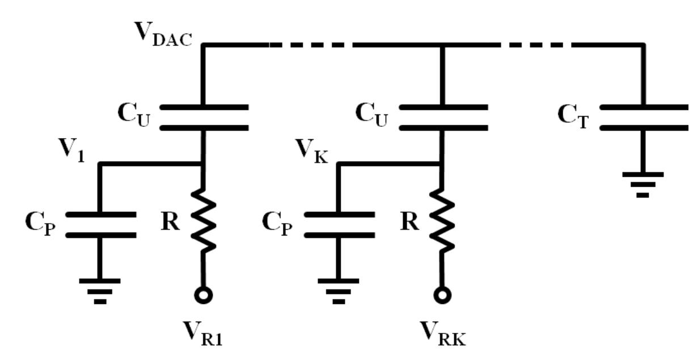

---------------------------

电路模型：每个单元上极板为 $ V_{DAC} $，下极板为 $ V_k $。单位电容为 $ C_u $，顶板寄生为 $ C_T $

### 1.对顶板写 KCL
$$
\sum_{k=1}^{n} C_u (\dot{V}_{DAC} - \dot{V}_k) = -C_T \dot{V}_{DAC}
$$

把左边展开：

$$
n C_u \dot{V}_{DAC} - C_u \sum_{k=1}^{n} \dot{V}_k = -C_T \dot{V}_{DAC}
$$

把含 $ \dot{V}_{DAC} $ 的项合并得到：

$$
C_u \sum_{k=1}^{n} \dot{V}_k = n C_u \dot{V}_{DAC} + C_T \dot{V}_{DAC} = n C_u (1 + \alpha_T) \dot{V}_{DAC}
$$

其中 $ C_T = n \alpha_T C_u $
两边除以 $ C_u $ 

$$
\sum_{k=1}^{n} \dot{V}_k = n (1 + \alpha_T) \dot{V}_{DAC} \tag{1}
$$
积分得
$$
\sum_{k=1}^{n} V_k = n(1 + \alpha_T) V_{DAC} - M\tag{2}
$$
其中 $ M $ 是积分常数（与初始条件有关）
**顶板寄生按比例把底板电压变化分配到VDC上**

### 2.底板做 KCL

$$
RC_u (\dot{V}_{DAC} - \dot{V}_k) = RC_P \dot{V}_k + (V_k - V_{Rk})
$$

对 $ k  $ 求和

**左边**:
$$
RC_u \sum_{k=1}^{n} (\dot{V}_{DAC} - \dot{V}_k) = RC_u \left( n \dot{V}_{DAC} - \sum_{k=1}^{n} \dot{V}_k \right)
$$

**右边**:
$$
RC_P \sum_{k=1}^{n} \dot{V}_k + \sum_{k=1}^{n} (V_k - V_{Rk})
$$

把两边相等，整理
$$
\dot{V}_{DAC} = \frac{1}{n} \sum_{k=1}^{n} \left[ (1 + \alpha_P) \dot{V}_k + \frac{V_k - V_{Rk}}{RC_u} \right]\tag{3}
$$

 $ C_P = \alpha_P C_u $
**底板的寄生影响了顶端变化速率**

### 3.将(1) (2) 代入(3)
$$
\dot{V}_{DAC} = \frac{1}{n} \left[ (1 + \alpha_P)n(1 + \alpha_T)\dot{V}_{DAC} + \frac{n(1 + \alpha_T)V_{DAC} - M - \sum V_{Rk}}{RC_u} \right]
$$

两边乘以 $ n $：
$$
n\dot{V}_{DAC} = (1 + \alpha_P)n(1 + \alpha_T)\dot{V}_{DAC} + \frac{n(1 + \alpha_T)V_{DAC} - M - \sum V_{Rk}}{RC_u}
$$

将含 $ \dot{V}_{DAC} $ 的项移到左侧：
$$
n\left[1 - (1 + \alpha_P)(1 + \alpha_T)\right]\dot{V}_{DAC} = \frac{n(1 + \alpha_T)V_{DAC} - M - \sum V_{Rk}}{RC_u}
$$

**左侧系数的变形**
计算系数 $ 1 - (1 + \alpha_P)(1 + \alpha_T) $：
$$
1 - (1 + \alpha_P)(1 + \alpha_T) = -(\alpha_P + \alpha_T + \alpha_P \alpha_T) = -(1 + \alpha_T)\left( \alpha_P + \frac{\alpha_T}{1 + \alpha_T} \right)
$$

**整理为一阶线性微分方程**
将负号移到右侧并整理，定义时间常数：
$$
\tau \equiv RC_u \left( \alpha_P + \frac{\alpha_T}{1 + \alpha_T} \right)
$$

最终得到一阶线性微分方程：
$$
\tau \dot{V}_{DAC} + V_{DAC} = \frac{1}{n(1 + \alpha_T)} \left[ M + \sum_{k=1}^{n} V_{Rk} \right]
$$

### 4. 求解微分方程
设 $ C_0 \equiv \frac{1}{n(1+\alpha_T)} \left[ M + \sum V_{Rk} \right] $，则 ODE 为
$$
\tau \dot{V} + V = C_0
$$

通解
$$
V_{DAC}(t) = C_0 + \left( V_{DAC}(0) - C_0 \right) e^{-t/\tau}
$$

$$
\Delta V_{DAC}(t) = \Delta V_{DAC}(\infty) \left( 1 - e^{-t/\tau} \right), \quad \Delta V_{DAC}(\infty) = \frac{x}{n(1 + \alpha_T)} \Delta V_X 
$$

DAC 输出对底板参考电压的阶跃变化呈现一阶 RC 充放电的指数特性

### 5. ½LSB 收敛时间
在时间 $ t_{\text{settle}} $ 时，DAC 输出与最终值的误差 ≤ $ \frac{1}{2} $ LSB
**顶板寄生电容 $ \alpha_T $ 会衰减 LSB 的有效幅度**，因此有效 LSB为 $ \frac{V_{FS}}{2n(1 + \alpha_T)} $

$$
\Delta V_{DAC}(\infty) - \Delta V_{DAC}(t_{\text{settle}}) \leq \frac{V_{FS}}{2n(1 + \alpha_T)} 
$$

$$
\frac{x}{n(1 + \alpha_T)} \cdot \frac{V_{FS}}{2} \cdot e^{-t_{\text{settle}}/\tau} \leq \frac{V_{FS}}{2n(1 + \alpha_T)}
$$

$$
 t_{\text{settle}} \geq \tau \ln x 
$$

### 6.取最坏情况
最坏情况（最长建立时间）出现在切换电容数 $ x $ 最大时

对于文中假设的split array 
第一次切换（ MSB 决策）时，每半阵中被切换的单位电容数最多，为 $ x_{\text{max}} = 2^{N-2} $

$$
t_{\text{settle,min}} = \tau \ln(2^{N-2}) = \tau (N - 2) \ln 2 
$$
$$
\tau \equiv RC_u \left( \alpha_P + \frac{\alpha_T}{1 + \alpha_T} \right)
$$