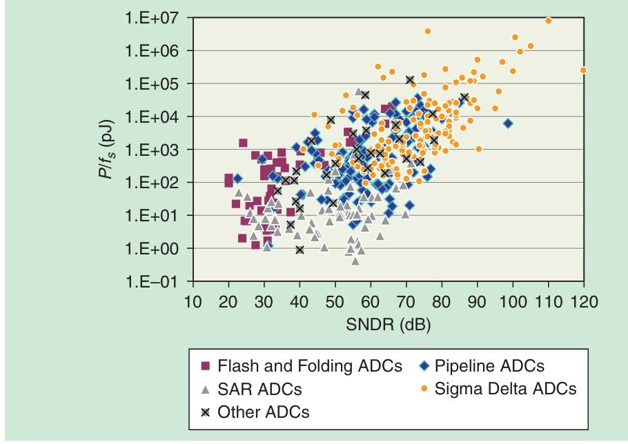
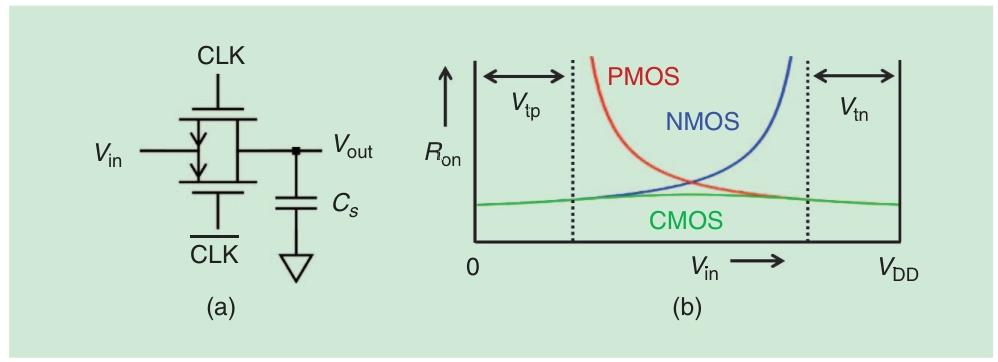
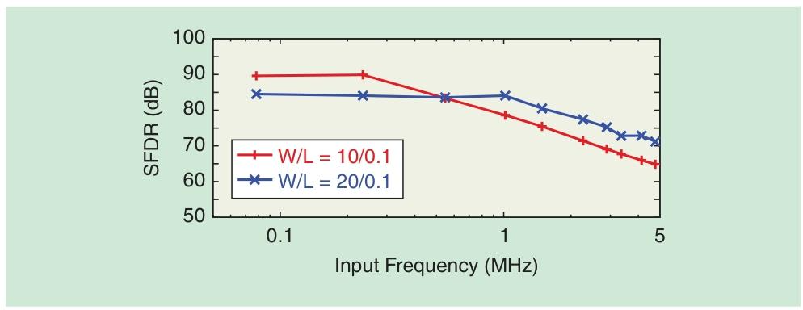
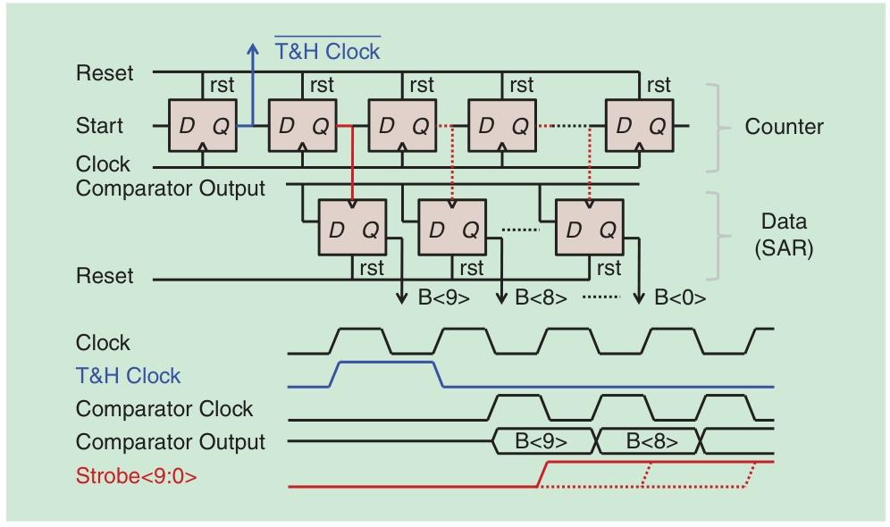
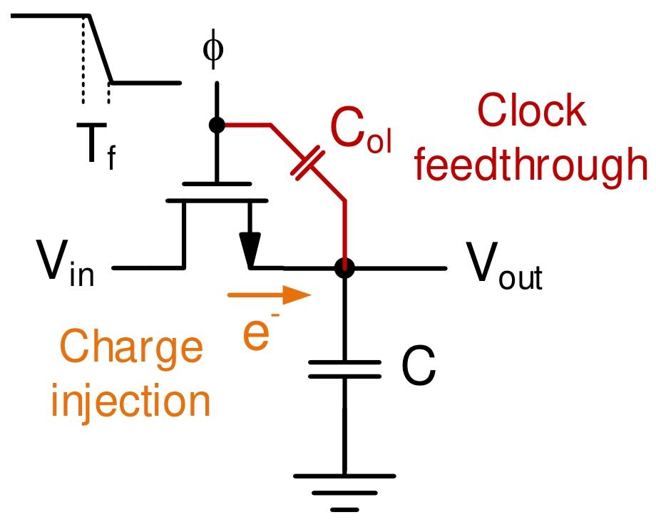

# 总览

sar adc在中精度40-70db SNDR功耗很低
同时采用时间交织技术可以达到90GS/s
# T/H
- 跟踪（Track）：时钟高电平时，开关导通，电容跟着输入信号$V_{in}$变
- 保持（Hold）：时钟低电平时，开关断开，电容电压冻结，供后续 N 步比较用

硬件实现
- 开关 + 电容，单端（1 个开关 + 1 个电容）或差分（2 组，抗干扰）
- 电容复用——T&H 的采样电容不用额外加，直接用 DAC 的电容阵列（比如 DAC 的$4C_u+2C_u+C_u$，既存输入信号，又生成参考电压），省面积省功耗
  
## 问题
1. 开关导通电阻$R_{on}$
   $\tau=RC$会影响速度，并且nmos只能传低电压，于是出现互补mos（传输门）开关，但是Ron还是会变
   
   - 时钟升压：把开关栅压升到 2$V_{dd}$
   - 自举：栅压随$V_{in}$变
2. 电荷注入
   - 减小电容
   - dummy电容进行补偿
   - 下级版采样
3. 采样噪声
   - 加大电容

- 低频段由电荷注入影响
- 高频段由Ron影响
- 尺寸加大，高频特性变好（Ron变小）；但是低频特性变差，电容存储的电荷变多了

4. 时钟Jitter
   对于时间交织以及高频ADC特别致命

5. 保持阶段的非理想
   - 漏电
   - 电容耦合

# DAC
一个差分输入单调切换开关dac的例子
$V_{dd}=1V$，$V_{in+}=0.6V$，$V_{in-}=0.4V$（差模0.2V）
1. 第1步：$V_{out+}=0.6V>V_{out-}=0.4V$，最高位=1，切$b_2$到$V_{dd}$，$V_{out-}$升0.5V→0.9V；
2. 第2步：$V_{out-}=0.9V>V_{out+}=0.6V$，中间位=0，切$a_1$到$V_{dd}$，$V_{out+}$升0.25V→0.85V；
3. 第3步：$V_{out-}=0.9V>V_{out+}=0.85V$，最低位=0，切$a_0$到$V_{dd}$，$V_{out+}$升0.125V→0.975V；
4. 第4步：$V_{out+}=0.975V>V_{out-}=0.9V$，超量程位=1，最终码=1001（4位）
最终结果1001，1是符号位剩下001代表0.125V

总电容$C_s$特性 |噪声的影响|对失配的影响 | 对速度的影响|对功耗 / 面积的影响
---|---|---|---|---|
增大$C_s$|有利：电容热噪声与$\sqrt{1/C_s}$成正比，$C_s$越大，噪声越小|有利：电容的 “相对失配”（实际偏差 / 理想值）随$C_s$增大而减小（大电容对工艺波动更不敏感）|不利：RC 时间常数$\tau=R_{on}C_s$增大，稳定变慢，限制采样率|不利：电容面积增大，充放电能量（$0.5C_sV_{dd}^2$）增多，功耗上升

## 最大问题：电容失配
- 共质心
- dummy电容
- 采用 “边缘电容（Fringing Capacitance）” 设计（Figure 12），实现极小单位电容（如 0.5fF）
- 校准（Calibration）,通过算法测量电容失配量，再用 “并联小校准电容” 修正
- 过采样 + 噪声整形
- 斩波 + 抖动（Chopping+Dithering）

# 比较器
前置放大 + 锁存器 的两级架构

非理想性
1. 噪声：导致 “误判”（比特错误率 BER）
建模特殊：输入是模拟信号，输出是数字信号，因此噪声需同时用 “输入参考噪声（$P_{n,\text{cmp}} [\text{V}^2]$” 和 “输出误码率（BER）” 
$P_1 = \frac{1}{2} + \frac{1}{2}\text{erf}\left( \frac{V_{in}}{\sqrt{2P_{n,\text{cmp}}}} \right)$
当$V_{in}$很大（正 / 负），$P_1 \approx 1$或0，噪声几乎不导致误判
当$V_{in} \approx 0$（输入接近平衡），噪声会显著提高 BER，成为误差源

前置放大器的负载电容决定噪声性能（$P_{n,\text{cmp}} \propto \frac{1}{\text{负载电容}}$），但负载电容越大，功耗也越高，速度也越慢
2. 速度：必须在小输入幅度下验证比较器速度，确保亚稳态导致的错误概率足够低。

# Logic

- 低要求场景：用标准数字单元（比如触发器、与门），省事
- 高要求场景（低功耗/高速）：定制异步逻辑，比如手动画触发器，减少冗余动作（省功耗）
  
# 系统级
1. 噪声
   - 低分辨率ADC（比如8位）量化噪声（位数少，猜不准的误差大）         
   - 高分辨率ADC （比如12位）热噪声为主 
2. 线性度
线性度由 “线性误差” 和 “非线性误差” 共同决定，两者影响截然不同
   - 线性误差（偏移、增益误差）：
比较器、DAC、T&H 的偏移 / 增益误差，仅导致整体输入偏移或增益缩放（如输入 1V 输出码偏 0.1V，或整体放大 1.1 倍），不产生失真。因此，这类误差通常可忽略，或通过数字校准简单补偿。
   - 非线性误差（失真）：
由 T&H 的失真（电荷注入、电容耦合）或 DAC 失配导致，会直接让 ADC 传输曲线 “偏离理想直线”，产生谐波失真（如 SFDR 下降）。这类误差无法通过简单校准消除，是高线性度设计的核心难点
3. 速度
   - 同步sar
   - 异步sar
4. 功耗
   - 数字模块功耗：随分辨率N 线性增长
   - 模拟模块功耗：
受噪声限制，随 SNR 指数增长（每提高 1 位分辨率，SNR 需提升 6dB，模拟功耗约需翻 4 倍）
5. 面积
   DAC 是 SAR 中面积最大的模块

# 前沿趋势
1. **时间交织SAR**：64个SAR一起工作，总采样率=64×单个SAR速率（比如90 GS/s的设计）
2. **流水线SAR**：把SAR当流水线的“每一级”，每级猜几位，整体又快又准；
3. **噪声整形SAR**：学sigma-delta ADC的“把噪声赶到高频”，让基带信号更干净，解决“准”的问题；
4. **超低功耗SAR**：比如1nW的10位ADC（比手机待机还省），用小电容、异步逻辑、亚1V供电，适合可穿戴设备。
--------------
# 问题：
 
<!-- height="200" 表示高度为 200 像素，宽度会自动按比例缩放 -->
文章说，低频SFDR受上级版采样电容charge injection影响

我从网上找了清华的课件
 
<!-- height="200" 表示高度为 200 像素，宽度会自动按比例缩放 -->
说这个分为Slow Gating和Fast Gating
Slow Gating的时候以时钟馈通为主，是线性误差
Fast Gating的时候以电荷注入为主，是非线性误差

但是文章中只说了低频的时候受电荷注入影响，没说时钟馈通，这是因为时钟馈通这里的线性误差其实对sfdr没什么影响吗？

能否大体理解为：
- 线性误差 → 改变DC和幅度

- 非线性误差 → 产生谐波/杂散→ SFDR

- 噪底 → 量化和热噪声