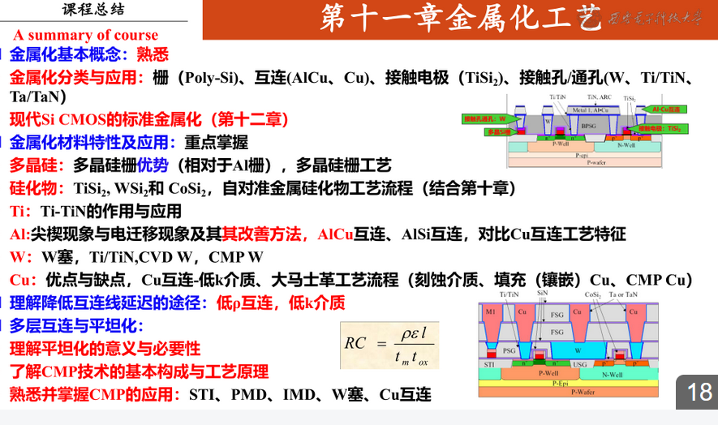
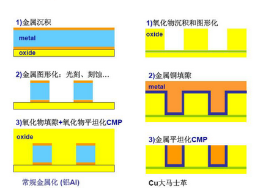

Chapter 11 Metallization

1. 栅
2. 互连线al cu
3. 接触电极
4. 填充材料plug  w

应用
1. 多晶硅栅
   - 需要离子注入
   - 相对al栅能够实现自对准源漏
2. 自对准TiSi2
   - cvd sio2
   - 干法刻蚀
   - pvd Ti
   - 快速退火
   - 湿法刻蚀
3. al pvd cvd
   - 容易电迁移
   - 电阻率高
4. Ti
   - Ti 粘合层
   - TiN 阻挡层
   - W塞：TiN
   - TiSi2 接触电极
5. W cvd
6. Cu
   - 低电阻
   - 抗电迁移
   - 难刻蚀
   - 高扩散
   - 难附着
  ---
  Al Si尖现象：Al在Si中快速溶解扩散。多加过量Si
  Al电迁移：Cu互联。Cu-Al合金

  ---
  互联延迟
  $RC=\frac{p\xi l}{t_mt_{ox}}$
  1. 低电阻率
  2. 低k降低$\xi$
   
   Cu互联
   大马士革工艺：
   1. 低k介质上刻蚀出沟槽
   2. cvd淀积势垒层
   3. Cu籽晶层淀积（pvd溅射）
   4. 淀积Cu
   5. 退火
   6. cmp
   

   多层互联
   1. 提高集成度
   2. 降低互联延迟
   3. 降低成本
   
   多层互联平坦化
   1. 防止侧向薄化
   2. 防止因为光刻胶厚度不一样曝光和显影的问题

CMP

