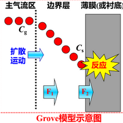

## Chapter 7 
CVD chemical vapour deposition

**氧化生长SiO2**

**STI浅槽隔离**
USG=undoped silicate glass未掺杂的二氧化硅

**侧墙隔离Sidewall spacer**   
LDD

---
基本过程
1. 传输
2. 吸附
3. 化学反应
4. 淀积
5. 脱吸
6. 移除
边界层气相
边界层厚度：流速小于0.99$U_m$的区域
边界层与基座尺寸有关

- **APCVD**
一个大气压
**气相传输控制**
高温，台阶覆盖差
污染
应力高

- **LPCVD**
   **表面反应控制**
  低压
  **温度低**
  均匀性好，台阶覆盖好
  速率低

  可做BPSG

- **PECVD**
等离子体
室温或低温
台阶覆盖好
淀积速率较高

- **MOCVD** 金属有机化学淀积

- **RECVD** 减压
