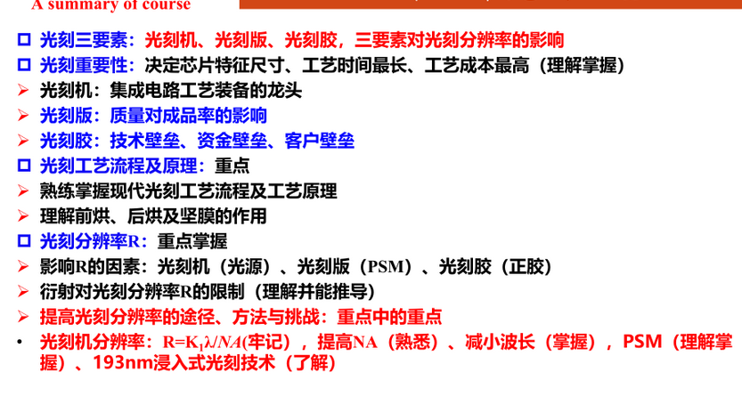
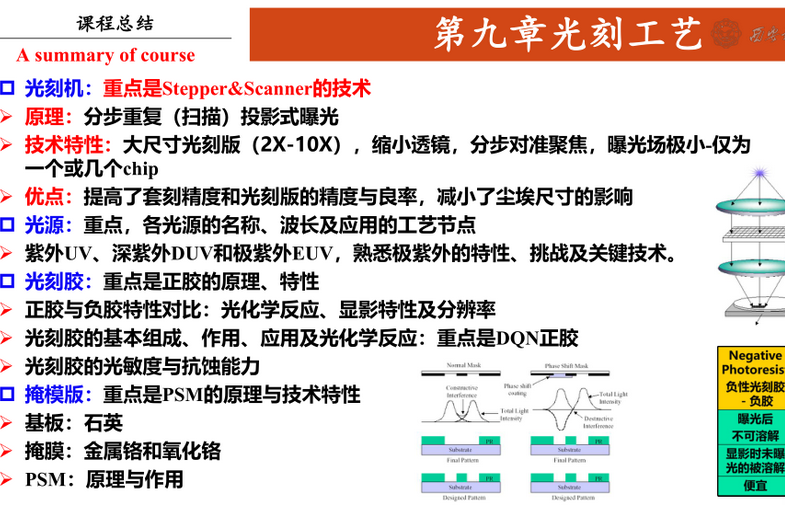

## Chapter 9 photolithography

1. 光刻机Stepper和Scanner
2. 光刻板
    - Mask 接触式 1：1
    - Reticle Stepper和Scanner 4：1 5：1 10：1
    - 金属Cr铬
    - 乳胶
3. 光刻胶photoresist

光刻工艺步骤
1. 清洗
   - RCA
2. 预烘
   - Pre bake 去掉二氧化硅表面的-OH
3. 涂胶
   - 旋涂
4. 前烘
5. 对准
   - Stepper
   - Scanner
6. 曝光
   - UV
   - DUV Krf=248nm Arf=193nm
   - EUV 13.5nm
7. 后烘
   - 平衡驻波，提升分辨率
8. 显影
   - 正负光刻胶
   - 正胶分辨率高
   - 负胶分辨率低
9.  坚膜
10. 图形检测
    
---
光刻机 Aligner
1. 早期接触式
   - 衍射小 
   - 容易损伤
2. 接近式
   - 衍射大
3. 投影式
   - 不易损伤，精度高
   - 系统复杂
4. Stepper 
   - 2X-10X的缩小
   - 一次完成曝光
5. Scanner 
   - 只完成光刻板的一部分图形，比Scanner小

---
$R=\frac{K_1\lambda}{NA}$
1. 提高Na
   - 更大的凸镜
   - 减小焦深DOF
   - 浸入式光刻
2. 减小\lambda
3. 减小K1  
   - PSM phase shift mask
     相移掩膜，消除干涉衍射