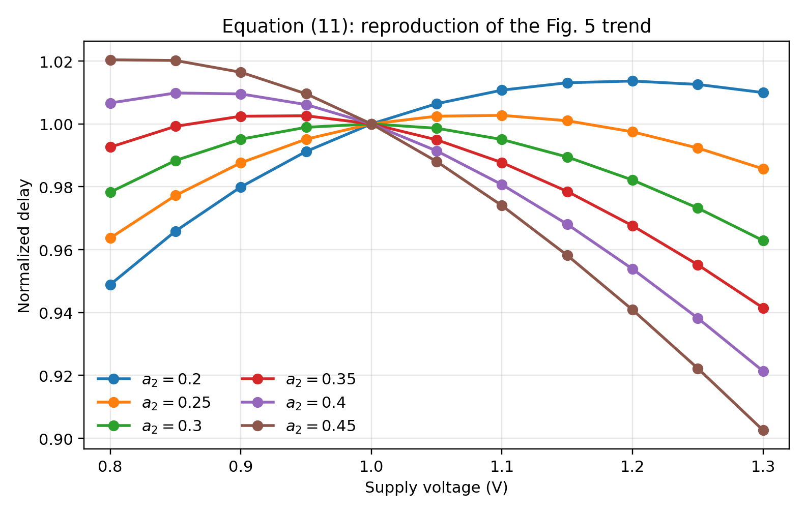
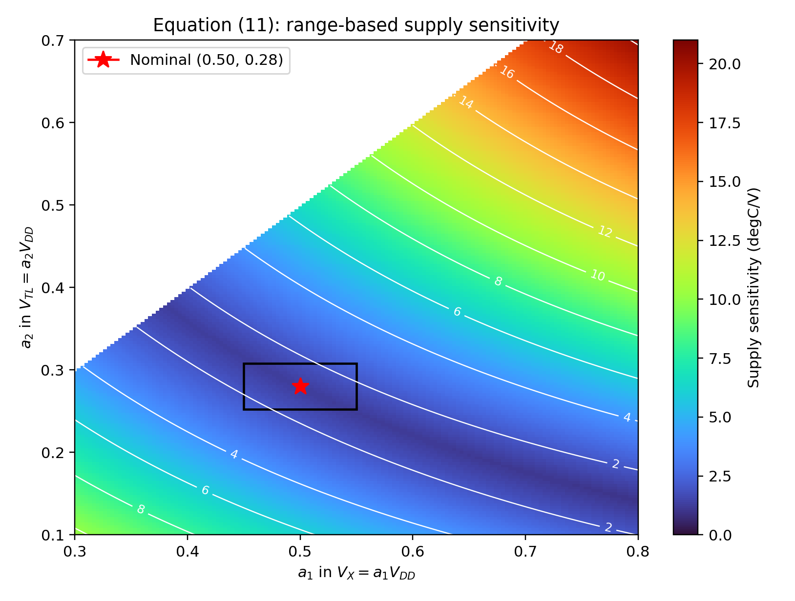
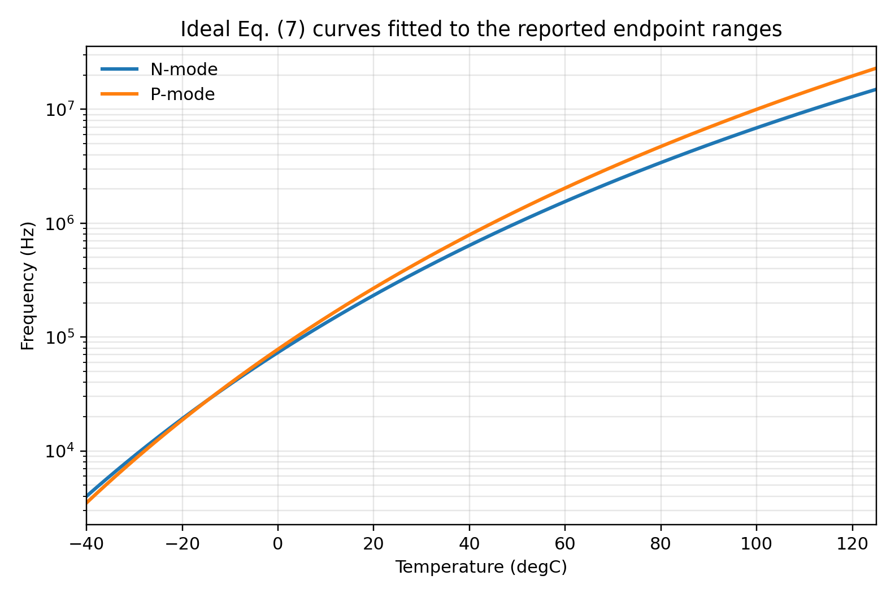

# A 1770-um2 Leakage-Based Digital Temperature Sensor With Supply Sensitivity Suppression in 55-nm CMOS

> [!abstract] 一句话总结
> 用亚阈值泄漏电流的指数温度特性产生延迟，再用 Schmitt trigger 的门限电源系数去抵消 DIBL 引起的泄漏电流电源系数，使单个 leakage-dominated ring oscillator（LDRO）无需稳压器就能在 0.8-1.3 V 数字电源上工作。

## 1. 文献信息

- 作者：Zhong Tang, Yun Fang, Zheng Shi, Xiao-Peng Yu, Nick Nianxiong Tan, Weiwei Pan
- 期刊：IEEE Journal of Solid-State Circuits, Vol. 55, No. 3, March 2020, pp. 781-792
- 工艺：标准 55-nm CMOS 数字工艺，RVT 器件
- DOI：[10.1109/JSSC.2019.2952855](https://doi.org/10.1109/JSSC.2019.2952855)
- 目标应用：SoC 多点片上热管理，不是高精度仪器级温度计

## 2. 论文要解决什么问题

SoC 热管理希望在多个热点附近放置面积小、功耗低、可直接接数字电源的温度传感器。传统方案的主要矛盾是：

1. BJT 温度传感器精度高，但先进工艺下难以兼容 sub-1-V 数字电源。
2. 电阻型温度传感器能效和分辨率好，但 R/C 面积限制进一步缩小。
3. Thermal-diffusivity 方案面积可以很小，但 mW 级功耗会带来自热。
4. RO/延迟型全 MOS 传感器面积和功耗合适，但 RO 频率通常对 VDD 非常敏感。
5. 已有解决法要么增加本地稳压器/基准，要么用两个 RO 的频率比；前者增加模拟开销，后者依赖两个不同 RO 的匹配，文中引用方案仍有约 34 °C/V 的电源敏感度。

论文的目标不是把电源敏感度降到零，而是在无需额外稳压器、特殊 native IO 器件或双 RO 比值的条件下，把它降到热管理可接受范围。

## 3. 系统架构

信号链如下：

```text
温度 T
  -> disabled MOS 亚阈值泄漏电流 Ileak(T, VDD)
  -> 对寄生电容缓慢充/放电，得到单向大延迟 td
  -> 4 级可重构 delay cell + NAND 构成 LDRO
  -> 频率 FRO(T)
  -> 两个 16-bit counter + FSM 构成 FDC
  -> (Nsen, Nref)
  -> 片外/处理器内对数换算和固定三阶系统误差校正
  -> 温度码
```

芯片集成了 8 个 LDRO sensing core，经 MUX 共享一个 FDC。单个 LDRO 面积 270 um2；若把 MUX 和共享 FDC 折算到一个 sensor，总面积为 1770 um2，主要由数字 FDC 占据。

## 4. 泄漏电流如何变成温度相关频率

### 4.1 亚阈值泄漏

NMOS 的 gate 和 source 接地时，论文用下式描述亚阈值泄漏：

$$
I_{leak,N}=I_0\exp\left(-\frac{V_{th}}{nV_T}\right)
\left[1-\exp\left(-\frac{V_{ds}}{V_T}\right)\right]
$$

其中：

$$
I_0=\mu C_{ox}\frac WL V_T^2e^{1.8}, \qquad V_T=\frac{kT}{q}
$$

当 $V_{ds}>3V_T$ 时，方括号接近 1：

$$
I_{leak,N}\approx I_0\exp\left(-\frac{V_{th}}{nV_T}\right)
$$

由于 $V_T=kT/q$，泄漏电流随温度快速上升。这种在数字电路里通常不希望出现的特性，在这里成为温度传感量。

### 4.2 N-mode delay cell 的三个阶段

一个普通 inverter 串联 disabled NMOS footer，节点 A 后接 Schmitt trigger。其一次慢翻转可分为：

1. **Reset phase**：输入低，PMOS 打开，A 被拉到 VDD；disabled NMOS 使 B 缓慢回到低电位。
2. **Quick charging / charge redistribution**：输入由低到高，开关短路电流和 C1/C2 电荷重分配，使 A、B 很快到达 $V_X$。一阶近似 $V_X=a_1V_{DD}$。
3. **Leakage-dominated discharge**：总负载 $C_L=C_1+C_2$ 只能由 disabled NMOS 的泄漏电流放电，直到 A 下降到 Schmitt trigger 的下降门限 $V_{TL}$。

慢放电满足：

$$
C_L\frac{dV_A}{dt}=-I_{leak,N}
$$

忽略 DIBL 时：

$$
t_{d,N}=C_L\frac{V_X-V_{TL}}
{I_0\exp(-V_{th}/nV_T)}
$$

因此：

$$
\ln t_{d,N}=K+\frac{V_{th}q}{nkT}
$$

$I_0$ 自身也随温度变化，但取对数后其影响被压缩，所以 $\ln t_d$ 近似与 $1/T$ 成线性关系。

P-mode 是互补过程：disabled PMOS header 通过泄漏对节点缓慢充电，直到越过 $V_{TH}$。

### 4.3 形成 LDRO

4 个 leakage delay cell 与一个 NAND 组成可使能 LDRO。每个 cell 只有一个方向由泄漏主导，另一个方向很快：

$$
F_{RO}=\frac{1}{N(t_{rise}+t_{fall})}\approx\frac{1}{Nt_d}
$$

于是：

$$
\ln F_{RO}=a\frac1T+b
$$

其中 $a$、$b$ 会随 process 和 die 改变，但每颗芯片做两点校准即可求出。注意 $F_{RO}$ 随温度上升，所以这里拟合得到的 $a$ 为负数。

归一化温度灵敏度为：

$$
\frac1{F_{RO}}\frac{dF_{RO}}{dT}=\frac{V_{th}q}{nkT^2}
$$

论文数学模型在室温给出约 4.6%/°C；实测在 20 °C 为 N-mode 约 5.6%/°C、P-mode 约 6.1%/°C。

## 5. 电源敏感度抑制：全文最关键的思想

### 5.1 两个相反方向的 VDD 效应

考虑 DIBL：

$$
I_{leak,N}=I_0\exp\left(\frac{-V_{th0}+\lambda V_{ds}}{nV_T}\right)
$$

VDD 增大时，DIBL 使泄漏电流增加，倾向于让延迟减小。另一方面，有效放电电压范围 $V_X-V_{TL}$ 也随 VDD 变化，合适设计后可让延迟增加。论文不消除这两个效应，而是让它们互相抵消。

设：

$$
V_X=a_1V_{DD}, \qquad V_{TL}=a_2V_{DD}, \qquad a_2<a_1
$$

积分得到论文式 (11)：

$$
t_{d,N}=K_1\left[
\exp\left(-\frac{\lambda a_2V_{DD}}{nV_T}\right)
-\exp\left(-\frac{\lambda a_1V_{DD}}{nV_T}\right)
\right]
$$

其中：

$$
K_1=\frac{C_LnV_T}{\lambda I_0}\exp\left(\frac{V_{th0}}{nV_T}\right)
$$

这说明电源敏感度不是由单一器件参数决定，而由 $a_1$ 和 $a_2$ 的相对位置决定。$a_1$ 主要来自 quick-charge 后的电荷重分配，$a_2$ 由 Schmitt trigger 的门限决定。

### 5.2 为什么使用 Schmitt trigger

- N-mode 使用下降门限 $V_{TL}$，P-mode 使用上升门限 $V_{TH}$，同一 delay cell 可通过 1-bit 控制重构。
- hysteresis 隔离 buffer 翻转时的 kickback noise，避免其污染慢泄漏节点。
- 可通过晶体管尺寸比独立调整两个门限的 VDD 系数。

长沟道近似下：

$$
V_{TL}\approx\frac{\sqrt{K_P}(V_{DD}-V_{TP})}{1+\sqrt{K_P}}
$$

$$
V_{TH}\approx\frac{V_{DD}+\sqrt{K_N}V_{TN}}{1+\sqrt{K_N}}
$$

其中 $K_P=(W_{P3}/L_{P3})/(W_{P4}/L_{P4})$，$K_N=(W_{N3}/L_{N3})/(W_{N4}/L_{N4})$。论文强调这些式子在 55 nm 下绝对值不精确，但足以说明尺寸比控制门限的电源系数。

仿真得到 quick-charge 节点系数：N-mode $a_1\approx0.47$，P-mode $a_1\approx0.57$。当 $K_P=K_N=2$ 时，0.8-1.3 V 范围内仿真电源敏感度分别为 2.25 °C/V 和 2.60 °C/V。

## 6. 关键晶体管尺寸

论文 Fig. 8 给出的尺寸如下，单位均为 um/um：

| 器件 | W/L |
|---|---:|
| MP0（header） | 48/0.06 |
| MN0（footer） | 16/0.06 |
| MP1, MP2 | 0.24/0.16 |
| MN1, MN2 | 0.24/0.16 |
| MP3, MP5 | 0.48/0.12 |
| MN3, MN5 | 0.36/0.12 |

设计意图：

- MP0/MN0 很宽，使 disabled 器件在室温产生 nA 级泄漏。
- inverter 使用 cascode，保证开启支路的等效电阻远小于 disabled header/footer，让绝大多数泄漏用于节点 A 的充放电。
- 若干 Schmitt trigger 器件使用非最小沟道长度，以改善匹配。
- 只使用 RVT 器件，无需特殊阈值器件。

## 7. FDC 的工作方式

FDC 由两个 16-bit counter 和 FSM 组成。直接在固定时间窗同时计数 sensing clock 和 reference clock，会因 sensing clock 异步、启动不稳定且跨越 kHz-MHz 频率范围而在低温产生较大误差。

论文的做法：

1. start 后 Counter1 等待第一个 sensing-clock 上升沿。
2. 该边沿到来时才启动 reference counter，自动去掉初始不完整周期。
3. 在给定最大参考计数内记录完整 sensing 周期 $N_{sen}$ 及其持续的参考周期 $N_{ref}$。
4. 计算：

$$
F_{sense}=\frac{N_{sen}}{N_{ref}}F_{ref}
$$

对于 50 MHz reference 与 16-bit 最大计数：

- 最低可测频率：$50\ \text{MHz}/65536=0.763\ \text{kHz}$
- 最高可测频率：50 MHz
- 最大转换时间：$65536/50\ \text{MHz}=1.31072\ \text{ms}$
- 量化误差小于 ±1 个 reference-clock 周期

## 8. 仿真结果

- 25 °C、$K_P=K_N=2$：N/P 电源敏感度 2.25/2.60 °C/V。
- PVT sweep：N/P 最坏均出现在 SS、高温，分别为 10/13.6 °C/V。
- 1000 次 mismatch Monte Carlo：25 °C、0.8-1.3 V 下，电源敏感度标准差为 N/P 0.16/0.24 °C/V。
- 仅 mismatch 的 200 次仿真：两点拟合后的非线性误差为 N-mode +0.10/-0.18 °C (3sigma)，P-mode +0.64/-0.36 °C (3sigma)。
- 加入 process 与 mismatch 后，绝对频率分布很宽，但仍保持 $\ln F\propto1/T$，因此需要宽输入范围 FDC，而不是依赖固定绝对频率。
- 0.9 V、50 MHz reference、室温仿真功耗：N-mode 5.5 uW，其中 LDRO 2.7 uW、FDC 2.8 uW；P-mode 6.1 uW。

## 9. 测量结果

测试对象为同一批次 8 颗芯片、共 64 个 sensing core；陶瓷 DIP 封装，以 Pt-100 为参考，金属盒作为热低通滤波器，温箱范围 -40 至 125 °C。

| 指标 | N-mode | P-mode |
|---|---:|---:|
| 实测频率范围 | 4 kHz-15 MHz | 3.5 kHz-23 MHz |
| 20 °C 温度灵敏度 | 约 5.6%/°C | 约 6.1%/°C |
| 两点校准后、未去系统误差 | +1.78/-1.66 °C | +1.78/-1.37 °C |
| 两点校准 + 固定三阶校正，-40-125 °C | ±0.70 °C (3sigma) | ±0.94 °C (3sigma) |
| 同上，-10-110 °C | ±0.54 °C (3sigma) | ±0.78 °C (3sigma) |
| 一点校准 + 固定三阶校正，-10-110 °C | ±1.38 °C (3sigma) | ±1.64 °C (3sigma) |
| 20 °C、0.8-1.3 V 电源敏感度 | 2.53-5.22 °C/V | 2.84-5.76 °C/V |
| 分辨率 | 16 mK | 13 mK |
| 转换时间 | 1.31 ms | 1.31 ms |
| 0.9 V 室温功耗 | 9.3 uW | 9.8 uW |
| 单次能量 | 12.2 nJ | 12.8 nJ |
| Resolution FoM | 3.1 pJ K2 | 2.2 pJ K2 |

不同温度下的电源敏感度：

| Mode | 指标 | -40 °C | 20 °C | 50 °C | 125 °C* |
|---|---|---:|---:|---:|---:|
| N | p-p | 1.12-3.94 | 2.53-5.22 | 4.11-7.16 | 10.26-15.35 |
| N | Avg. | 1.83 | 3.87 | 5.70 | 12.70 |
| P | p-p | 3.94-8.16 | 2.84-5.76 | 2.22-4.73 | 0.80-5.58 |
| P | Avg. | 5.07 | 4.07 | 3.40 | 2.60 |

*125 °C 因 SPI 限制只测 0.8-1.2 V，其余为 0.8-1.3 V。低温时 N-mode 更好，高温时 P-mode 更好；如果按温度切换模式，全温范围可保持低于 5.58 °C/V。

## 10. N-mode 与 P-mode 的取舍

### N-mode

- NMOS mobility 和单位面积亚阈值电流更大，目标 subthreshold leakage 相对 junction/gate leakage 更占主导。
- disabled 器件可以更小，面积效率更高。
- 线性和精度更好，更适合热管理。

### P-mode

- 独立 n-well 与更高温度灵敏度使 rms 分辨率略好。
- 高温时电源抑制更好。
- 但线性、精度和面积效率略差。

## 11. 我对论文的评价

### 真正有价值的点

1. **把 DIBL 从误差源变成可抵消对象**：不是增加 reference，而是在同一 delay cell 内让两种 VDD 依赖相消。
2. **Schmitt trigger 同时解决三个问题**：提供可设计门限、允许 N/P 双模式、抑制慢节点的 kickback。
3. **架构与校准匹配**：process 导致绝对频率大幅变化并不可怕，只要 $\ln F$ 对 $1/T$ 的形状稳定，两点校准就能吸收 die-to-die 的主要变化。
4. **适合多点热监控**：270 um2 sensing core 可分散放置，数字 FDC 可共享。

### 需要谨慎理解的点

1. 文中“digital temperature sensor”仍依赖 reference clock，并把对数运算及三阶系统误差校正放在片外；它不是完全自包含的纯数字宏单元。
2. 9.3/9.8 uW 不是独立电源直接测得，而是用整片实测功耗乘以仿真的功耗占比估算。
3. “电源敏感度”主要是 0.5 V 范围内峰峰温度误差除以电压跨度，不等同于某一偏置点的小信号 PSRR。高频电源噪声则依赖 RO/FDC 的时间平均。
4. 只测试了一个 batch 的 8 颗芯片；跨 lot、老化和封装应力没有数据。
5. 固定三阶 polynomial 的系数需要用若干样片建立；论文没有公布系数和原始测量数据，因此最终 ±0.70 °C 曲线无法从论文独立精确重算。
6. 两点校准仍需逐颗芯片成本。若目标仅是 ±3 °C 的热保护，一点校准可能更符合量产需求。

## 12. 本次复现完成了什么

### 已成功复现

1. **Fig. 5 数学趋势**：使用论文式 (11) 及 $\lambda=0.1,n=1.5,V_T=26$ mV、$a_1=0.5$，得到与原图一致的 delay-VDD 曲线族。
2. **7.5%/V 数值**：$a_2=0.3$ 时，以 0.8-1.3 V 内归一化 delay 的 peak-to-peak 变化除以 0.5 V，计算为 7.50%/V。
3. **Fig. 6 contour**：对 $a_1,a_2$ sweep 后，重现论文的低敏感度“谷底”。$a_1=0.5,a_2=0.28$ 的 nominal 值约 1.25 °C/V；在两者独立 ±10% 方框内，最坏约 2.53 °C/V，与论文所述约 2.6 °C/V 一致。
4. **Eq. (7) 温频关系**：用论文给出的频率端点重建理想曲线，20 °C 局部灵敏度约为 N-mode 5.4%/°C、P-mode 5.8%/°C，与实测 5.6%/°C、6.1%/°C 接近。
5. **FDC 与 FoM 算术**：重算得到 0.763 kHz、1.31072 ms、12.2/12.8 nJ、3.1/2.2 pJ K2，均与论文表格吻合。







### 目前不能严格复现

- Spectre transistor-level PVT/Monte Carlo：缺少原始 55-nm PDK、RVT BSIM model、mismatch 参数和 testbench。
- post-layout 频率、功耗和面积：缺少 GDS、寄生提取和标准单元库。
- Fig. 18-22 的逐芯片测量与 ±0.70 °C 精度：论文未提供 raw data、三阶 correction coefficients、校准点的具体选择。
- 真实 FDC RTL 的门级时序/功耗：只有框图和工作说明，没有 RTL/netlist。

因此，本次结果应称为**论文数学模型的行为级复现**，不能称为完整芯片复现。

## 13. 如何继续做 Cadence 级复现

### 阶段 A：单个 delay cell

1. 使用可获得的 55/65 nm RVT PDK，按 Fig. 8 搭建 power-gated cascode inverter + Schmitt trigger。
2. 分别配置 N/P mode，观察 A、B、Vout，确认 reset、quick redistribution、leakage-dominated 三阶段。
3. 在 0.8-1.3 V、-40-125 °C sweep 中提取单级 $t_d$、$V_X$、$V_{TL}$、$V_{TH}$。
4. 线性拟合 $V_X$ 对 VDD 得 $a_1$；拟合门限得 $a_2$，与式 (11) 比较。

### 阶段 B：优化电源敏感度

1. 参数化 $K_P$、$K_N$ 对应的 Schmitt 尺寸比。
2. 以全 VDD 范围的 peak-to-peak 等效温度误差为 cost function，而不是只优化 0.9 V 的局部导数。
3. 检查 TT/SS/FF/SF/FS、温度与 mismatch；重点关注 SS + 高温最坏角。
4. 若 PDK 与论文不同，不应强求同一个 $K=2$，应重新寻找门限电源系数的最优点。

### 阶段 C：LDRO 与校准

1. 4 个 delay cell + NAND 构成可使能环振。
2. transient sweep 得 $F(T,VDD)$，用 $\ln F=a/T+b$ 做两点校准。
3. 分离三类残差：单 die 的系统曲率、die-to-die 的 a/b 变化、VDD 引起的残差。
4. 用若干 Monte Carlo 样本拟合固定三阶 correction，再在未参与拟合的样本上验证，避免把测试样本同时用于拟合和报告。

### 阶段 D：FDC

1. 用 Verilog/SystemVerilog 实现双 16-bit counter + FSM。
2. 输入从 0.763 kHz 到 50 MHz，随机化 sensing/reference 相位。
3. 验证启动时丢弃不完整周期，误差小于 ±1 reference cycle。
4. 将 FDC 量化误差换算为温度误差，并与 RO jitter、reference TC 分开统计。

## 14. 复现文件

- 脚本：`leakage_sensor_reproduction/reproduce_ldro.py`
- 使用说明：`leakage_sensor_reproduction/README.md`
- 数值核对：`leakage_sensor_reproduction/results/model_checks.csv`
- 温频拟合参数：`leakage_sensor_reproduction/results/temperature_fit.csv`

运行：

```powershell
cd leakage_sensor_reproduction
python .\reproduce_ldro.py
```

## 15. 可迁移的设计启发

这篇论文对模拟/混合信号设计最有启发的地方，不是“用 leakage 测温”本身，而是以下方法论：

1. 对一个难以消除的一阶非理想项，寻找另一个**方向相反且可调**的电路依赖，在本地闭合误差预算。
2. 行为模型先找低敏感度 valley，再用 transistor sizing 把实际电路的有效参数映射到该 valley。
3. process variation 若主要改变 gain/offset，可以交给低阶校准；真正需要电路抑制的是校准后仍残留、且随运行条件变化的误差。
4. 指标必须按系统使用方式定义：这里优化的是 0.8-1.3 V 全范围的峰峰温度误差，而非单点导数。这一点同 ADC 的全输入范围 INL 与局部小信号 gain error 的区别很相似。

