<center><h1>模拟集成电路大作业 </h1>


 <h3>指导老师：刘术彬</h3>
<h3 >作者:董展宇  学号：21049200240</h3>
<h3> 2024年6月17日</h3> </center>
<div STYLE="page-break-after: always;"></div>

图像分析使用EDA课上装的custom waveview

## 实验一
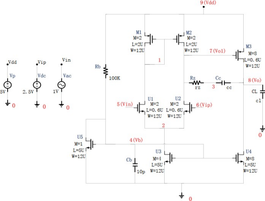
直流工作点分析。要求:
- 写出网表文件
- 直流工作点分析
1. 节点电压分析
2. 电路功耗分析
3. 偏置电流分析
4. 工作状态分析
### 网表文件
```hspice
.TITLE amplifier
.LIB 'D:\Hspice\lib\csmc.lib' TT


.PARAM dd=5
.PARAM ip=2.5
.PARAM rb=100k
.PARAM cl=1p

Vdd Vdd 0 DC dd
Vdc Vip 0 DC ip
Vin Vin 0 DC 2.5 AC 1
M_U1 1 Vin 2 0 nm L=0.6u W=12u M=2
M_U2 Vol Vip 2 0 nm L=0.6u W=12u M=2
M_U3 2 Vb 0 0 nm L=5u W=12u M=4
M_U4 Vo Vb 0 0 nm L=5u W=12u M=8
M_U5 Vb Vb 0 0 nm L=5u W=12u M=1

M_M1 1 1 Vdd Vdd pm L=2u W=12u M=2
M_M2 Vol 1 Vdd Vdd pm L=2u W=12u M=2
M_M3 Vo Vol Vdd Vdd pm L=0.6u W=12u M=8

R_Rb Vb Vdd rb
R_Rz Vol 3 10k

C_C1 Vo 0 cl
C_Cb Vb 0 10p
C_Cc 3 Vo 10p


.PRINT DC V(Vo) V(Vol) V(Vin)

.OP
.OPTION NODE LIST POST
.END
```
### 直流工作点分析
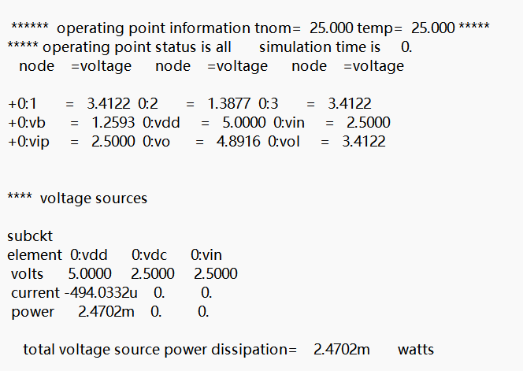
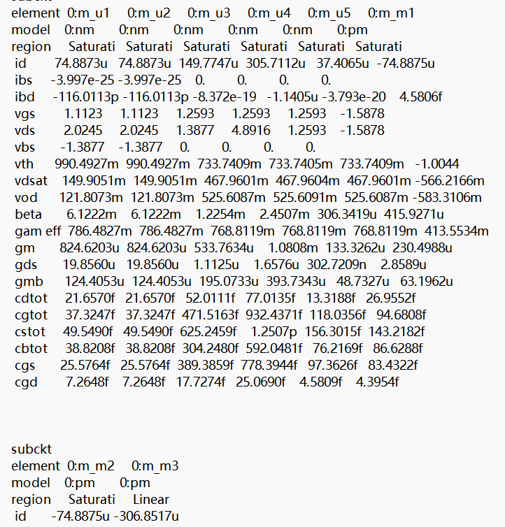
1. 节点电压分析, Vo 节点电压为 4.8916V。
2. 电路功耗分析, 电路功耗为 2.4702mW。
3. 偏置电流分析(M_U3 的偏置电流) M_U3 的偏置电流为 Vol = 3.4122V
4. 工作状态分析(M_M3 的工作模式，线性、饱和、截止)只有 M3 工作在线性区，其余均工作在饱和区。
## 第二次实验
### 直流扫描分析
VDC 2.45 2.55 0.001
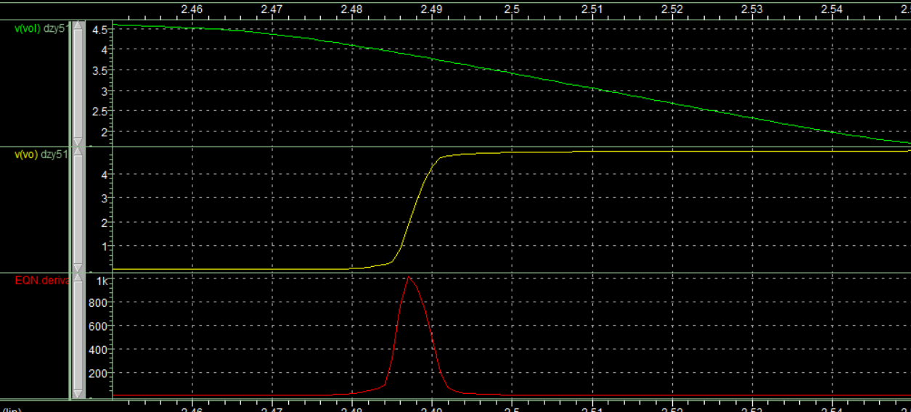
VDC 2.49 2.495 0.0001
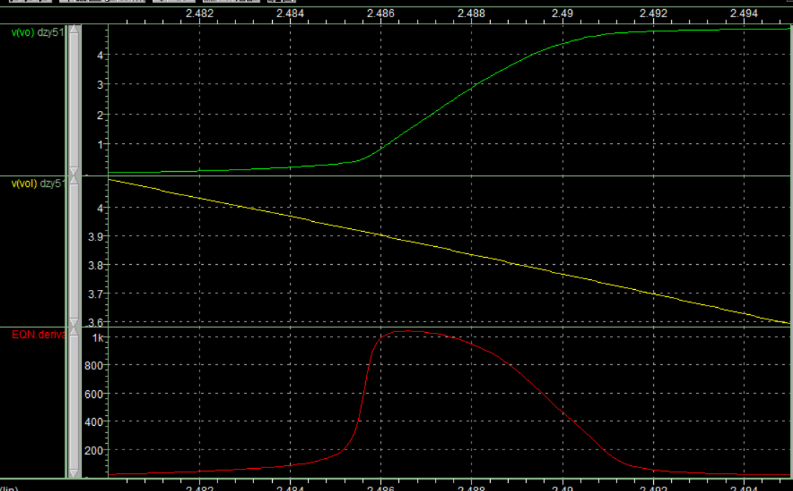
当g在500以上，范围在2.489-2.490之间
### 工艺角分析
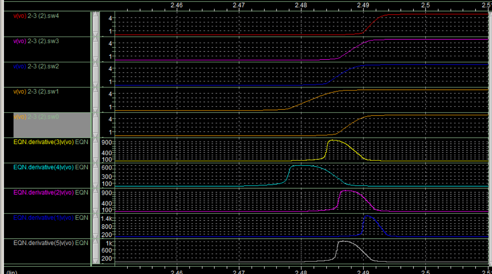
可以看出 FF 增益最小， SS 增益最大。
四种角主要是影响阈值电压和电容来导致跨导的不一样。
各个角度的失调值都在2.48-2.49之间
### 温度分析
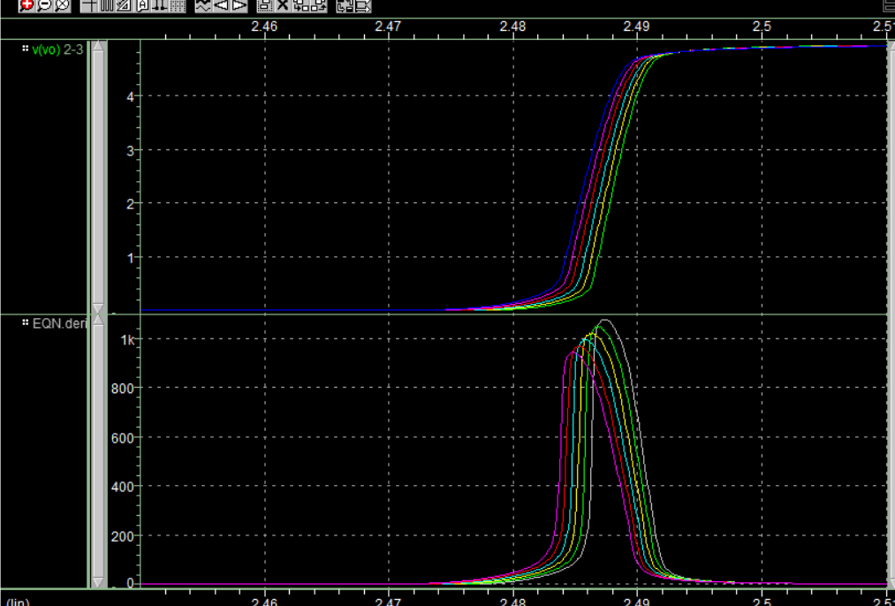

## 第三次实验
### 交流扫描分析
(考虑 OTA 的系统失调，没有补偿电阻，即 Rz=0)
要求:
1.得出幅频特性曲线图、相频特性曲线图
2.由图像求出增益带宽积 GBW、相位裕度
3.分析密勒补偿效应(cc 电容值 0-5 PF，步长 1 PF)
4.分析零极点抵消效果(Rz 电阻值 0-2k，步长 0.2k)
#### 无补偿电阻
```
.TITLE amplifier
.LIB 'D:\Hspice\lib\csmc.lib' TT


.PARAM dd=5
.PARAM ip=2.4876
.PARAM rb=100k
.PARAM cl=1p

Vdd Vdd 0 DC dd
Vdc Vip 0 DC ip
Vin Vin 0 DC 2.5 AC 1
M_U1 1 Vin 2 0 nm L=0.6u W=12u M=2
M_U2 Vol Vip 2 0 nm L=0.6u W=12u M=2
M_U3 2 Vb 0 0 nm L=5u W=12u M=4
M_U4 Vo Vb 0 0 nm L=5u W=12u M=8
M_U5 Vb Vb 0 0 nm L=5u W=12u M=1

M_M1 1 1 Vdd Vdd pm L=2u W=12u M=2
M_M2 Vol 1 Vdd Vdd pm L=2u W=12u M=2
M_M3 Vo Vol Vdd Vdd pm L=0.6u W=12u M=8

R_Rb Vb Vdd rb
R_Rz Vol 3 0

C_C1 Vo 0 cl
C_Cb Vb 0 10p
C_Cc 3 Vo 10p


.AC DEC 10 1k 200MEG
.OP
.OPTION NODE LIST POST
.END
```
得到幅频曲线和相频曲线
可得到 GBW=99.8MHz 相位裕度=34.6 度
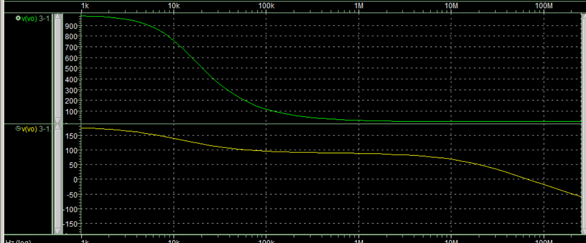
#### 补偿电容
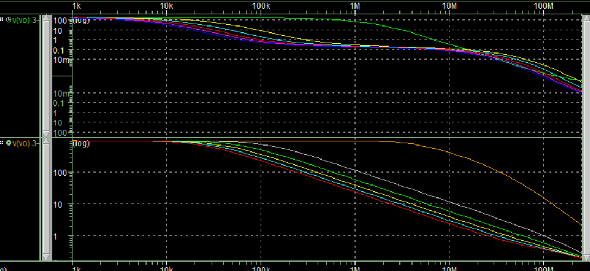
增加 Cc， GBW 减小、相位裕度增加 当 Cc=5pF， GBW 减小到 24.8MHz，相位裕度增加到 59 度
#### 补偿电阻
观察零极点抵消效果 当 Rz 增加到 1k Ohm， GBW=102MHz，相位裕度增加到 67 度
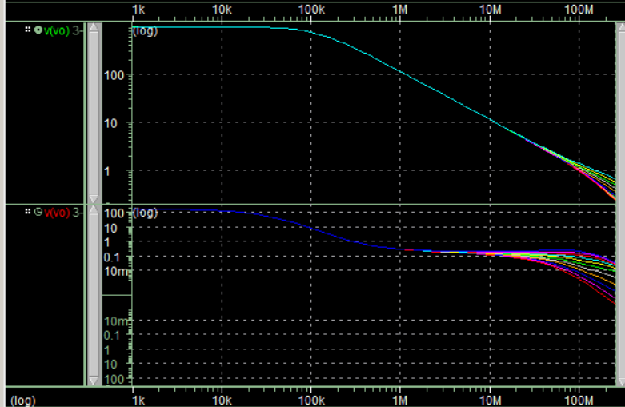
### 工艺角分析
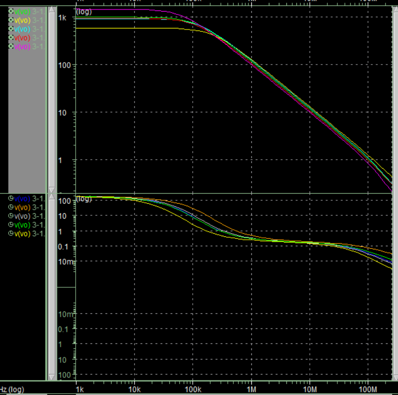
### 温度分析
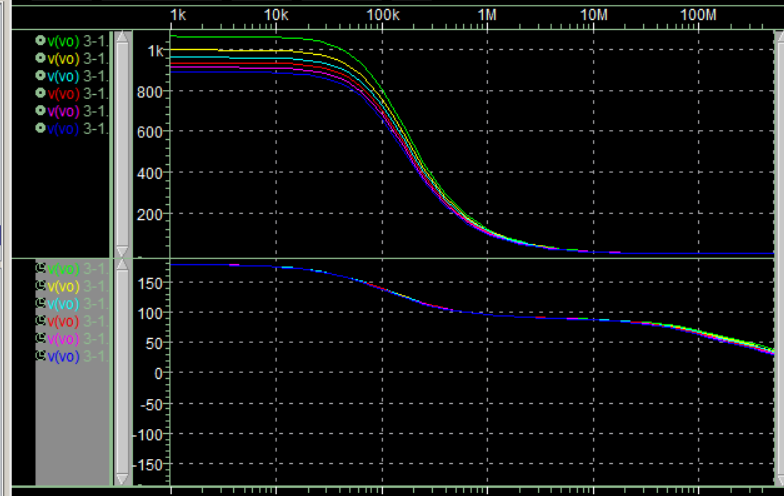
|TEMP|Gain|GBW|Phase Margin
|---|---|---|---
0|1030|109Mhz|68.3
20|998|104Mhz|67.4
40|962|98.3Mhz|66.8
60|936|94.5Mhz|66.2
80|913|90.7Mhz|65.7
100|890|86.7Mhz|65.4

## 第四次实验
### 噪声

等效输入噪声为106.1966u
### 压摆率分析
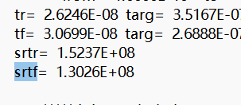
上升压摆率 srtr 为 1.5237E+08，下降压摆率 srtf 为 1.3026E+08
### 蒙特卡洛分析
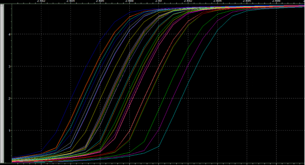