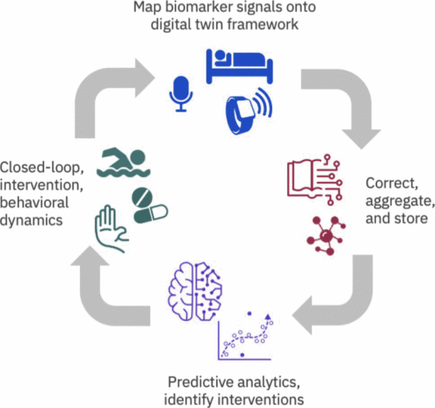

<h2>物联网芯片与系统课程论文 </h2>

<h1>物联网在医疗电子领域的应用与挑战：综述与展望 </h1>

 <h3>指导老师：曾志斌</h3>
<h3 >作者:董展宇  学号：21049200240</h3>
<h3> 2024年5月8日</h3> 

---
# 摘要
物联网技术在不断演进，其发展与应用前景令人振奋。随着智能设备的普及和互联网的高速发展，物联网技术正成为连接世界的重要桥梁。从智能家居到智慧城市，物联网的应用已经贯穿了人们的日常生活。随着技术的不断进步，越来越多的传感器、智能设备和数据平台将相互连接，构建起一个智慧、互联的生态系统。

同时，医疗电子领域的重要性与挑战并存，它既是推动医疗保健行业发展的关键因素，也面临着一系列的挑战。医疗电子技术通过数字化医疗记录、远程医疗服务和智能医疗设备等手段，提高了医疗服务的效率和质量，降低了医疗成本，改善了患者的治疗体验。然而，随之而来的是数据安全和隐私保护等问题。医疗数据的泄露和被篡改可能导致严重的后果，因此建立健全的数据安全体系和隐私保护机制至关重要。此外，医疗电子技术的标准化和互操作性也是当前面临的挑战之一。不同厂商生产的医疗设备之间存在着互操作性的问题，影响了医疗数据的共享和传递，阻碍了医疗服务的连贯性和协同性。因此，制定统一的标准和规范，推动医疗设备之间的互联互通是当前亟待解决的问题之一。

尽管医疗电子领域面临诸多挑战，但其应用前景依然十分广阔。通过不断创新和技术突破，医疗电子技术将为医疗保健行业带来革命性的变革，提高医疗服务的质量和效率，为人类健康事业作出更大的贡献。

**关键词：物联网  医疗电子  健康监控 远程医疗  数据安全**

<h3>  
[toc]  
</h3>

# 第一章 绪论
 ## 1.1物联网技术的发展与应用前景
首先，物联网技术将进一步深化各行各业的数字化转型。从智能家居到智慧城市，物联网的应用已经贯穿了人们的日常生活，而随着技术的发展，更多的传感器和智能设备将被部署，实现更加智能化和自动化的生活和工作环境。
此外，物联网技术还将为人们的生活和健康提供更多的便利和关怀。在医疗保健领域，物联网技术已经实现了远程医疗和健康监测，帮助人们实时监测健康状况，并及时采取措施预防疾病。未来，随着医疗设备和传感器的进一步普及和发展，物联网技术将为人们提供更加个性化和精准的医疗服务。

综上所述，物联网技术的发展与应用前景广阔，将为人类社会带来更多的便利和机遇，推动世界向着更加智能化、数字化和可持续发展的方向迈进。

 ## 1.2 医疗电子领域的重要性和挑战

首先，医疗电子技术的发展为医疗保健提供了巨大的便利和效益。通过数字化医疗记录、远程医疗服务和智能医疗设备等手段，医疗电子技术可以提高医疗服务的效率和质量，降低医疗成本，促进医疗资源的合理分配。同时，医疗电子技术还可以实现医患间的实时交流和信息共享，提高医疗决策的科学性和准确性，改善患者的治疗体验和健康状况。
然而，医疗电子领域也面临着诸多挑战。首先，数据安全和隐私保护是医疗电子技术面临的重要问题。随着医疗信息的数字化和网络化，医疗数据面临着被黑客攻击和泄露的风险，患者的个人隐私也可能受到侵犯。因此，如何建立健全的数据安全体系和隐私保护机制成为亟待解决的问题。
其次，医疗电子技术的标准化和互操作性也是当前面临的挑战之一。由于医疗电子技术涉及到多个领域和多种设备，不同厂商生产的设备之间存在着互操作性的问题，导致医疗数据无法有效地共享和传递，影响了医疗服务的连贯性和协同性。因此，制定统一的标准和规范，推动医疗设备之间的互联互通至关重要。
随着物联网技术的快速发展，其在医疗电子领域的应用也日益广泛。物联网技术通过连接各种医疗设备、传感器和数据平台，实现了医疗信息的实时监测、远程诊断和个性化治疗，极大地改善了医疗服务的质量和效率。本文将重点探讨物联网在医疗电子中的应用，并展望其未来的发展前景。

# 第二章 物联网在健康监测与远程医疗中的应用

## 2.1智能穿戴设备

物联网（IoT）允许自动收集大量与健康相关的数据，如日常活动、体重（BW）和血压（BP）。 已经研究了使用物联网设备监测糖尿病患者，但无法评估物联网依赖性影响，因为没有测量对照组的健康数据。 这项多中心、开放标签、随机、平行组研究将比较使用物联网的强化健康指导和传统医学指导对血糖控制的影响。 本研究将在门诊2型糖尿病患者中进行，为期6个月。 将向物联网组患者提供用于测量日常活动量、BW和BP的物联网设备。 医疗保健专业人士（HCP）将根据数据提供适当的反馈。 非物联网控制，将为患者提供不具有反馈功能的测量设备。 主要结局为6个月时的糖化血红蛋白。 该研究已经在两个参与的门诊诊所招募了101名患者，其中50名在物联网组，51名在非物联网组。 除甘油三酯外，两组的基线特征无差异。 这将是第一项评价HCP密集反馈的IoT依赖性效应的随机对照研究。 该结果将验证一种新的健康数据收集和反馈提供方法，该方法适用于糖尿病支持，具有更高的有效性和更低的成本。[1]

# 第三章物联网在医疗设备连接与管理中的应用

## 3.1医疗设备互联网化

为提供一种帮助孕妇诊断胎儿健康状况的便捷途径,设计了基于Lab VIEW的胎心监测系统。[6]依据物联网的理念,运用服务器系统、硬件系统、软件系统的模块化系统设计思维,采用硬件系统采集胎心信号,通过智能终端将数据上传至服务器端,并借助服务器中基于Lab VIEW编写的信号处理程序,利用重采样、巴特沃斯低通滤波、小波滤波等方法,得到准确的胎心频率图并通过TCP/IP协议传送至医生端。论文详细阐述的基于Lab VIEW的胎心监测系统,可满足实时、动态和远程监护胎儿的需求。实现孕妇足不出户,即可完成关于胎儿健康状况的的医患沟通,实验结果表明,本系统在临床医疗中具有实际意义。[2]

## 3.2远程设备监测与管理

物联网技术可以实现对医疗设备的远程监测和管理，包括设备的运行状态、维护信息和故障诊断等。通过远程监测和管理，可以及时发现设备的故障和异常，减少停机时间和维修成本。

**案例：** 西门子医疗的远程设备监测系统可以实时监测医疗设备的运行状态和性能参数，并提供远程诊断和维护服务，提高了设备的可靠性和可用性。

# 第四章物联网在医疗数据管理与分析中的应用

## 4.1数据采集与存储 

医疗保健行业正在经历着数字医疗技术的兴起和物联网（IoT）设备的日益普及所带来的巨大变化。 然而，尽管这种技术组合有可能通过改善患者预后来彻底改变医疗保健，但除了满足法规合规性和合同义务外，还存在与数据收集，组织和可访问性相关的几个关键挑战。
为了应对这些挑战，不同的团体提出了一种基于数据结构架构的方法，用于医疗保健场景中的数据生命周期管理。 例如，Macias等人开发了一种基于智能医疗数字孪生的数据结构架构，用于监控养老院中COVID-19病毒的传播[1]。 Ahouandjinou等人提出了一种用于重症监护室（ICU）中的可视患者监护系统的混合架构，以改善重症医疗护理[2]。 其他框架是智能的，例如数据管道模型，它结合了机器学习来自动监控，检测，缓解和警报数据管道不同阶段出现的问题[3]。 然而，虽然这些提议的数据结构实现是有效的，但它们缺乏用户在本地或云数据集成之间进行选择的灵活性。 它们也不支持使用不同的工作流引擎，例如Kubeflow来管理机器学习（ML）和机器学习操作（MLOps）管道，或者Apache Airflow来管理大规模的复杂数据工程管道。 此外，在无代码/低代码方法中，数据集成代码不能被容易地重用，这使得针对新项目的数据结构工具和软件的用户培训和使用更加困难。
来自UCSD的团队提出了一种数据结构解决方案，该解决方案提供了一种端到端的方法来集成来自EHR，移动应用程序，物联网传感器和可穿戴设备的异构数据。 我们还展示了与UCSD合作进行的老年人研究中数据结构实施的一个例子，目的是加深我们对临床和亚临床睡眠障碍（如睡眠呼吸暂停）的认知，社会和流动性影响的理解。

**案例：** Data Fabric在老年人家庭远程监护研究中的应用

本文讨论的数据结构的实现是与UCSD和IBM数字健康团队合作进行的基于家庭的远程监护研究。 在这项基于家庭的远程监护研究中使用的传感器可以分为环境传感器或需要参与者参与的脚本任务[5]（图a）。 根据数据源，数据摄取是通过批处理或实时操作模式完成的（图b）。 数据存储在暂存和生产数据存储中，由CIDE验证（图c）。 最后，提取数据，根据CODE进行验证（图d），并在Grafana仪表板中进行可视化（图e）。

家庭远程监护研究概述。 (b)数据收集过程。 (c)一种数据存储解决方案，可定制用于存储多个数据源和数据格式。 (d)数据集成管道，用于（i-iii）数据准备，（iv）数据分析和（v）生成CODE。 (e)使用Grafana作为仪表板引擎进行数据访问。")

(a)家庭远程监护研究概述。 (b)数据收集过程。 (c)一种数据存储解决方案，可定制用于存储多个数据源和数据格式。 (d)数据集成管道，用于（i-iii）数据准备，（iv）数据分析和（v）生成CODE。 (e)使用Grafana作为仪表板引擎进行数据访问。

## 4.2数据分析与应用

数字健康是一个近年来蓬勃发展的跨学科领域。 移动和物联网（IoT）技术的无处不在、可穿戴传感器的可用性以及云计算服务的经济高效性，开创了一个以预测性、预防性和个性化护理为重点的医疗保健服务新时代。 通过将边缘计算、云计算和人工智能（AI）等新信息技术的力量引入医疗保健领域，许多传统实践都可以得到改善，并开发出新的方法。

例如，最常见的传统预防保健形式是定期健康检查，其目的是在潜在的健康问题成为问题之前发现它们。 然而，这些检查仅提供了对个体健康轨迹的偶发性观察，并且这些检查的不频繁可能导致错过最佳干预的窗口。 结合可穿戴式和环境传感技术，现在可以在日常生活活动中实时连续监测数字生物标志物[1]。 来自各种智能设备的生物信号可以通过云计算资源传输到远程数据中心，构建个人健康的整体模型，或“数字孪生”[5]
 

 用于实时远程监测生理和物理参数以及生成健康洞察的信息流程图

**案例：**
当摄取数据集时，API网关由调用者通过批处理作业脚本或事件驱动的前端应用程序调用。 API网关将向Task Dispatcher提交请求以及数据集，并将任务添加到任务队列。 下一个可用的worker将声明该任务，并向调用者返回一个任务ID。 当工作进程完成计算时，结果将以任务id作为键保存在结果存储中。 然后调用者可以检索结果。

在基于Orbit的编排层之上，有一个名为Clinical Task Manager的用户交互应用程序。 研究人员可以使用此工具定义包括一个或多个子任务（例如问卷调查、音频/视频记录等）的临床研究。 进行数据收集，并分配一个队列来执行这些任务。 这些任务将根据研究人员设置的时间表或事件驱动的条件推送到队列的边缘设备（例如智能手机）。 当受试者完成任务时，数据将由Health Guardian自动收集，Orbit-Service将协调分析工作流程以生成结果。

Health Guardian中描述的所有组件都是容器化的，可以部署到任何公共云或私有云。 这允许灵活的部署策略，以符合各种隐私和安全规则和法规。 还有一个公共服务层，包括日志记录、访问控制和其他安全措施，以确保在整个数据管道中维护数据质量和安全性。[3]

# 第五章 智能医疗系统的发展
## 5.1 人工智能与大数据在医疗中的应用
在医疗管理中,ChatGPT作为一种人工智能技术,可以利用自然语言处理、机器学习、深度学习等技术手段,实现对医疗数据的处理和分析,从而为医院的管理和决策提供智能化的支持。具体而言,ChatGPT可以应用到以下典型应用场景中,助力医务管理提质增效。

(1)AI导诊台:
AI导诊台是一种基于人工智能技术的智能医疗设备,旨在通过与患者的交互,协助患者初步判断病情、提供就诊指引、提供医疗服务等。ChatGPT可以集成到AI导诊台,理解患者的自然语言描述,从而更准确地了解患者的病情和需求,为患者提供更加智能化、人性化和自然的导诊服务体验。集成ChatGPT的AI导诊台根据患者的自然语言描述,准确地了解患者的病情和需求,并通过自然语言的方式与患者互动。例如,患者描述自己的就诊诉求可能会用一些非正式的语言或方言,ChatGPT能够通过对这些语言的理解和分析,告知患者应该挂哪个科室的号,并提示相关的流程、院内就医路线等等,从而实现协助智慧医院医务导诊服务人员面向就诊患者提供就医流程指导、就医预分诊、就医挂号、院内就诊路线提示等导诊辅助服务。

(2)智能病历归档:

智能病历归档是智慧医疗中非常重要的环节,通过对患者电子病历内容的语义分析,实现对病历的智能归档。ChatGPT利用深度学习技术实现对病历文本的分析和归纳,将病历信息自动归档到对应的分类标签中。当医生填写病历时,ChatGPT可以智能地分析病历内容,并推荐相应的分类和标签,从而减轻医生撰写工作量。例如,当医生输入“胃炎”时,ChatGPT可以自动推荐相应的分类为消化内科,并将病历信息归档到该分类中。ChatGPT可以通过自然语言搜索技术,快速检索病历信息,提高医生的工作效率。当医生需要查询某个病人的病历信息时,可以通过自然语言输入病人的基本信息,如姓名、年龄等,ChatGPT可以自动搜索病历信息,并返回相应的结果。

(3)智能调配和排班:

智能调配与排班是一种基于人工智能技术的智能医疗应用,它通过对医疗资源、医护人员等数据的分析和处理,智能地安排医护人员的工作计划和班次,以便更好地提升医疗管理效率。ChatGPT可以集成到排班管理系统中,当医护人员需要请假或换班时,通过ChatGPT与系统进行交互,可以快速且准确地调配医护人员的工作计划和班次,提升智慧医疗中的医务管理的效率。

(4)医疗数据分析与预测:

在智慧医疗领域中,医疗数据分析与预测是通过对医疗数据进行收集、整理和分析,预测疾病的发展趋势,以提高医疗服务的质量和效率。ChatGPT可以在医疗数据分析与预测中扮演重要角色。例如,ChatGPT可集成到医疗数据管理的相关系统中,ChatGPT可以提取出关键信息和特征,进而实现通过使用自然语言交互的方式对数据分析和挖掘,从而提升医疗数据分析的效率。

(5)智能监测和管理:
在智慧医疗中,面向医务管理的智能监测和管理是指利用人工智能技术对医院、医疗机构的各项管理工作进行智能化监测和管理。这些管理工作包括医院资源调度、医护人员管理、医疗质量管理、医疗风险管理、医药采购管理等方面。智能监测和管理可以帮助医疗机构更加高效地运营,提高医疗服务质量,降低医疗事故风险,提高医疗资源利用效率,从而实现医疗机构的可持续发展。ChatGPT可以集成并接入医疗设备和传感器数据,利用深度学习和自然语言处理技术,实现对众多医疗器械的智能化监测和问题主动发现等。

# 参考文献
[1]https://webofscience.clarivate.cn/wos/alldb/full-record/WOS:000408062800005
[2]陈硕章,刘海斌,张羽翔,裴彦名,邸浈棋,张蒙,梁海涵.基于LabVIEW与物联网的远程胎心监测系统设计[J].电子世界,2016,(07):50-52+70.
[3]B. Wen et al., "Health Guardian Platform: A technology stack to accelerate discovery in Digital Health research," 2022 IEEE International Conference on Digital Health (ICDH), Barcelona, Spain, 2022, pp. 40-46, doi: 10.1109/ICDH55609.2022.00015.
[4]吴英华,罗家锋,林成创.迈入人工智能新时代:ChatGPT在智慧医疗应用场景研究与思考[J].数据通信,2023,(04):33-38+54.
[5]Arambepola, C (Arambepola, Carukshi); Ricci-Cabello, I (Ricci-Cabello, Ignacio); Manikavasagam, P (Manikavasagam, Pavithra); Roberts, N (Roberts, Nia) ; French, DP (French, David P.) ; Farmer, A (Farmer, Andrew)"The Impact of Automated Brief Messages Promoting Lifestyle Changes Delivered Via Mobile Devices to People with Type 2 Diabetes: A Systematic Literature Review and Meta-Analysis of Controlled Trials" JOURNAL OF MEDICAL INTERNET RESEARCH APR 2016 DOI10.2196/jmir.5425.
[6]朱璐瑛,贺鹏飞,周洋.基于Coiflets正交小波的超宽带脉冲波形设计[J].现代电子技术,2008,31(23):1-3.
[7]赵继印,刘海英,马洪顺,等.基于coif5小波的多普勒胎心音信号提取算法的研究[J].中国生物医学工程学报,2006,25(5):538-541.
