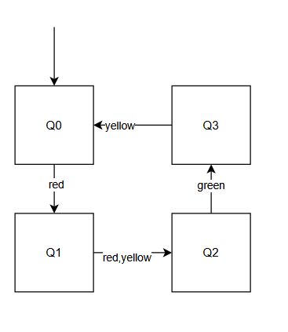
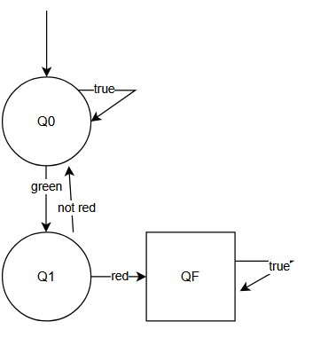
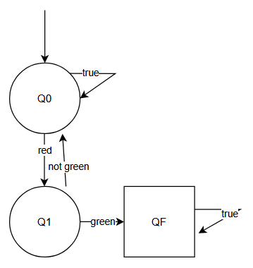
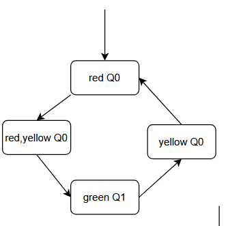
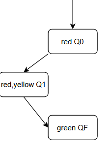

# CPS I — Exercise Sheet 9
**University of Freiburg · Winter Term 2025/26**

**Author:** Zhanyu Dong, Xin Pu

---
## Exercise 1: Model Checking

1. \(A_{T}\)

2. Bad Prefixes
\(A_{P1}\)

\(A_{P2}\)

3. Intersection
Intersection of \(A_{T}\) and \(A_{P1}\)
no accepting state can be reached

Intersection of \(A_{T}\) and \(A_{P2}\)
Is accepting state can be reached 
\(\mathcal{L}(A_T \cap A_{P_2}) \neq \emptyset\)
So TS doesnt satisfy P2
Counter Example：{red}{red,yellow}{green}

## Exercise 2: Safety & Liveness
- 1
  - Safety \(E=\{\sigma \in \Sigma ^ \omega \mid a \in A_0\}\)
  - Liveness \(E=\{\sigma \in \Sigma ^ \omega \mid \exist i \ge 0,a \in A_i\}\)
- 2
  - Safety \(E=\{\sigma \in \Sigma ^ \omega \mid \forall i \ge 0 , a \notin A_i\}\)
  - Liveness \(E=\{\sigma \in \Sigma ^ \omega \mid \exist^\infty i \ge 0,a \in A_i\}\)
- 3
  - Safety \(E=\{\sigma \in \Sigma ^ \omega \mid b \in A_0\}\)
  - Liveness \(E=\{\sigma \in \Sigma ^ \omega \}\)
- 4
  - Safety:No, because every trace violets safety property has a bad prefix
  - Liveness \(E=\{\sigma \in \Sigma ^ \omega \mid \exist i \ge0,a \in A_i\}\)

## Exercise 3: LT Properties
- \(P_1=\{σ∈Σ^ω
 ∣∀i≥0,a∈A_i
​
 ∨b∈A_i
​
 \}\) 
  - Invariant
  - Safety
  - not Liveness
- \(P_2 = \{\sigma\in\Sigma^\omega \ \bigg|\ \exists i\ge0,\ (a\in A_i\ \land\ \forall j\neq i,\ a\notin A_j) \} \cup \{\sigma\in\Sigma^\omega \ \bigg|\ \forall i\ge0,\ b\notin A_i \}\)
  - not Invariant
  - not Safety
  - not Liveness
- \(P_3=\{\sigma \in \Sigma ^\omega \mid \forall i \ge 0\ (a \in A_i ) \implies  (b \notin A_{i+1} )\}\)
  - not Invariant
  - Safety
  - not Liveness
