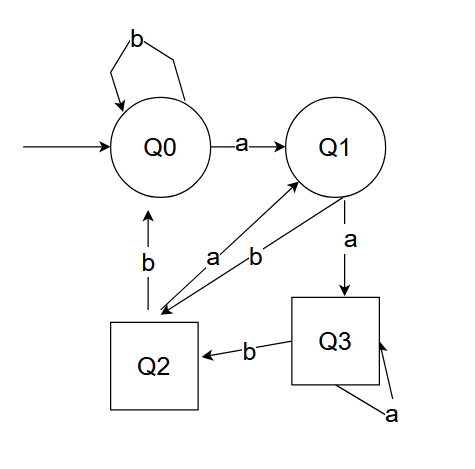
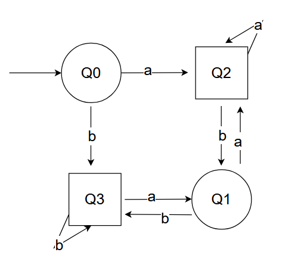

# CPS I — Exercise Sheet 1    
**University of Freiburg · Winter Term 2025/26**

**Author:** Zhanyu Dong, XinPu

---

## 1.Propositional Logic
**Atomic Propositions**
- `a` Alice joins group 1
- `b` Bob joins group 1
- `c` Claire joins group 1

Assign the value true if the corresponding person joins group 1,and false else

**Given Conditions**
1. If Alice joins group 1, the tutor refuses to accept Bob.  
   **Formula:**  \(
   a \rightarrow \neg b
   \)
2. At least one of Bob and Claire cannot go to group 1. 
   **Formula:**  \(\neg (b \wedge c)\)
3. Claire hates Alice and doesn’t want to be in the same group. 
   **Formula:**  \(a \leftrightarrow \neg c\)

4. Alice wants to submit solutions with either Bob or Claire.   
   **Formula:**\(a \rightarrow ( (a \leftrightarrow b) \vee (a \leftrightarrow c) )\)

**Truth Table**

| a | b | c | 1 | 2 | 3 | 4 | Overall Logic |
|:-:|:-:|:-:|:--:|:--:|:--:|:--:|:--:|
| T | T | T | F | F | F | T | F |
| T | T | F | F | T | T | T | F |
| T | F | T | T | T | F | T | F |
| T | F | F | T | T | T | F | F |
| F | T | T | T | F | T | F | F |
| F | T | F | T | T | T | T | F |
| F | F | T | T | T | T | T | T |
| F | F | F | T | T | F | T | F |

### Conclusion:\(a=\text{False}\),\(b=\text{False}\),\(c=\text{True}\) 

---
## 2.Finite Automata
- (a) \(L_1 = \left\{ x_0 x_1 \dots x_n \mid n \in \mathbb{N}, n \geq 1, (\forall i \leq n, x_i \in \{a, b\}), x_{n-1} = a \right\}\)
(b) \(L_2 =\left\{ x_0 x_1 \dots x_n \mid n \in \mathbb{N}_0, (\forall i \leq n, x_i \in \{a, b\}), x_0 = x_n \right\}\)
- 
**L1:**

**L2**

- **L1**
  - Q：\(\{ Q_0, Q_1, Q_2, Q_3 \}\)
   -   \(\Sigma\)：\(\{ a, b \}\)
   -   \(\delta\)：\(\begin{cases}
  (Q_0, a, Q_1),\ (Q_0, b, Q_0) \\
  (Q_1, a, Q_3),\ (Q_1, b, Q_2) \\
  (Q_3, a, Q_3),\ (Q_3, b, Q_2) \\(Q_2, a, Q_1),\ (Q_2, b, Q_0)
  \end{cases}\)
   - \(Q_{\text{init}}\)：\(\{ Q_0 \}\)
   - F：\(\{ Q_2, Q_3 \}\)
-  **L2**
   - Q：\(\{ Q_0, Q_1, Q_2, Q_3 \}\)
   - \(\Sigma\)：\(\{ a, b \}\)
   - \(\delta\)：\(\begin{cases}
  (Q_0, a, Q_2),\ (Q_0, b, Q_3) \\
  (Q_2, a, Q_2),\ (Q_2, b, Q_1) \\
  (Q_1, a, Q_2),\ (Q_1, b, Q_3) \\
  (Q_3, a, Q_1),\ (Q_3, b, Q_3)
  \end{cases}\)
   - \(Q_{\text{init}}\)：\(\{ Q_0 \}\)
   - F：\(\{ Q_2, Q_3 \}\)