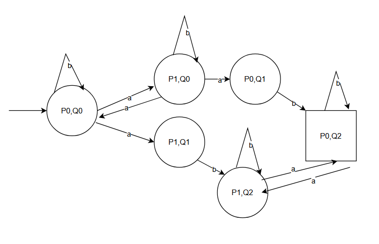
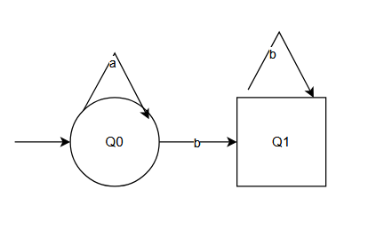
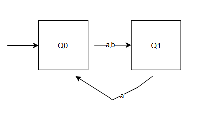

# CPS I — Exercise Sheet 2    
**University of Freiburg · Winter Term 2025/26**

**Author:** Zhanyu Dong, Xin Pu

---
## 1.Implications

Group 1:
- A implies B
- A is a sufficient condition for B
- A only if B
- A is stronger than B
- A ∧ ¬B does not hold
- ¬A ∨ B holds
- If not B, then not A

Group 2：
- B implies A
- A is a necessary condition for B
- A if B
- A is weaker than B

## 2.Intersection of Finite Automata

## 3. Buchi Automata 
1. Define
\(L_1 = \left\{ x_0x_1\ldots \mid (\forall i \in \mathbb{N}_0. x_i \in \Sigma) \ and \  \exists j \in \mathbb{N}_0. \forall i \in \mathbb{N}_0. i > j \ and \  x_i \neq a \right\}\)

\(L_2 = \left\{ x_0x_1\ldots \mid (\forall i \in \mathbb{N}_0. x_i \in \Sigma) \ and \  \ \forall i \in \mathbb{N}_0. x_{2i+1} = a \right\}\)
2. Buchi Automata

- **L1**
  - Q：\(\{ Q_0, Q_1 \}\)
   -   \(\Sigma\)：\(\{ a, b \}\)
   -   \(\delta\)：\(\begin{cases}
  (Q_0, a, Q_0),\ (Q_0, b, Q_1) \\
   (Q_1, b, Q_1) 
  \end{cases}\)
   - \(Q_{\text{init}}\)：\(\{ Q_0 \}\)
   - F：\(\{ Q_1\}\)
-  **L2**
   - Q：\(\{ Q_0, Q_1 \}\)
   -   \(\Sigma\)：\(\{ a, b \}\)
   -   \(\delta\)：\(\begin{cases}
  (Q_0, a, Q_1),\ (Q_0, b, Q_1) \\
   (Q_1, a, Q_0) 
  \end{cases}\)
   - \(Q_{\text{init}}\)：\(\{ Q_0 \}\)
   - F：\(\{ Q_0,Q_1\}\)