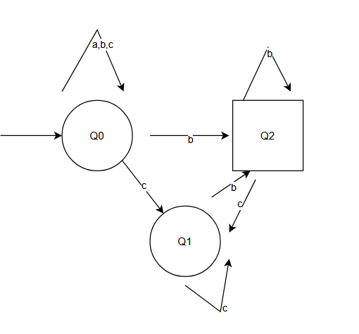
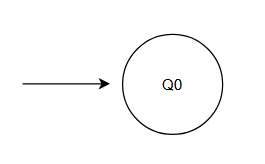
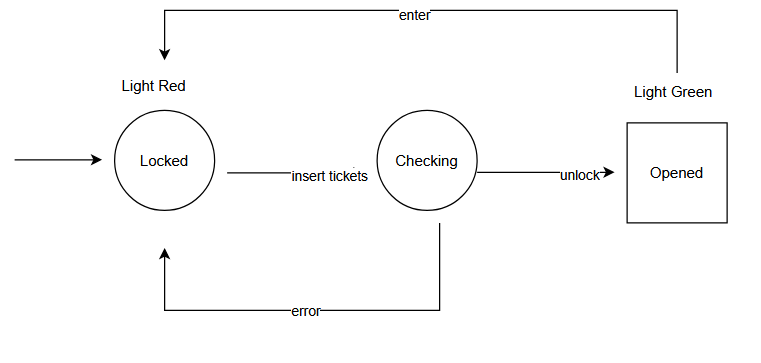
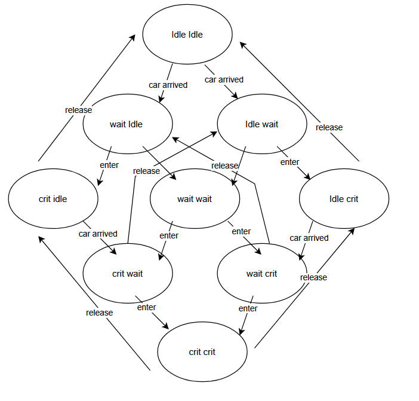
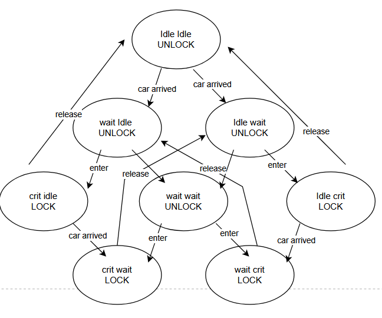

# CPS I — Exercise Sheet 3    
**University of Freiburg · Winter Term 2025/26**

**Author:** Zhanyu Dong, Xin Pu
---
## 1. Intersection of ω-regular languages
(a)

(b)
Empty \(\omega\) Language

## 2.Transition Systems

This models an automated ticket gate

## 3. Crossroads Traffic Lights 

- Yes, safe.The atomic propositions green1 and green2 correspond to crit_1 and crit_2, respectively. Once one direction acquires the lock, the other direction cannot execute unlock until the first one releases it. Therefore, there is no reachable state where both crit_1 and crit_2 hold simultaneously.
- A common expectation is liveness / responsiveness / no starvation, i.e., if there is a car waiting in a direction (state wait_i), it will eventually be allowed to proceed (state crit_i).
This property may not hold in the current model because the arbiter only enforces mutual exclusion but does not implement fair scheduling.