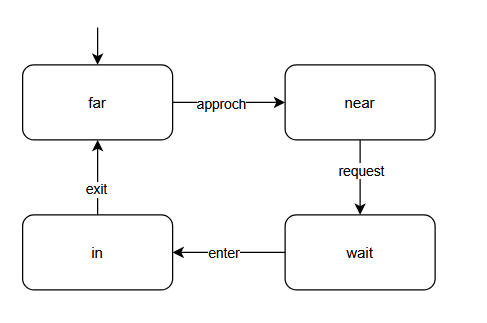
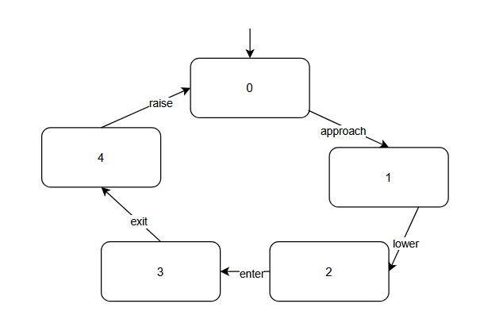
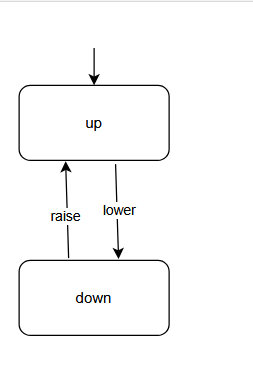
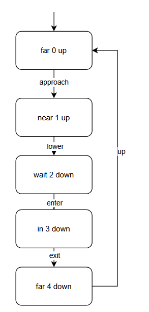
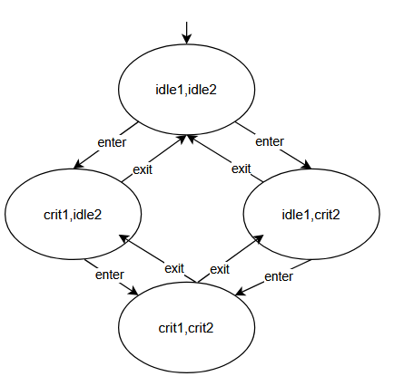
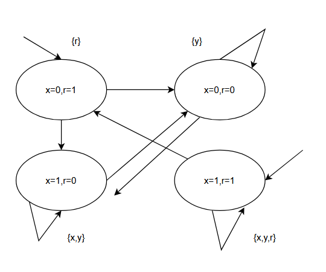

# CPS I — Exercise Sheet 4  
**University of Freiburg · Winter Term 2025/26**

**Author:** Zhanyu Dong, Xin Pu

---

## Exercise 1: Synchronization 
-  \(\text{Syn} = \text{Act} \cap \text{Act}'\)
- \(\text{Syn} = \emptyset\)

## Exercise 2: Railroad Crossing
- The flaw is the lack of synchronization between the train's "enter" action and the gate's "lower" action, allowing the train to enter the crossing while the gate is up (a race condition causing unsafe states).
- Train

Controller

Gate

- 

## Exercise 3: Mutual Exclusion without Request

- \(s_1 \xrightarrow{\alpha} s_1' \in TS_1\) \((s_1, s_2) \xrightarrow{\alpha} (s_1', s_2) \in TS_1 \parallel TS_2\)
\((idle1, idle2) \xrightarrow{enter} (crit1, idle2)\)
- \(s_2 \xrightarrow{\alpha} s_2' \in TS_2\)  \((s_1, s_2) \xrightarrow{\alpha} (s_1, s_2') \in TS_1 \parallel TS_2\)\((idle1, idle2) \xrightarrow{enter} (idle1, crit2)\)

\(P \xrightarrow{\alpha} P'\)  \(,Q \xrightarrow{\alpha} Q'\)（\(\alpha \in \text{Syn}\)） \(P \parallel Q \xrightarrow{\alpha} P' \parallel Q'\)
\((idle1, idle2, unlock) \xrightarrow{enter} (crit1, idle2, lock)\)
## Exercise 4: Hardware Circuit and Transition System 
