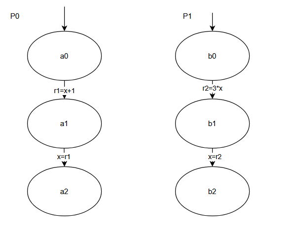
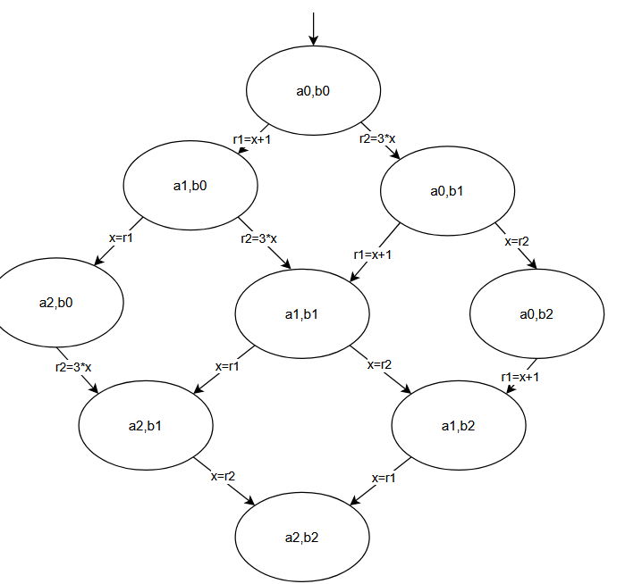
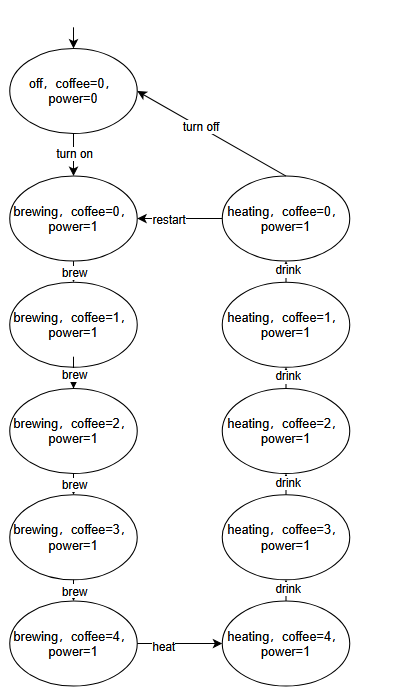

# CPS I — Exercise Sheet 4  
**University of Freiburg · Winter Term 2025/26**

**Author:** Zhanyu Dong, Xin Pu

---
## Exercise 1: Parallelism - Interleaving
a.

b.

c. The reachable state is (a2,b2), and the finally x value is (2,3,4,6)
## Exercise 2: Coffee Machine and Transition System

- \( \langle \text{off}, \{0,0\} \rangle \xrightarrow{\text{turn.on}} \langle \text{brewing}, \{0,1\} \rangle \)
\[
\frac{s_1 \xrightarrow{\alpha}_1 s_1'}
{\langle s_1, s_2\rangle \xrightarrow{\alpha} \langle s_1', s_2\rangle}
\]

\[s_1 = \langle \text{off}, {0,0} \rangle\]
\[s_1' = \langle \text{brewing}, {0,1} \rangle\]
\[\alpha=turn.on\]

- \( \langle \text{brewing}, \{0,1\} \rangle \xrightarrow{\text{brew}} \langle \text{brewing}, \{1,1\} \rangle \)
\[
\frac{s_1 \xrightarrow{\alpha}_1 s_1'}
{\langle s_1, s_2\rangle \xrightarrow{\alpha} \langle s_1', s_2\rangle}
\]
\[s_1 = \langle brewing,{coffee=0,\ power=1}\rangle\]
\[s_1' = \langle brewing,{coffee=1,\ power=1}\rangle\]
\[\alpha = brew\]

 

- \( \langle \text{brewing}, \{4,1\} \rangle \xrightarrow{\text{heat}} \langle \text{heating}, \{4,1\} \rangle \)
\[\frac{s_1 \xrightarrow{\alpha}_1 s_1'}
{\langle s_1, s_2\rangle \xrightarrow{\alpha} \langle s_1', s_2\rangle}\]
\[s_1 = \langle brewing,{coffee=4,\ power=1}\rangle\]
\[s_1' = \langle heating,{coffee=4,\ power=1}\rangle\]
\[\alpha = heat\]
  

 **Reasons the Given Transitions Are Invalid**
- \( \langle \text{off}, \{0,0\} \rangle \xrightarrow{\text{heat}} \langle \text{heating}, \{0,0\} \rangle \):
  The "heat" action is only associated with the "brewing" location (no "heat" transition exists from the "off" location in the program graph). SOS rules require actions to match the current location, so this transition is invalid.

- \( \langle \text{brewing}, \{4,1\} \rangle \xrightarrow{\text{brew}} \langle \text{brewing}, \{5,1\} \rangle \):
  The guard condition for "brew" is coffee < 4; here, the coffee amount is 4, so the guard condition fails. SOS rules require guard conditions to hold for transitions to fire, so this transition is invalid.

### Part (b) 
We label the transition system with atomic propositions (e.g., \( P_{\text{off}}: \text{power} = 0 \), \( P_{\text{coffee0}}: \text{coffee} = 0 \)) and verify the properties below:

(i)
**True**:
Only the "off" location has \( \text{power} = 0 \), and the coffee amount at "off" is always 0 (the initial state and the guard condition for the "turn.off" transition require \( \text{coffee} = 0 \)).

(ii)
**False**:
When \( \text{coffee} = 2 \), the current location is "brewing" (since 2 < 4). The only enabled action is "brew", which increases the coffee amount to 3 (2 + 1). It cannot jump directly to 4, so the next step can only be 3.

(iii) 
**True**:
The guard condition for "brew" is `coffee < 4`, so "brew" stops firing once \( \text{coffee} = 4 \). All other actions (e.g., "drink") either decrease or preserve the coffee amount, so \( \text{coffee} \leq 4 \) at all times.

(iv)
**False**:
An execution path (e.g., "off → brewing → brew×4 → heating → drink×4 → restart → brewing → ...") is only off initially and stays powered on afterward. Thus, \( \text{power} = 0 \) does not occur infinitely often.

(v) 
**True**:
When \( \text{coffee} = 0 \), execution paths must progress (the system cannot remain indefinitely in the initial "off" state without triggering actions). For example: (1) `off → turn.on` (step 1: brewing, \( \text{coffee} = 0 \)); (2) `brewing → brew` (step 2: brewing, \( \text{coffee} = 1 \)). Even in longer valid paths, the coffee amount becomes positive within 3 steps.

