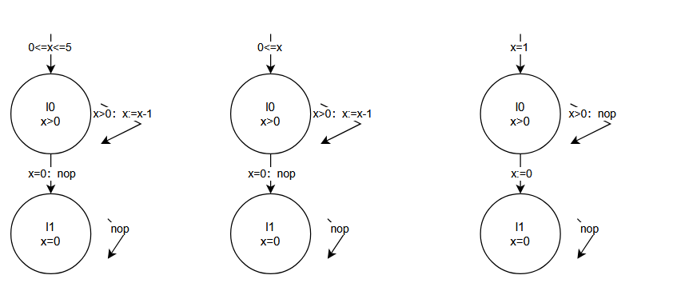

# CPS I — Exercise Sheet 7
**University of Freiburg · Winter Term 2025/26**

**Author:** Zhanyu Dong, Xin Pu

---
 ## Exercise 1: Linear-Time Properties
- Formalize Pi as a set of traces using set comprehension
  - \[ P_1\{ A_0A_1\ldots \in (2^{\text{AP}})^\omega \mid \forall i \in \mathbb{N}.\ a \in A_i \lor b \in A_i \} \]
  - \[ P_2\{ A_0A_1\ldots \in (2^{\text{AP}})^\omega \mid (\forall i \in \mathbb{N}.\ (b \in A_i \implies \exists j \leq i.\ a \in A_j)) \} \]
  - \[ P_3\{ A_0A_1\ldots \in (2^{\text{AP}})^\omega \mid \forall i \in \mathbb{N}.\ (a \in A_i \implies \exists j > i.\ b \in A_j) \} \]
  - \[P_4 \{ A_0A_1\ldots \in (2^{\text{AP}})^\omega \mid |\{ i \in \mathbb{N} \mid a \in A_i \}| = 3 \} \]
  - \[P_5 \{ A_0A_1\ldots \in (2^{\text{AP}})^\omega \mid (|\{i \in \mathbb{N} \mid a \in A_i\}| = \infty) \to (|\{i \in \mathbb{N} \mid b \in A_i\}| = \infty) \} \]
  - \[ P_6\{ A_0A_1\ldots \in (2^{\text{AP}})^\omega \mid |\{i \in \mathbb{N} \mid a \in A_i\}| < \infty \} \]
- satisfies Pi
  - \( (\{a\}\{b\})^\omega\)
  - \( \{a\}\{a,b\}^\omega \)
  - \( (\{a\}\{b\})^\omega \)
  - \( \{a\}\{a\}\{a\}\emptyset^\omega \)
  - \( (\{a\}\{b\})^\omega \)
  - \( \{a\}\emptyset^\omega \)
-  does not satisfy Pi
   -  \( \emptyset (\{a\}\{b\})^\omega \)
   -  \( (\{b\}\{a\})^\omega \)
   -  \( \{a\}\emptyset^\omega \)
   -  \( \{b\}^\omega \)
   -  \( \emptyset\{a\}^\omega\)
   -  \( \{a\}^\omega \)
- Explain whether or not the transition system below satisfies P
  - false
  - true
  - true
  - false
  - true
  - false

## Exercise 2: Trace Inclusion
1. 
  

**2. First we find the Traces.**
- \( \text{Traces}(\mathcal{T}_{P_1}) \)：\( \{ \{x>0\}^n \{x=0\}^\omega \mid n \in \{0,1,...,5\} \} \)
- \( \text{Traces}(\mathcal{T}_{P_2}) \)：\( \{ \{x>0\}^n \{x=0\}^\omega \mid n \in \mathbb{N}_0  \} \)
- \( \text{Traces}(\mathcal{T}_{P_{3a} \parallel P_{3b}}) \)：\( \{ \{x>0\}^\omega \} \cup \{ \{x>0\}^k \{x=0\}^\omega \mid k \in \mathbb{N} . k\neq 0 \} \)
- \( \text{Traces}(\mathcal{T}_4) \)：\( \{ \{x>0\}^\omega \} \cup \{ \{x>0\}^n \{x=0\}^\omega \mid n \in \mathbb{N}_0\} \)
1. \( \mathcal{T}_{P_1} \subseteq \mathcal{T}_{P_2} \)
2.  \( \mathcal{T}_{P_2} \nsubseteq \mathcal{T}_{P_1} \)
3.  \( \mathcal{T}_{P_1} \nsubseteq \mathcal{T}_{P_{3a} \parallel P_{3b}} \)
4.  \( \mathcal{T}_{P_{3a} \parallel P_{3b}} \nsubseteq \mathcal{T}_{P_1} \)
5.  \( \mathcal{T}_{P_1} \subseteq \mathcal{T}_4 \)
6.  \( \mathcal{T}_4 \nsubseteq \mathcal{T}_{P_1} \)
7.  \( \mathcal{T}_{P_2} \nsubseteq \mathcal{T}_{P_{3a} \parallel P_{3b}} \)
8.  \( \mathcal{T}_{P_{3a} \parallel P_{3b}} \nsubseteq \mathcal{T}_{P_2} \)
9.  \( \mathcal{T}_{P_2} \subseteq \mathcal{T}_4 \)
10. \( \mathcal{T}_4 \nsubseteq \mathcal{T}_{P_2} \)
11. \( \mathcal{T}_{P_{3a} \parallel P_{3b}} \subseteq \mathcal{T}_4 \)
12. \( \mathcal{T}_4 \nsubseteq \mathcal{T}_{P_{3a} \parallel P_{3b}} \)

**3. Eventually x=0**
\[ E = \{ A_0A_1\ldots \in (2^{\text{AP}})^\omega \mid \exists^\infty i \in \mathbb{N}.\ x=0 \in A_i \} \]
As i mentioned the Traces in (2)\( \mathcal{T}_{P_1} \models E \)\( \mathcal{T}_{P_2} \models E \)
- \( \mathcal{T}_{P_{3a} \parallel P_{3b}} \not\models E \)  Exist Trace\( \{x>0\}^\omega \)
- \( \mathcal{T}_4 \not\models E \)Exist Trace\( \{x>0\}^\omega \)

