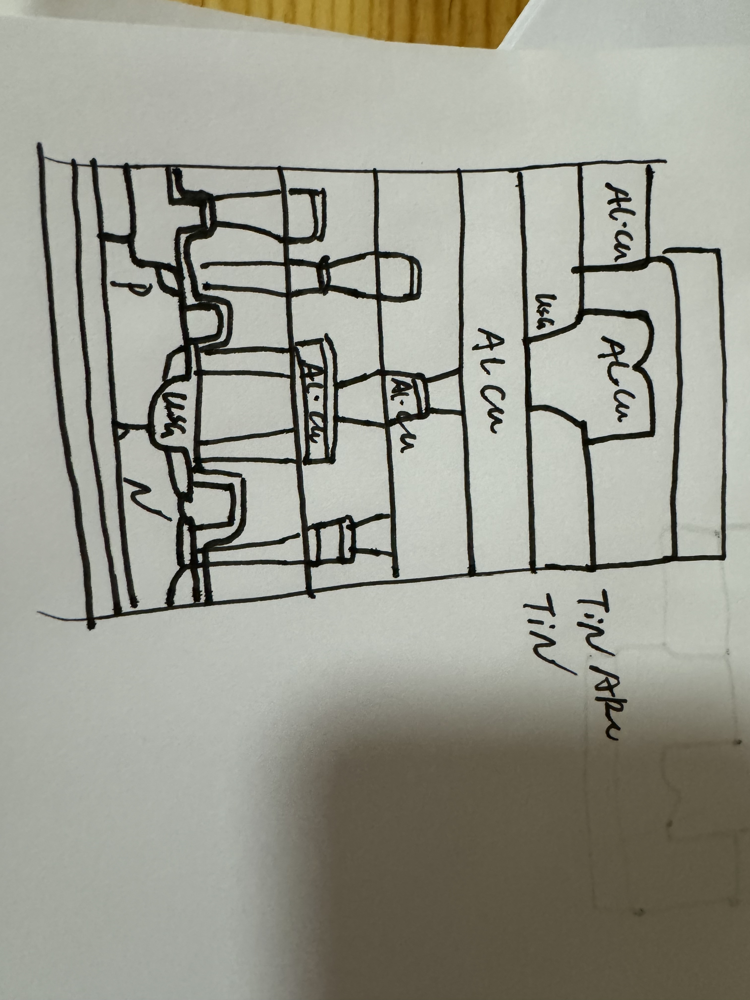

<h3> Chapter 6-8 cvd pvd 外延
<h3>董展宇</h3>

1.湿法刻蚀是液体，各向同性刻蚀剖面，选择性好。干法刻蚀是等离子体，各向异性刻蚀剖面，选择性差。  覆盖刻蚀用湿法比较好，图形刻蚀用干法比较好。
 2.栅：掺杂多晶硅 Poly-Si。MOSFET等场效应器件的组成部分
接触孔与通孔：金属W。连接器件有源区的接触孔和各互连间的通孔的材料
互连：Al-Cu合金互连,Cu互连。将各个独立的元件连接成为具有一定功能的电路模块。
接触电极：金属硅化物。直接与半导体材料接触的材料，以及提供与外部相连的接触点。
3.淀积SiO2：CVD
干法刻蚀：自对准形成侧墙
淀积金属Ti：PVD
退火：栅、源和漏上形成TiSi2，侧墙不形成TiSi2
刻蚀Ti：湿法刻蚀，形成TiSi2电极
4.

Cu金属层 (Cu)：采用铜，通过电镀技术（电化学沉积）形成，然后光刻和刻蚀。
Al合金金属层 (Al, Si)：采用Al合金（通常是Al-Si合金），通过溅射沉积，然后光刻和刻蚀形成互连图案。
局部互连氧化物层 (SiO2)：通过化学气相沉积（CVD）或热氧化技术形成的二氧化硅层，用于电绝缘。
钝化层 (SiN)：采用氮化硅，通过CVD形成，用于保护和绝缘。
栅极 (多晶硅)：通过低压化学气相沉积（LPCVD）沉积多晶硅，然后光刻和刻蚀。
栅氧化层 (SiO2)：通过热氧化在Si表面形成的薄氧化层。
N型/P型源极/漏极 (N+, P+)：通过离子注入技术掺杂形成的重掺杂区域。
P型阱 (P-well) 和 N型阱 (N-well)：通过离子注入形成的掺杂区域，用于形成CMOS的双阱结构。
P型衬底 (P-substrate)：通常是P型硅衬底