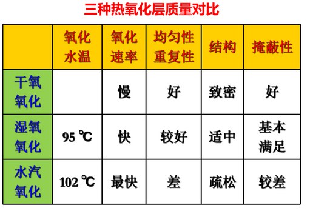
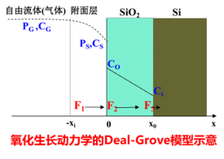

## Chapter 3 氧化Oxidation
---

- [ ] 氧化习题
---
#### 基础
**高温
产生$Si0_2$**

$Si0_2$无定形，由Si-O4组成
-桥键氧：连接两个Si，多数
-非桥键氧：连接一个Si，少数

各种密度折射率电阻率介电常数熔点均与**制备方法**有关（无定形）
**只与HF反应**

---

#### 热氧化

|对比|工艺特性|技术特点|
|---|---|---|
|热氧化|消耗Si表面|质量好|
|CVD|不消耗Si表面|相对差|
1. 干氧
    - 慢
    - 质量好，掩蔽性强
    - 用于超薄氧化层
2. 水汽 （产生$H_2$）
    - 最快
    - 质量差
    - 厚氧化层
3. 湿氧
   - 中等
  
4. 掺Cl氧化
   - 吸收 Na+
5. 实际 **干-湿-干**
   >湿->速率
   干->界面质量

---

#### Deal-Grove-Model

$F_1=h_g(C_g-C_s)$
$F_2=D_{ox}(C_o-C_i)/{X_o}$
$F_3=N_1dX_o/dt$
$F_1=F_2=F_3$
扩散系数小是扩散控制
反应系数小是反应控制

**$$Z_{ox}=\frac{A}{2}[\sqrt{1+\frac{t+\tau}{A^2/4B}}-1]$$**
  
  - 氧化时间很短
  $Z_{ox}=\frac{B}{A}(t+\tau)$
   线性 反应控制
   - 氧化时间很长
   $Z_{ox}^2=B(t+\tau)$
   抛物线 扩散控制

   $$\tau=\frac{Z_{ox}^2+AZ_{ox}}{B}$$
   $D_{ox}=D_0\exp(-E_a/{KT})$ 与温度程负指数关系

   - 高温氧化炉
   - 立式氧化炉
   - 卧式氧化炉
  ---
#### 二氧化硅的应用
- 场氧隔离locos
    - 湿氧
- 栅氧
    - 干氧
- 表面钝化层
    - 干湿干
- 掺杂掩蔽膜
    - 干湿干
- 缓冲氧化层
- 离子注入屏蔽氧化层
- 金属层间绝缘层（CVD 非氧化）