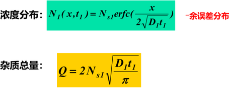
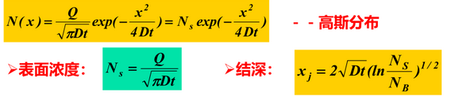

## Chapter 4

受主 B Al Ga In
施主 N P As Sb

**间隙式扩散** H
**替位式扩散** B P As Sb
替位式更难

**扩散系数**
>$D_{ox}=D_0\exp(-E_a/{KT})$
与活化能成反比，温度正比
#### 两部扩散
1. 恒定表面源扩散（800-900°
   
2. 有限表面源扩散（1000-1200°）
 
 ---
 1. 气态源扩散
 2. 固态
 3. 液态
---
#### 扩散的问题
1. 各向同性，有横向扩散（不适合小尺寸）
2. 不能独立控制结深和温度
3. 高温，深结（不适合小尺寸）
