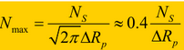
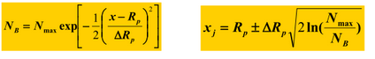

## Chapter 5 ion plantation
 
#### 优势
1. 低表面浓度
2. 浅结
3. 浓度和结深可控
4. 均匀掺杂
5. 高纯度多离子
6. 温度低
7. 横向扩散小
#### 缺点
1. 损伤：退火
2. 成本高

#### 流程
1. 离子源：带电
2. 质量分析仪：筛选
3. 加速器
4. 聚焦
5. 偏束
6. 扫描器
7. 靶室

- 先加速，后分析：大磁场
- 先分析，后加速：分析仪小，加速中流束强度可能变
- 前后加速，中间分析
  
  ---
#### 阻挡机制 （高斯分布）
- 核阻挡
   - 阻挡明显
     - 控制结深
   - 晶格损伤大
- 电子阻挡
   - 阻挡不明显
      - 结深不容易控制，随机
   - 晶格损伤小
  
  
  
---
#### 沟道效应
单晶靶：各向异性
非晶靶：各项同性
**沟道效应：如果沿着单晶靶主晶轴方向入射，只有电子阻挡。**
方法：
1. 偏离主晶轴方向入射
2. 表面淀积非晶层
3. 表面制造损伤层
   
阴影效应：注入离子受到掩膜的阻挡
方法：
1. 旋转硅片
2. 注入后扩散
   
---
#### 晶格损伤
1. 轻注入离子：B 电子碰撞
2. 重注入离子：As 核碰撞

注入损伤
1. 散射中心
2. 缺陷中心
3. 杂质不在晶格上

**退火目的：**
1. **消除注入损伤**
2. **掺杂激活**
   
快速退火：温度高，时间短，浓度不易再分布 Rapid thermal annealing

### 阱注入（高能量，低剂量） LDD注入（低能量，低剂量） 源漏注入 多晶硅栅注入

**金属栅对准：先做源漏，再做栅**
**多晶硅栅自对准：先做多晶硅栅，再做源漏（多晶硅做Mask，多晶硅也同时被掺杂）**
