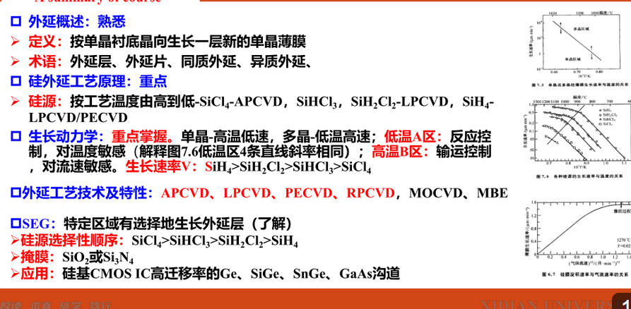
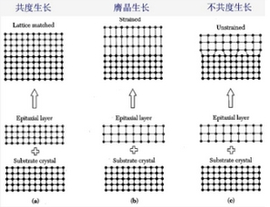
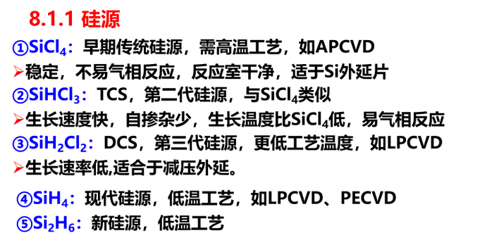
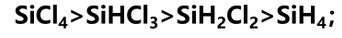

## Chapter8 Epitaxy

在单晶衬底上再长一层单晶薄膜
1. 获得高质量硅单晶：外延层缺陷少
2. 均匀掺杂
3. 多层外延层实现特殊结构 GaAs HEMT
   
**同质外延**

**异质外延**
- Si+SiGe
- SiGe+Si
- 蓝宝石上外延Si-Sapphire
- 蓝宝石外延GaN，SiC
  
1. 共度生长：同质外延
2. 赝晶生长：异质应变外延
3. 非共度生长：异质弛豫外延

外延生长步骤与CVD相同
>1. 传输
>1. 吸附
>2. 化学反应
>3. 淀积
>4. 脱吸
>5. 移除

**高温低速：单晶
低温高速：多晶**

外延掺杂：原位掺杂
1. 扩散
2. 自掺杂

杂志扩散再分布：余误差

---
SEG选择性外延，有选择的生长外延

**MBE分子束外延**：温度低，生长速率低，精确可控。**适用于任何外延**
MOCVD：化合物半导体外延