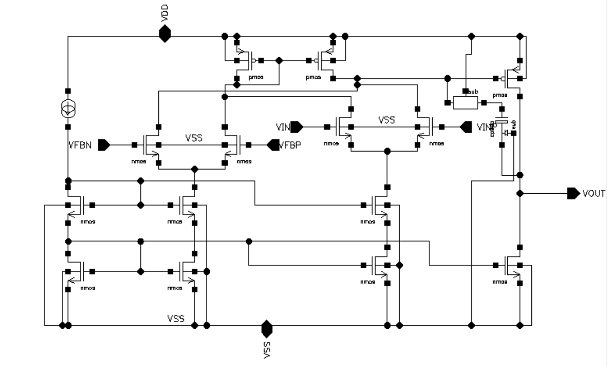
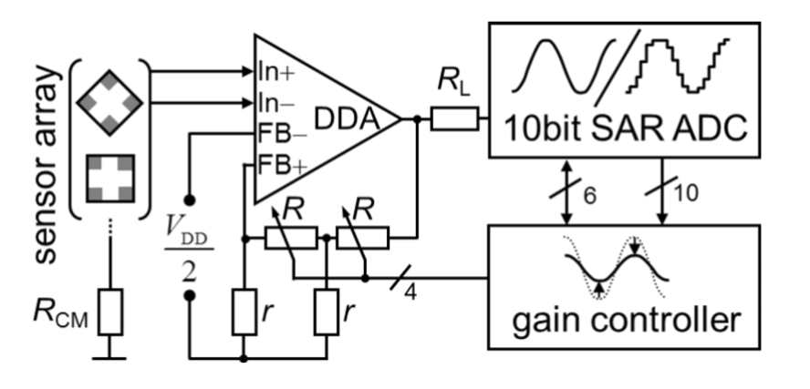
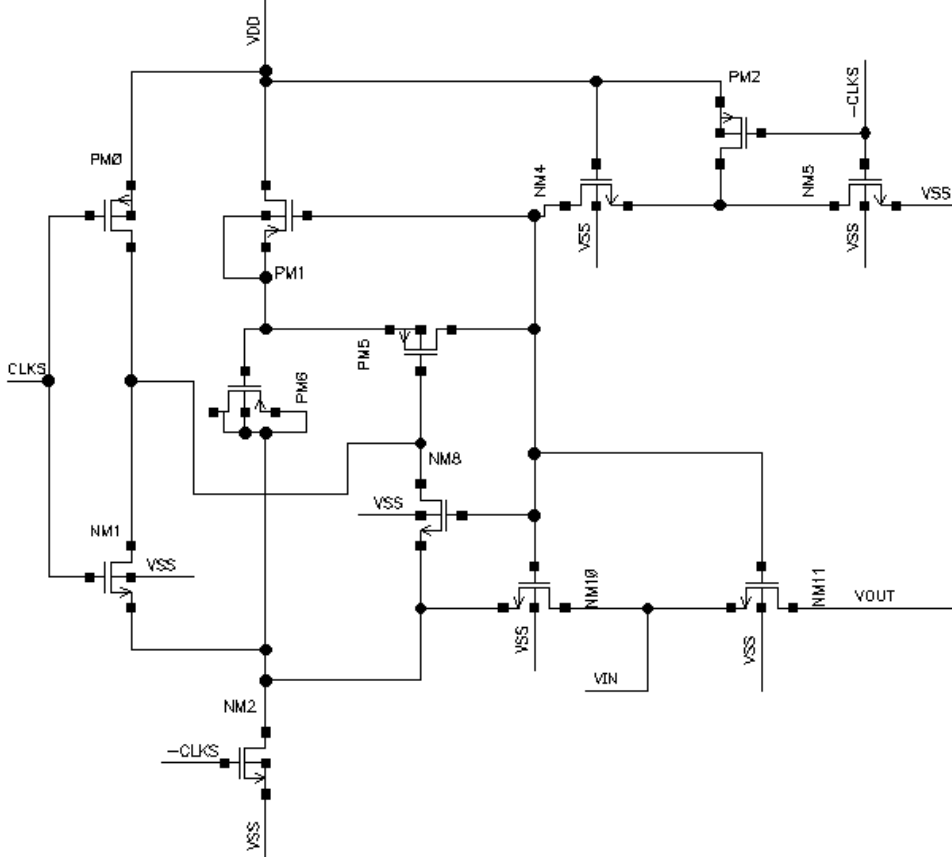
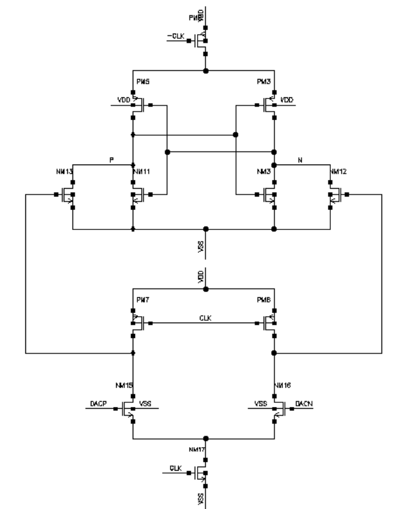

<!-- _class: profile -->

<h1>董展宇</h1>
<h2>模拟 IC 设计</h2>

23 岁 · 浙江

<h3>教育背景</h3>
<table class="edu">
<tr><td>德国弗莱堡大学</td><td>嵌入式系统工程 · 硕士</td><td class="small">2025.10 – 至今 Data Converters；RF and Microwave Circuits（1.3/1）</td></tr>
<tr><td>德国汉诺威莱布尼茨大学</td><td>电子信息 · 本科交换</td><td class="small">2024.10 – 2025.06 Mixed-Signal Circuits（1.7/1）</td></tr>
<tr><td>西安电子科技大学</td><td>集成电路设计与集成系统 · 本科</td><td class="small">2021.09 – 2025.06 模拟集成电路（96/100）</td></tr>
</table>

---

PROJECT 01 · SENSOR INTERFACE

# DDA 传感器读出前端电路设计与仿真

德国弗莱堡大学 · XFAB 0.35 μm CMOS

<table>
<tr><th>模块 / 方法</th><th>结果 / 贡献</th></tr>
<tr><td>核心 DDA</td><td>双差分输入级、偏置支路、输出级；RC Miller 补偿</td></tr>
<tr><td>开环仿真</td><td>DC gain 84 dB · GBW 4 MHz</td></tr>
<tr><td>噪声分析</td><td>1 Hz–36 kHz 输入参考噪声 5.68 μVrms</td></tr>
<tr><td>闭环 + ADC 负载</td><td>最大增益下：输入参考噪声 9.57 μVrms；输出积分噪声 2.2 mVrms（约 0.68 LSB）</td></tr>
</table>

---

PROJECT 02 · SAR ADC FRONT-END

# SAR ADC 自举采样开关与比较器设计

德国弗莱堡大学 · XFAB 0.18 μm CMOS · 40 MS/s

<table>
<tr><th>模块 / 方法</th><th>结果 / 贡献</th></tr>
<tr><td>自举采样开关</td><td>驱动 2 pF CDAC；完成预充电、栅极升压、输入相关 Ron、电荷注入与时钟馈通分析</td></tr>
<tr><td>采样性能</td><td>低频输入 ENOB ≈ 17.6 bit；接近 Nyquist 频率 ≈ 12.23 bit</td></tr>
<tr><td>动态比较器</td><td>双尾流两级结构；1 GHz、CL = 100 fF 下时钟到输出延迟 ≈ 0.3 ns</td></tr>
<tr><td>噪声指标</td><td>输入等效噪声 σn,in = 0.16 mV</td></tr>
</table>

